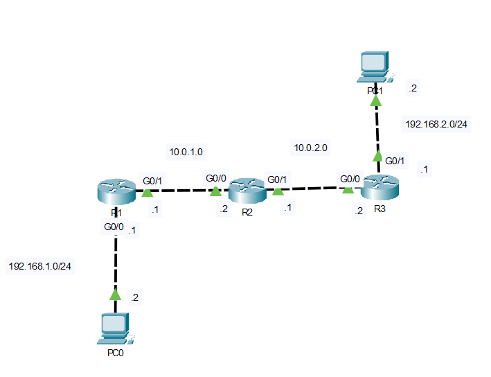
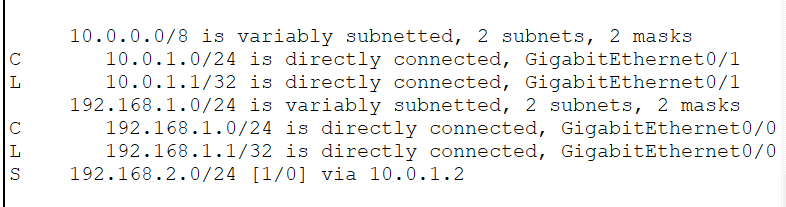
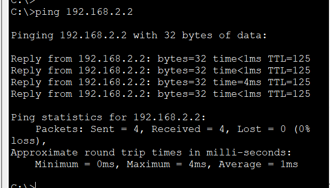

# Basic Static Routing

In this lab, I configured **static routes** to enable communication between two remote LANs connected through multiple routers. Each router was manually configured with the appropriate routes, allowing end devices on different networks to communicate successfully.

This topology demonstrates the fundamental concept of static routing and how routers forward packets between remote networks using manually defined routes.

## Objective

Gain hands-on experience configuring and verifying static routes between multiple routers while understanding how routing tables determine packet forwarding.

## Topology



## IP Addressing

| Device | Interface | IP Address |
|---------|-----------|------------|
| PC0 | NIC | 192.168.1.2/24 |
| R1 | G0/0 | 192.168.1.1/24 |
| R1 | G0/1 | 10.0.1.1/30 |
| R2 | G0/0 | 10.0.1.2/30 |
| R2 | G0/1 | 10.0.2.1/30 |
| R3 | G0/0 | 10.0.2.2/30 |
| R3 | G0/1 | 192.168.2.1/24 |
| PC1 | NIC | 192.168.2.2/24 |

## Configuration

### R1

```cisco
ip route 192.168.2.0 255.255.255.0 10.0.1.2
```

### R2

```cisco
ip route 192.168.1.0 255.255.255.0 10.0.1.1
ip route 192.168.2.0 255.255.255.0 10.0.2.2
```

### R3

```cisco
ip route 192.168.1.0 255.255.255.0 10.0.2.1
```

## Verification

### Router

`show ip route`



### End-to-End Connectivity

`ping 192.168.2.2`



## What I Learned

- Configured static routes to reach remote networks.
- Understood the difference between directly connected and remote networks.
- Learned how routers use routing tables to determine the next-hop destination.
- Verified end-to-end connectivity using routing table inspection and ICMP ping.
- Reinforced how packets traverse multiple routers to reach their destination.

## Files

- `Basic-Static-Routing.pkt` — Cisco Packet Tracer lab
- `topology.png` — Network topology diagram
- `verification-route.png` — Routing table verification
- `verification-ping.png` — End-to-end connectivity verification