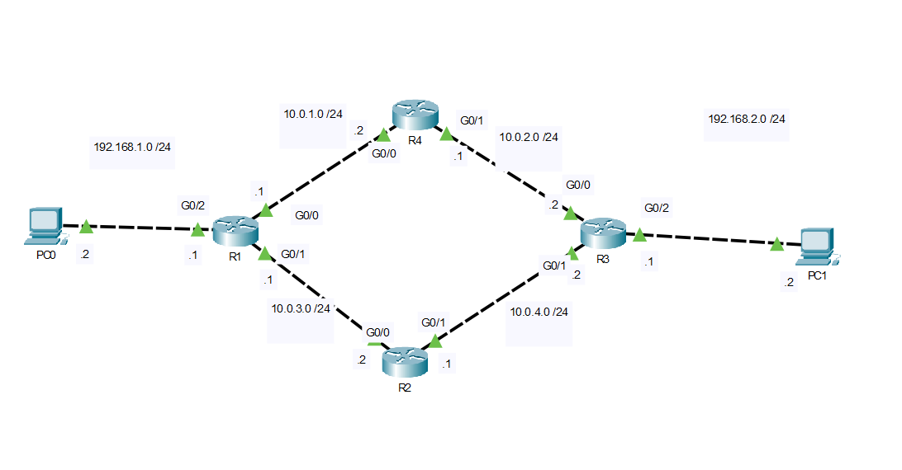
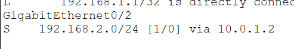
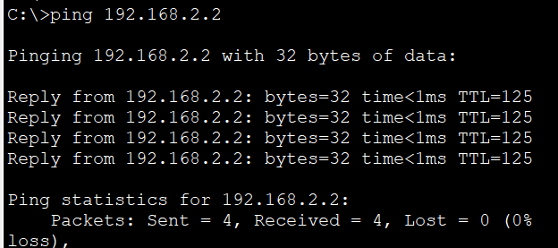
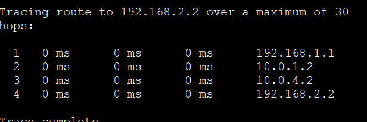
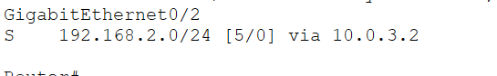
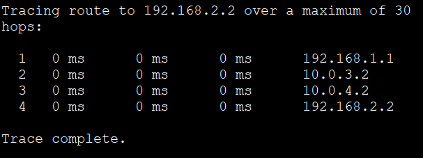

# Floating Static Route

In this lab, I configured a **floating static route** to provide **redundant connectivity** between two remote LANs. The primary path forwards traffic through **R4** using the default administrative distance, while a backup static route through **R2** is configured with a higher administrative distance. If the primary path becomes unavailable, the router automatically switches to the backup route.

This topology demonstrates how floating static routes provide a simple form of redundancy in small and medium-sized networks without requiring a dynamic routing protocol.

## Objective

Gain hands-on experience configuring floating static routes and verify automatic failover when the primary path becomes unavailable.

## Topology



## IP Addressing

| Network | Subnet |
|---------|--------|
| PC0 LAN | 192.168.1.0/24 |
| R1 ↔ R4 | 10.0.1.0/24 |
| R4 ↔ R3 | 10.0.2.0/24 |
| R1 ↔ R2 | 10.0.3.0/24 |
| R2 ↔ R3 | 10.0.4.0/24 |
| PC1 LAN | 192.168.2.0/24 |

## Configuration

### Primary Static Route (via R4)

```cisco
ip route 192.168.2.0 255.255.255.0 10.0.1.2
```

### Floating Static Route (Backup via R2)

```cisco
ip route 192.168.2.0 255.255.255.0 10.0.3.2 5
```

> The backup route has an **Administrative Distance (AD) of 5**, making it less preferred than the primary static route (AD = 1). It is installed in the routing table only when the primary route is no longer available.

## Verification

### Primary Route

`show ip route`



### End-to-End Connectivity

`ping 192.168.2.2`



`tracert 192.168.2.2`



### Failover Test

After shutting down the **R1–R4** link:

`show ip route`



`tracert 192.168.2.2`



## What I Learned

- Configured a floating static route using a higher administrative distance.
- Understood how routers select routes based on administrative distance.
- Verified that the primary route is preferred during normal operation.
- Simulated a link failure and observed automatic failover to the backup path.
- Reinforced how floating static routes provide redundancy without requiring a dynamic routing protocol.

## Files

- `Floating-Static-Route.pkt` — Cisco Packet Tracer lab
- `topology.png` — Network topology diagram
- `verification-primary-route.png` — Primary routing table
- `verification-primary-tracert.png` — Traceroute using the primary path
- `verification-backup-route.png` — Backup routing table after failover
- `verification-backup-tracert.png` — Traceroute using the backup path
- `verification-ping.png` — End-to-end connectivity verification