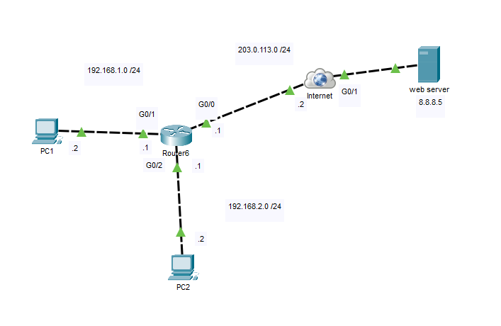
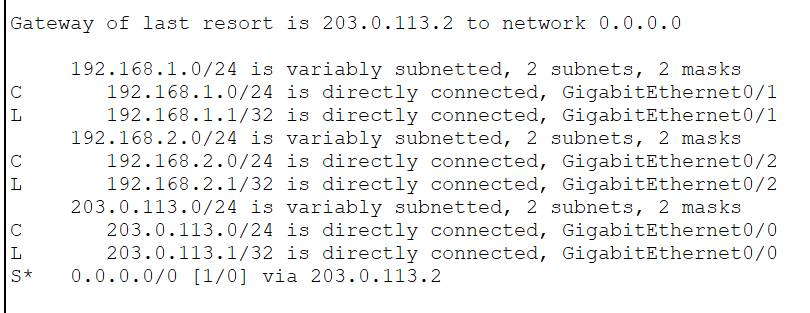
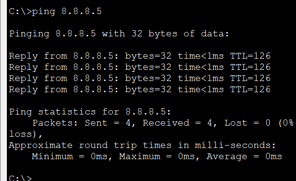
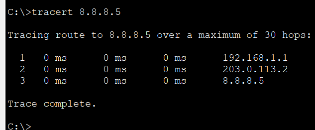

# Default Route

In this lab, I configured a **default static route** to allow hosts on multiple local networks to reach destinations outside of their directly connected networks. Instead of creating individual routes for every remote network, the router forwards all unknown traffic to a designated next-hop toward the simulated Internet.

This simplified topology represents a common small business network where a single edge router provides Internet connectivity for multiple internal LANs.

## Objective

Gain hands-on experience configuring and verifying a default static route while understanding how routers forward traffic destined for unknown networks.

## Topology



## IP Addressing

| Device | Interface | IP Address |
|---------|-----------|------------|
| PC1 | NIC | 192.168.1.2/24 |
| Router | G0/1 | 192.168.1.1/24 |
| PC2 | NIC | 192.168.2.2/24 |
| Router | G0/2 | 192.168.2.1/24 |
| Router | G0/0 | 203.0.113.1/24 |
| Internet | G0/0 | 203.0.113.2/24 |
| Web Server | NIC | 8.8.8.5 |

## Configuration

### Router

```cisco
ip route 0.0.0.0 0.0.0.0 203.0.113.2
```

## Verification

### Router

`show ip route`



### End-to-End Connectivity

`ping 8.8.8.5`



`tracert 8.8.8.5`



## What I Learned

- Configured a default static route using `0.0.0.0/0`.
- Understood how routers use the default route when no more specific route exists.
- Verified connectivity from internal hosts to an external network.
- Observed how traffic is forwarded through the configured next-hop toward the Internet.
- Reinforced the role of default routes in simplifying routing for edge routers.

## Files

- `Default-Route.pkt` — Cisco Packet Tracer lab
- `topology.png` — Network topology diagram
- `verification-route.png` — Routing table verification
- `verification-ping.png` — End-to-end connectivity verification
- `verification-tracert.png` — Traceroute verification