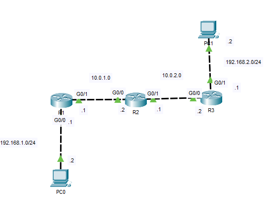
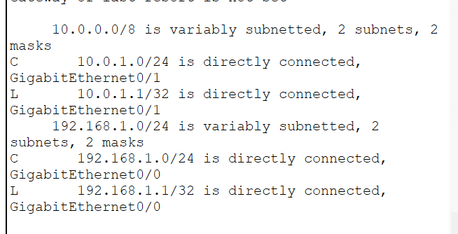
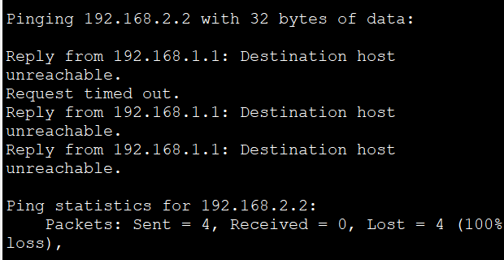
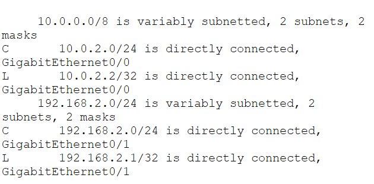
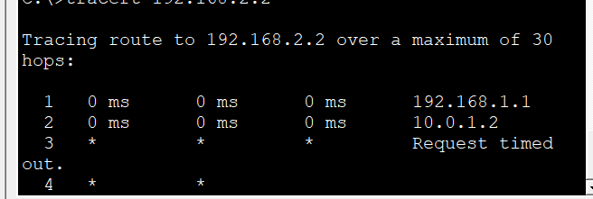

# Static Route Troubleshooting

In this lab, I intentionally introduced common static routing misconfigurations and used Cisco IOS verification commands to identify and resolve connectivity issues. The objective was to strengthen my troubleshooting methodology by analyzing routing tables, verifying interface status, and validating end-to-end connectivity.

## Objective

Practice troubleshooting static routing issues by identifying incorrect route configurations and restoring communication between remote networks.

## Topology



---

# Scenario 1: Incorrect Next-Hop Address

## Problem

R1 was configured with an incorrect next-hop address:

```cisco
ip route 192.168.2.0 255.255.255.0 10.0.5.2
```

The correct configuration should be:

```cisco
ip route 192.168.2.0 255.255.255.0 10.0.1.2
```

## Symptoms

- PC0 cannot reach PC1.
- The destination network is not reachable.
- Static route points to a non-existent next-hop.

## Verification

`show ip route`



`ping 192.168.2.2`



## Resolution

Updated the static route with the correct next-hop address and verified end-to-end connectivity.

---

# Scenario 2: Missing Return Route

## Problem

R3 was missing the route back to the **192.168.1.0/24** network.

Missing configuration:

```cisco
ip route 192.168.1.0 255.255.255.0 10.0.2.1
```

## Symptoms

- Requests from PC0 reach PC1.
- Reply packets cannot return to the source.
- End-to-end communication fails due to the missing return path.

## Verification

`show ip route`



`tracert 192.168.2.2`



## Resolution

Configured the missing static route on R3 and confirmed successful two-way communication.

---

## What I Learned

- Verified routing tables to identify incorrect or missing routes.
- Understood how an incorrect next-hop prevents packet forwarding.
- Reinforced that successful communication requires routing in both directions.
- Used Cisco IOS verification commands to isolate and resolve routing issues.
- Developed a structured approach to troubleshooting static routing problems.

## Files

- `Static-Route-Troubleshooting.pkt` — Cisco Packet Tracer lab
- `topology.png` — Network topology diagram
- `scenario1-route.png`
- `scenario1-ping.png`
- `scenario2-route.png`
- `scenario2-tracert.png`