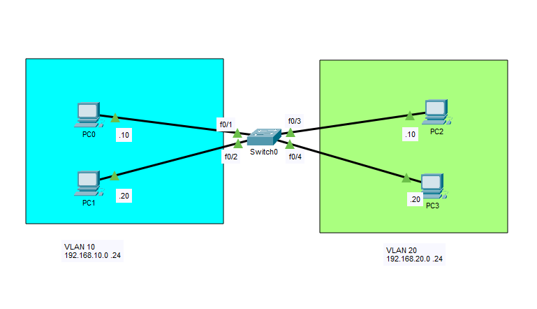
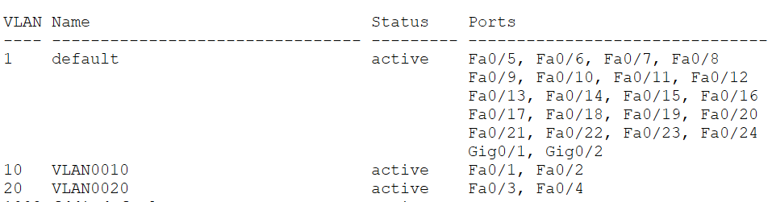
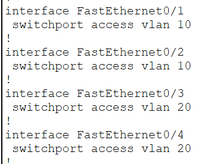
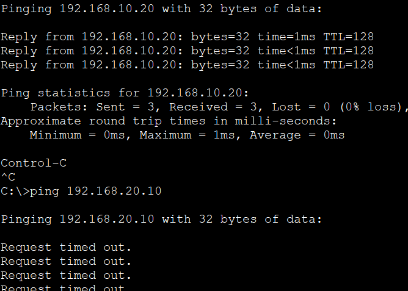

# Basic VLAN Configuration

In this lab, I configured two Virtual Local Area Networks (VLANs) on a single Layer 2 switch to understand how VLANs logically segment a network into separate broadcast domains.

Although all devices are connected to the same physical switch, hosts assigned to different VLANs cannot communicate with each other without Layer 3 routing. This lab serves as my introduction to VLANs and establishes the foundation for future labs involving trunking, inter-VLAN routing, DHCP, DNS, and NAT.

## Objective

Gain hands-on experience creating VLANs, assigning switch ports to VLANs, verifying VLAN membership, and understanding how VLANs isolate network traffic.

## Topology



## Network Overview

### VLAN 10

| Device | IP Address |
|---------|------------|
| PC0 | 192.168.10.10/24 |
| PC1 | 192.168.10.20/24 |

### VLAN 20

| Device | IP Address |
|---------|------------|
| PC2 | 192.168.20.10/24 |
| PC3 | 192.168.20.20/24 |

## Configuration Summary

Configured:

- Created VLAN 10 and VLAN 20
- Assigned switch access ports to their respective VLANs
- Configured static IP addresses on all hosts
- Verified VLAN membership
- Tested communication within and across VLANs

## Configuration Snippets

### Create VLANs

```cisco
vlan 10
 name USERS

vlan 20
 name SERVERS
```

### Assign Access Ports

```cisco
interface range FastEthernet0/1-2
 switchport mode access
 switchport access vlan 10

interface range FastEthernet0/3-4
 switchport mode access
 switchport access vlan 20
```

## Verification

### VLAN Database

`show vlan brief`



### Switchport Configuration

`show running-config`



### Connectivity Test

Verified the following connectivity:

- ✅ PC0 ↔ PC1 (Same VLAN)
- ✅ PC2 ↔ PC3 (Same VLAN)
- ❌ PC0 ↔ PC2 (Different VLANs)
- ❌ PC1 ↔ PC3 (Different VLANs)



## What I Learned

- Created and named VLANs on a Cisco Layer 2 switch.
- Assigned switch ports to specific VLANs using access mode.
- Verified VLAN membership using Cisco IOS commands.
- Confirmed that devices within the same VLAN can communicate directly.
- Observed that devices in different VLANs are isolated and cannot communicate without a Layer 3 device.
- Reinforced the concept that VLANs create separate Layer 2 broadcast domains while sharing the same physical switch.

## Files

- `Basic-VLAN-Configuration.pkt` — Cisco Packet Tracer lab
- `topology.png` — Network topology diagram
- `verification-vlan.png` — Output of `show vlan brief`
- `verification-switchport.png` — Output of `show interfaces switchport`
- `verification-ping.png` — Connectivity verification