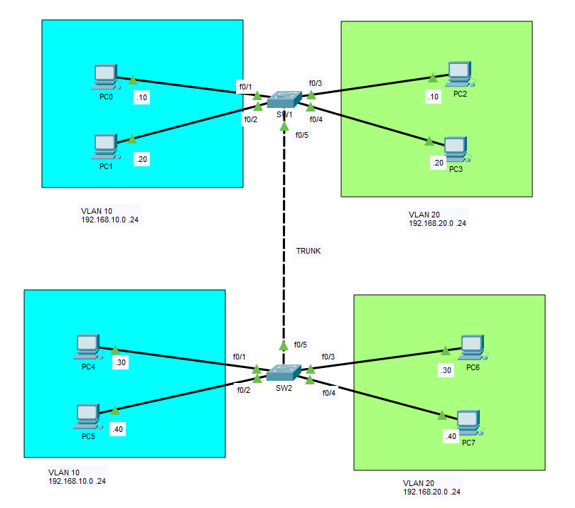
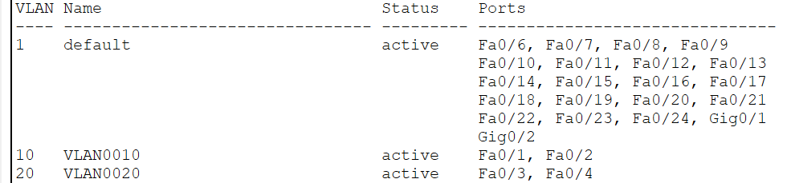
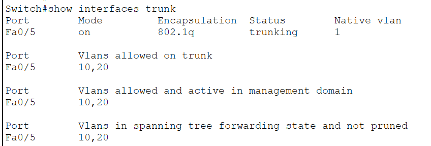
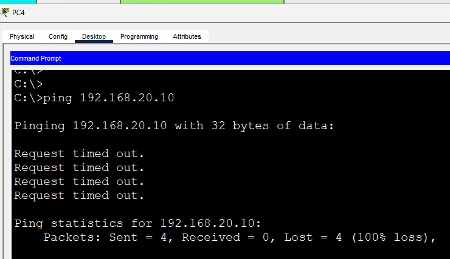

# VLAN Trunking (802.1Q)

In this lab, I configured an IEEE 802.1Q trunk link between two Layer 2 switches to allow multiple VLANs to traverse a single physical connection.

Without trunking, VLAN traffic would be confined to a single switch. By configuring a trunk port, VLAN information is preserved across the link, allowing devices in the same VLAN to communicate even when connected to different switches.

## Objective

Gain hands-on experience configuring an 802.1Q trunk, allowing multiple VLANs across a single link, and verifying communication between devices in the same VLAN located on different switches.

## Topology



## Network Overview

### VLAN 10

| Device | IP Address |
|---------|------------|
| PC0 | 192.168.10.10/24 |
| PC1 | 192.168.10.20/24 |
| PC4 | 192.168.10.30/24 |
| PC5 | 192.168.10.40/24 |

### VLAN 20

| Device | IP Address |
|---------|------------|
| PC2 | 192.168.20.10/24 |
| PC3 | 192.168.20.20/24 |
| PC6 | 192.168.20.30/24 |
| PC7 | 192.168.20.40/24 |

## Configuration Summary

Configured:

- Created VLAN 10 and VLAN 20 on both switches
- Assigned access ports to their respective VLANs
- Configured an IEEE 802.1Q trunk between SW1 and SW2
- Allowed only VLANs 10 and 20 across the trunk
- Verified end-to-end communication between hosts in the same VLAN

## Configuration Snippets

### Create VLANs

```cisco
vlan 10
 name USERS

vlan 20
 name SERVERS
```

### Configure Access Ports

```cisco
interface range FastEthernet0/1-2
 switchport mode access
 switchport access vlan 10

interface range FastEthernet0/3-4
 switchport mode access
 switchport access vlan 20
```

### Configure Trunk Port

Configured on **both switches**.

```cisco
interface FastEthernet0/5
 switchport mode trunk
 switchport trunk allowed vlan 10,20
```

## Verification

### Verify VLAN Database

`show vlan brief`



### Verify Trunk Status

`show interfaces trunk`



### Connectivity Test

Verified the following connectivity:

- ✅ PC0 ↔ PC4 (VLAN 10)
- ✅ PC1 ↔ PC5 (VLAN 10)
- ✅ PC2 ↔ PC6 (VLAN 20)
- ✅ PC3 ↔ PC7 (VLAN 20)

Communication between different VLANs was not possible because no Layer 3 routing device was present.

Examples:

- ❌ PC0 ↔ PC2
- ❌ PC4 ↔ PC6



## What I Learned

- Configured an IEEE 802.1Q trunk between two Cisco switches.
- Allowed multiple VLANs to traverse a single physical link.
- Verified trunk operation using Cisco IOS commands.
- Understood the difference between access ports and trunk ports.
- Confirmed that devices in the same VLAN can communicate across multiple switches through a trunk link.
- Reinforced that trunking extends VLANs between switches but does not provide inter-VLAN communication.


## Additional Notes

By default, Cisco trunk ports use VLAN 1 as the native VLAN. Frames belonging to the native VLAN are transmitted untagged unless configured otherwise.

This lab uses the default native VLAN configuration.

## Files

- `VLAN-Trunking-802.1Q.pkt` — Cisco Packet Tracer lab
- `topology.png` — Network topology diagram
- `verification-vlan.png` — Output of `show vlan brief`
- `verification-trunk.png` — Output of `show interfaces trunk`
- `verification-ping.png` — Connectivity verification

