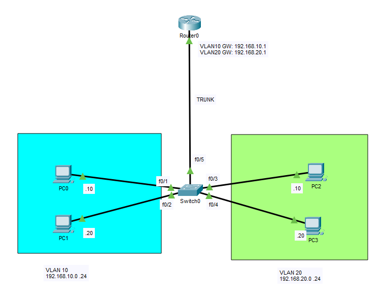
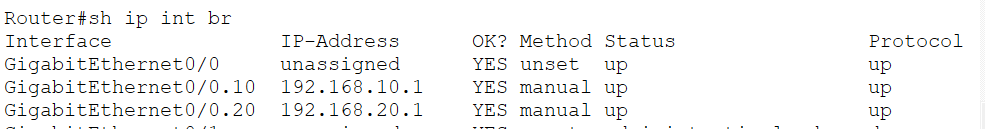
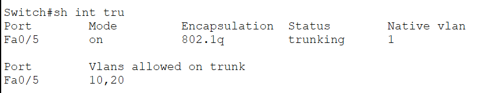
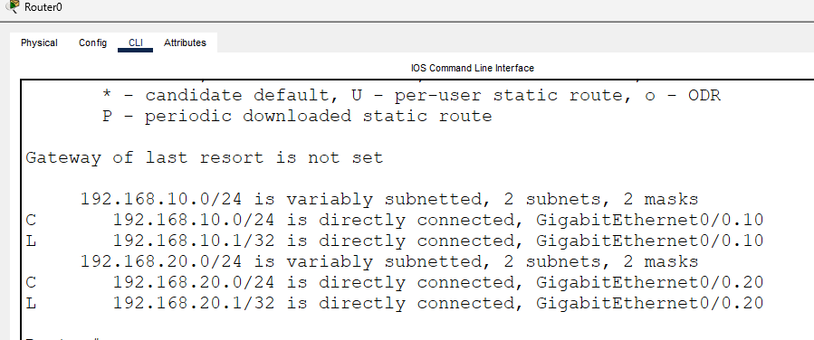
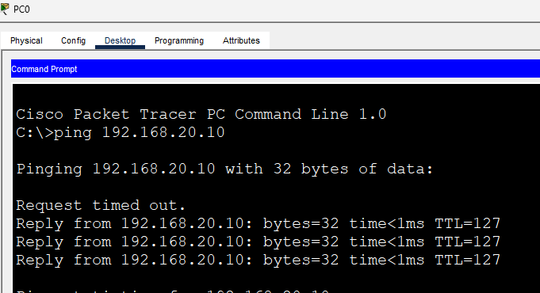

# Inter-VLAN Routing (Router-on-a-Stick)

In this lab, I configured **Inter-VLAN Routing using the Router-on-a-Stick (ROAS)** method. A single physical router interface was divided into multiple logical subinterfaces, allowing devices in different VLANs to communicate while sharing one trunk connection to the switch.

Router-on-a-Stick is a common solution for small to medium-sized networks where a Layer 3 switch is not available. It demonstrates how Layer 2 segmentation through VLANs is combined with Layer 3 routing to enable communication between separate broadcast domains.

## Objective

Gain hands-on experience configuring Router-on-a-Stick, creating router subinterfaces, enabling IEEE 802.1Q encapsulation, and verifying communication between different VLANs.

## Topology



## Network Overview

### VLAN 10

| Device | IP Address | Default Gateway |
|---------|------------|-----------------|
| Router G0/0.10 | 192.168.10.1/24 | - |
| PC0 | 192.168.10.10/24 | 192.168.10.1 |
| PC1 | 192.168.10.20/24 | 192.168.10.1 |

### VLAN 20

| Device | IP Address | Default Gateway |
|---------|------------|-----------------|
| Router G0/0.20 | 192.168.20.1/24 | - |
| PC2 | 192.168.20.10/24 | 192.168.20.1 |
| PC3 | 192.168.20.20/24 | 192.168.20.1 |

## Configuration Summary

Configured:

- VLAN 10 and VLAN 20
- Access ports for end devices
- IEEE 802.1Q trunk between the switch and router
- Router subinterfaces for each VLAN
- Default gateways for all hosts
- Inter-VLAN routing

## Configuration Snippets

### Switch Configuration

```cisco
interface FastEthernet0/5
 switchport mode trunk
 switchport trunk allowed vlan 10,20
```

### Router Configuration

```cisco
interface GigabitEthernet0/0
 no shutdown

interface GigabitEthernet0/0.10
 encapsulation dot1Q 10
 ip address 192.168.10.1 255.255.255.0

interface GigabitEthernet0/0.20
 encapsulation dot1Q 20
 ip address 192.168.20.1 255.255.255.0
```

## How Router-on-a-Stick Works

When a host sends traffic to a different VLAN, the frame is forwarded to the switch and sent across the trunk link to the router.

The router identifies the VLAN tag, processes the packet on the corresponding subinterface, performs Layer 3 routing, and forwards the packet back through the same trunk with the appropriate VLAN tag.

This allows multiple VLANs to share a single physical router interface while maintaining logical separation.

## Verification

### Verify Router Subinterfaces

`show ip interface brief`



### Verify Trunk Status

`show interfaces trunk`



### Verify Routing Table

`show ip route`



### Connectivity Test

Verified the following communication:

- ✅ PC0 ↔ PC1 (Same VLAN)
- ✅ PC2 ↔ PC3 (Same VLAN)
- ✅ PC0 ↔ PC2 (Inter-VLAN Routing)
- ✅ PC1 ↔ PC3 (Inter-VLAN Routing)



## What I Learned

- Configured Router-on-a-Stick using router subinterfaces.
- Applied IEEE 802.1Q encapsulation on router subinterfaces.
- Configured a trunk link between the switch and router.
- Assigned default gateways for hosts in different VLANs.
- Verified successful communication between separate VLANs through Layer 3 routing.
- Reinforced the relationship between VLAN segmentation, trunking, and inter-VLAN routing.

## Files

- `Router-on-a-Stick.pkt` — Cisco Packet Tracer lab
- `topology.png` — Network topology diagram
- `verification-router.png` — Output of `show ip interface brief`
- `verification-trunk.png` — Output of `show interfaces trunk`
- `verification-route.png` — Output of `show ip route`
- `verification-ping.png` — End-to-end connectivity verification