# VLAN Troubleshooting

In this lab, I intentionally introduced several common VLAN configuration issues and followed a structured troubleshooting process to identify, isolate, and resolve each problem.

Rather than focusing on configuration alone, this lab emphasizes the verification commands and logical workflow used to diagnose Layer 2 connectivity problems. These scenarios are representative of issues commonly encountered in enterprise environments and reinforce the importance of validating switch, trunk, and router configurations.

## Objective

Develop a systematic troubleshooting approach for identifying and resolving common VLAN and Inter-VLAN Routing issues using Cisco IOS verification commands.

## Topology

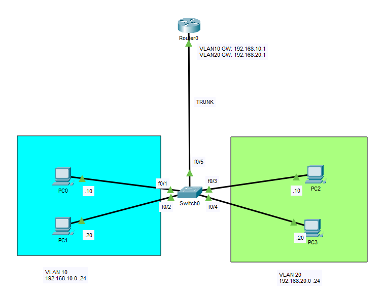

## Baseline Network

### VLAN 10

| Device | IP Address | Default Gateway |
|---------|------------|-----------------|
| PC0 | 192.168.10.10 | 192.168.10.1 |
| PC1 | 192.168.10.20 | 192.168.10.1 |

### VLAN 20

| Device | IP Address | Default Gateway |
|---------|------------|-----------------|
| PC2 | 192.168.20.10 | 192.168.20.1 |
| PC3 | 192.168.20.20 | 192.168.20.1 |

The baseline configuration is identical to the previous Router-on-a-Stick lab. Each troubleshooting scenario begins with a working network before introducing a single configuration error.

---

# Scenario 1 – Incorrect VLAN Assignment

## Problem

PC0 was accidentally assigned to VLAN 20 instead of VLAN 10.

### Incorrect Configuration

```cisco
interface FastEthernet0/1
 switchport access vlan 20
```

Expected configuration:

```cisco
interface FastEthernet0/1
 switchport access vlan 10
```

## Symptoms

- PC0 cannot communicate with PC1.
- PC0 unexpectedly communicates with VLAN 20 hosts.
- Inter-VLAN communication behaves unexpectedly.

## Investigation

### Verify VLAN Membership

```cisco
show vlan brief
```

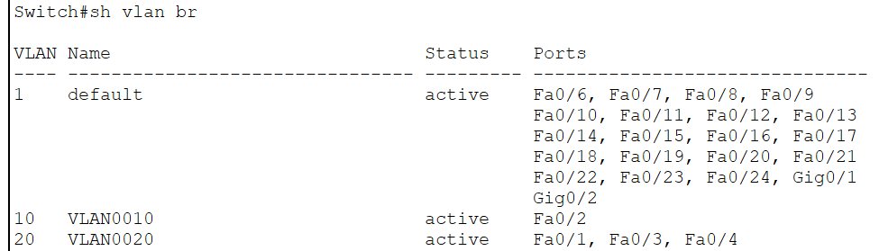

### Verify Switchport

```cisco
show interfaces FastEthernet0/1 switchport
```

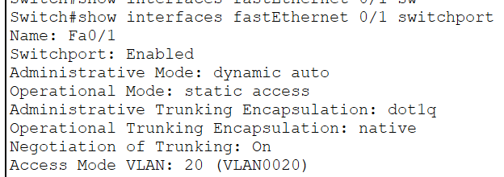

## Resolution

```cisco
interface FastEthernet0/1
 switchport access vlan 10
```

---

# Scenario 2 – Trunk Misconfiguration

## Problem

The switch uplink to the router was mistakenly configured as an access port.

### Incorrect Configuration

```cisco
interface FastEthernet0/5
 switchport mode access
```

Expected configuration:

```cisco
interface FastEthernet0/5
 switchport mode trunk
 switchport trunk allowed vlan 10,20
```

## Symptoms

- Devices communicate within the same VLAN.
- Inter-VLAN routing no longer works.
- Default gateways become unreachable.

## Investigation

### Verify Trunk Status

```cisco
show interfaces trunk
```

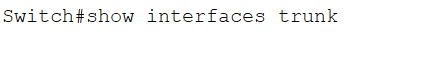

### Verify Switchport Mode

```cisco
show interfaces FastEthernet0/5 switchport
```

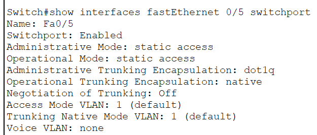

## Resolution

```cisco
interface FastEthernet0/5
 switchport mode trunk
 switchport trunk allowed vlan 10,20
```

---

# Scenario 3 – Missing Router Subinterface

## Problem

The router subinterface for VLAN 20 was removed.

### Incorrect Configuration

```cisco
! interface GigabitEthernet0/0.20
! encapsulation dot1Q 20
! ip address 192.168.20.1 255.255.255.0
```

## Symptoms

- VLAN 20 hosts cannot reach their default gateway.
- VLAN 10 continues to operate normally.
- Inter-VLAN communication fails only for VLAN 20.

## Investigation

### Verify Router Interfaces

```cisco
show ip interface brief
```

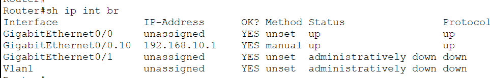

### Verify Running Configuration

```cisco
show running-config
```

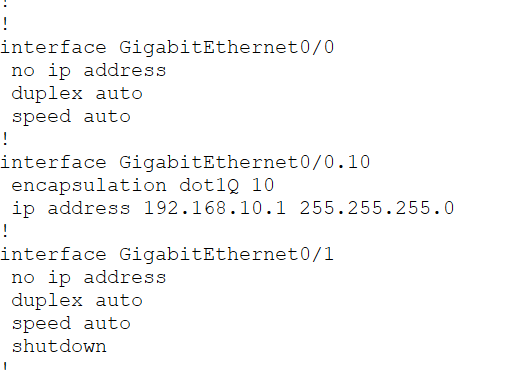

### Verify Routing Table

```cisco
show ip route
```

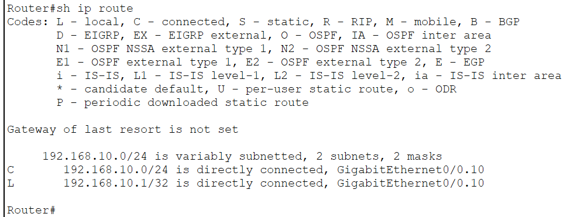

## Resolution

```cisco
interface GigabitEthernet0/0.20
 encapsulation dot1Q 20
 ip address 192.168.20.1 255.255.255.0
```

---

# End-to-End Connectivity Verification

After resolving each troubleshooting scenario, I verified connectivity from the perspective of an end user.

### 1. Verify Default Gateway Reachability

The first step was to confirm that PC0 could successfully reach its configured default gateway.

`ping 192.168.10.1`

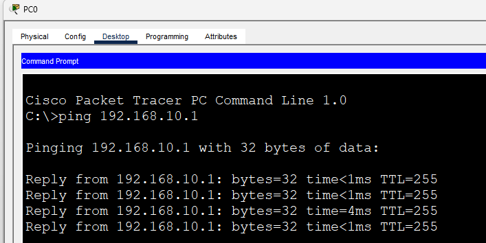

---

### 2. Verify Same VLAN Connectivity

Next, I verified communication between two hosts within the same VLAN.

`ping 192.168.10.20`

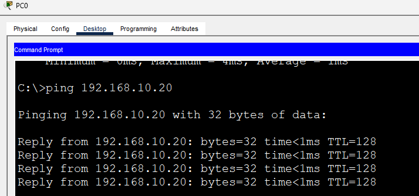

---

### 3. Verify Inter-VLAN Connectivity

Finally, I verified that Inter-VLAN Routing was functioning correctly by pinging a host in VLAN 20.

`ping 192.168.20.10`

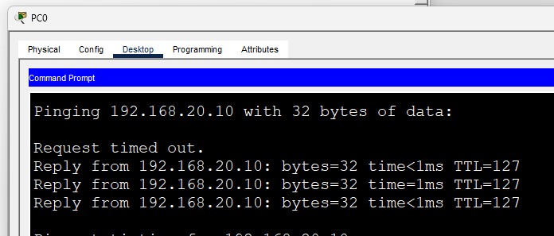

---

All connectivity tests completed successfully after the configuration issues were corrected.

- ✅ PC0 → Default Gateway (192.168.10.1)
- ✅ PC0 → PC1 (Same VLAN)
- ✅ PC0 → PC2 (Different VLAN via Router-on-a-Stick)

---

# Troubleshooting Workflow

For every issue, I followed the same methodology:

1. Identify the symptoms.
2. Verify end-to-end connectivity using `ping`.
3. Verify VLAN membership.
4. Verify switchport configuration.
5. Verify trunk status.
6. Verify router subinterfaces.
7. Apply the correction.
8. Confirm the issue has been resolved.

---

# IOS Verification Commands Used

```cisco
show vlan brief

show interfaces trunk

show interfaces switchport

show ip interface brief

show ip route

show running-config
```

---

# What I Learned

- Diagnosed common VLAN configuration mistakes using Cisco IOS verification commands.
- Distinguished between access port, trunk, and router configuration issues.
- Followed a structured troubleshooting methodology instead of relying on trial and error.
- Reinforced that many connectivity problems originate from small Layer 2 configuration errors.
- Improved confidence troubleshooting VLAN and Inter-VLAN Routing issues commonly encountered in enterprise environments.

---

# Files

- `VLAN-Troubleshooting.pkt` — Cisco Packet Tracer lab
- `topology.png` — Network topology
- `scenario1-vlan.png`
- `scenario1-switchport.png`
- `scenario2-trunk.png`
- `scenario2-switchport.png`
- `scenario3-interface.png`
- `scenario3-running.png`
- `scenario3-route.png`
- `verification-final.png`