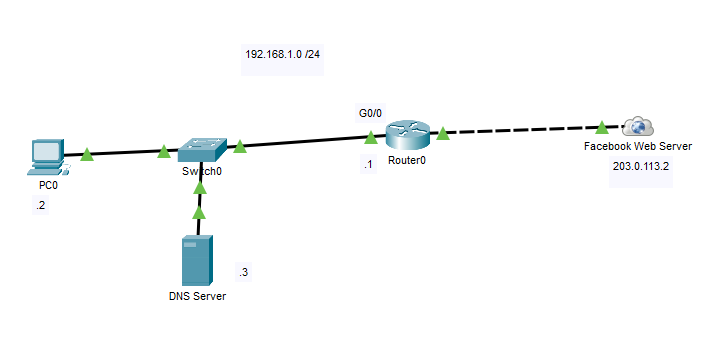
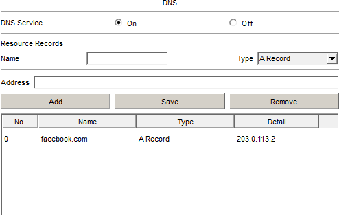
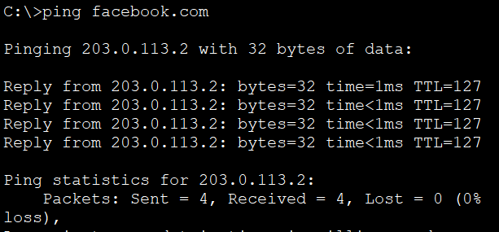

# Basic DNS

In this lab, I configured a **Domain Name System (DNS)** server to resolve a domain name to the IP address of a web server. Instead of accessing the web server using its IP address, the client accesses it using the domain name **facebook.com**, demonstrating how DNS translates human-readable names into IP addresses.

## Objective

Gain hands-on experience configuring a DNS server, creating DNS records, and verifying successful hostname resolution to a web server.

## Topology



## IP Addressing

| Device | Interface | IP Address |
|---------|-----------|------------|
| PC0 | NIC | 192.168.1.2/24 |
| Router0 | G0/0 | 192.168.1.1/24 |
| DNS Server | NIC | 192.168.1.3/24 |
| Facebook Web Server | NIC | 203.0.113.2/24 |

## Configuration

### DNS Server

- Enabled the DNS service.
- Created an **A Record** mapping the domain name to the web server.

```text
facebook.com  →  203.0.113.2
```

### Web Server

- Enabled the HTTPS service.
- Hosted a simple static webpage.

### Client

- Configured the DNS server address as **192.168.1.3**.

## Verification

### DNS Records



### Name Resolution

`ping facebook.com`



### Web Browser

`https://facebook.com`


## What I Learned

- Configured a DNS server to resolve domain names to IP addresses.
- Created and verified DNS A records.
- Configured a client to use a DNS server for name resolution.
- Verified successful access to a web server using a domain name instead of an IP address.
- Reinforced how DNS simplifies access to network resources by translating names into IP addresses.

## Files

- `Basic-DNS.pkt` — Cisco Packet Tracer lab
- `topology.png` — Network topology diagram
- `verification-dns.png` — DNS server configuration
- `verification-ping.png` — Name resolution verification
- `verification-browser.png` — Browser accessing the website using the domain name