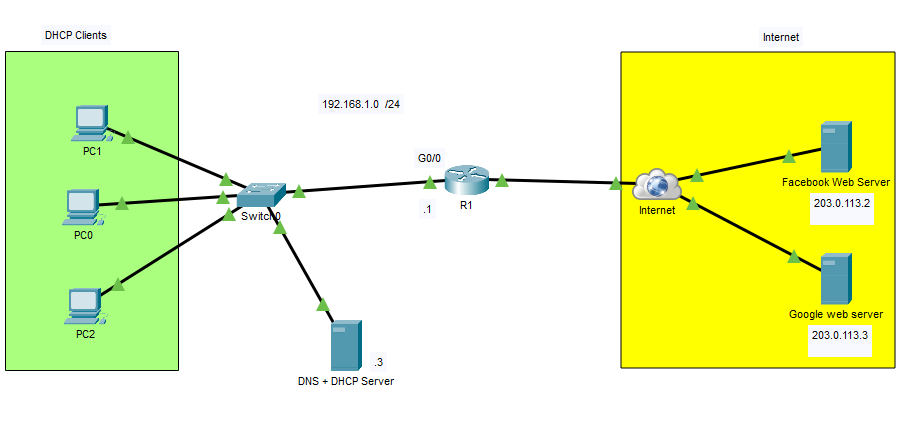
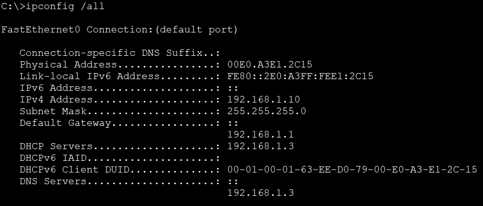
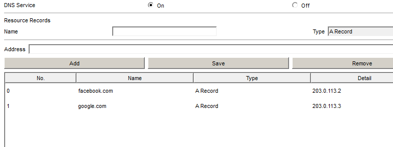
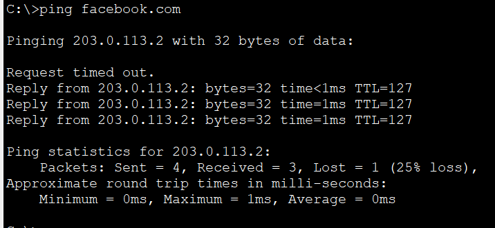
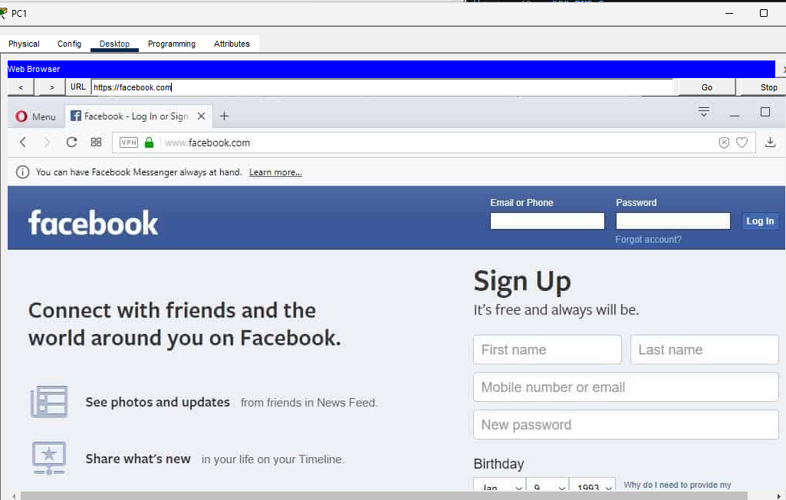
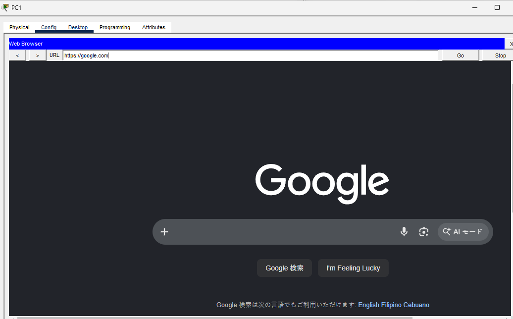

# DNS + DHCP Integration

In this lab, I configured a server to provide both **DHCP** and **DNS** services for multiple client devices. The clients automatically obtain their IP configuration from the DHCP server, including the DNS server address, allowing them to access web services using domain names instead of IP addresses.

This lab reflects a common enterprise scenario where users report that they **cannot access websites or the Internet**. In many cases, the root cause is not Internet connectivity itself, but an issue with DHCP or DNS. By integrating both services into a single lab, I gained hands-on experience configuring, verifying, and troubleshooting two of the most fundamental network services used in enterprise environments.

## Objective

Gain hands-on experience configuring DHCP and DNS services, verify automatic client configuration, and understand how these services work together to provide seamless network connectivity.

## Topology



## IP Addressing

| Device | Interface | IP Address |
|---------|-----------|------------|
| R1 | G0/0 | 192.168.1.1/24 |
| DNS + DHCP Server | NIC | 192.168.1.3/24 |
| Facebook Web Server | NIC | 203.0.113.2 |
| Google Web Server | NIC | 203.0.113.3 |
| PC0 | DHCP Client | Assigned via DHCP |
| PC1 | DHCP Client | Assigned via DHCP |
| PC2 | DHCP Client | Assigned via DHCP |

## Configuration

### DHCP Server

Configured a DHCP pool with:

- Network address
- Subnet mask
- Default gateway
- DNS server
- Starting IP address
- Maximum number of users

### DNS Server

Configured DNS A Records:

```text
facebook.com  →  203.0.113.2
google.com    →  203.0.113.3
```

### Clients

Configured all client PCs to obtain their network settings automatically using DHCP.

## Verification

### DHCP Lease

`ipconfig /all`



### DNS Configuration



### Name Resolution

`ping facebook.com`



### Browser

`https://facebook.com`



`https://google.com`



## What I Learned

- Configured a DHCP server to automatically assign IP addresses and network parameters.
- Configured a DNS server to resolve domain names into IP addresses.
- Verified that DHCP correctly distributes the DNS server address to clients.
- Confirmed successful access to web services using domain names instead of IP addresses.
- Reinforced how DHCP and DNS work together to provide seamless network connectivity.
- Practiced validating DHCP leases and DNS resolution, two of the first services to verify when troubleshooting enterprise user connectivity issues.

## Files

- `DNS + DHCP.pkt` — Cisco Packet Tracer lab
- `topology.png` — Network topology diagram
- `verification-dhcp.png` — DHCP lease verification
- `verification-dns.png` — DNS server configuration
- `verification-ping.png` — Name resolution verification
- `verification-facebook.png` — Browser accessing Facebook by domain name
- `verification-google.png` — Browser accessing Google by domain name