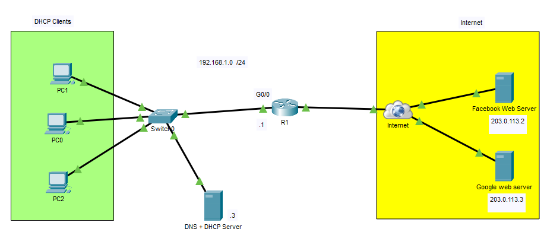
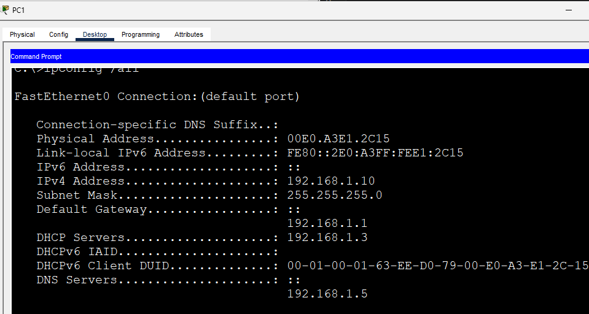
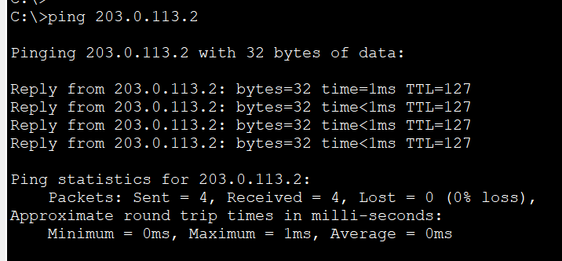
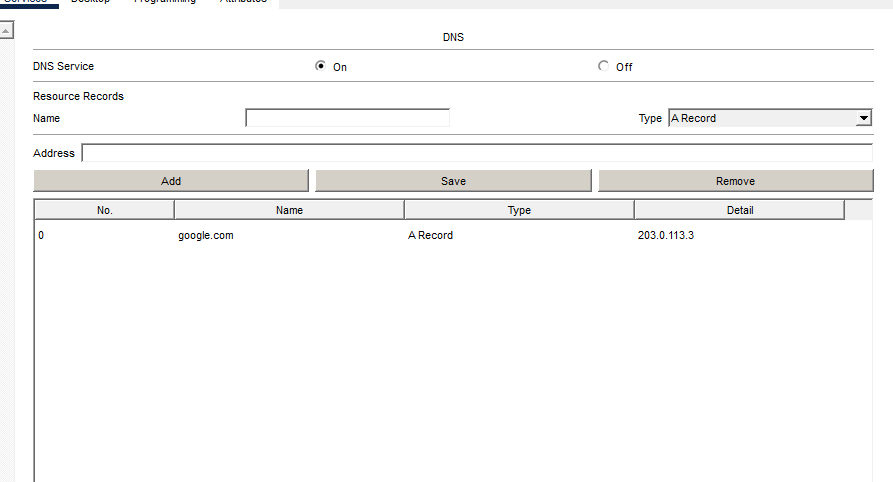
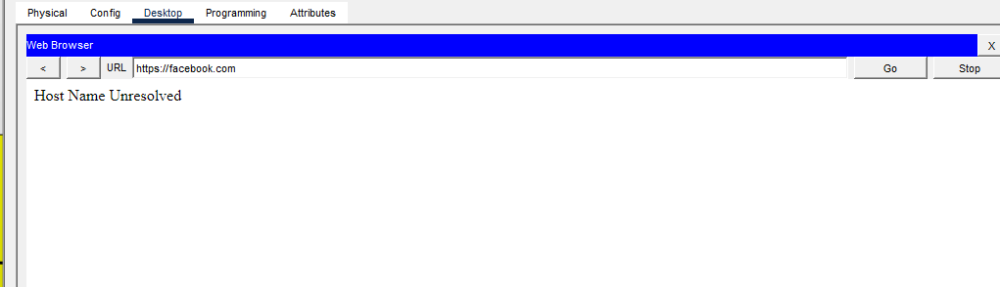
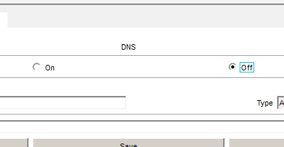

# DNS Troubleshooting

In this lab, I intentionally introduced common DNS-related misconfigurations and followed a structured troubleshooting process to restore connectivity. While users may report that they "cannot access the Internet," the root cause is often a DNS issue rather than a loss of network connectivity.

Using the same topology as the previous lab, I simulated realistic enterprise scenarios where clients were unable to reach websites due to DNS configuration problems. Each scenario focuses on identifying the root cause using verification commands and restoring normal operation.

## Objective

Practice troubleshooting common DNS issues by verifying IP connectivity, DHCP configuration, DNS settings, and hostname resolution using Cisco Packet Tracer.

## Topology

---

# Scenario 1: Incorrect DNS Server Address

## Problem

The client successfully obtained an IP address through DHCP, but the configured DNS server address was incorrect.

## Symptoms

- Client receives a valid DHCP lease.
- Can ping the default gateway.
- Can ping the web server by IP address.
- Cannot access `facebook.com`.

## Verification

`ipconfig /all`

`ping 203.0.113.2`

`ping facebook.com`

## Resolution

Updated the client's DNS server address to the correct DNS server and verified successful hostname resolution.

---

# Scenario 2: Missing DNS Record

## Problem

The DNS server was operational, but the **facebook.com** A record was missing.

## Symptoms

- Client receives a valid DHCP lease.
- DNS server is reachable.
- Web server is online.
- Hostname resolution fails.

## Verification

DNS Records

`ping facebook.com`

Browser

## Resolution

Created the missing DNS A record mapping **facebook.com** to the web server's IP address and verified successful name resolution.

---

# Scenario 3: DNS Service Disabled

## Problem

The DNS service on the server was disabled.

## Symptoms

- DHCP continues to function normally.
- Clients receive valid IP addresses.
- IP connectivity remains functional.
- All hostname resolution fails.

## Verification

DNS Service

`ping facebook.com`

Browser

## Resolution

Enabled the DNS service and confirmed that clients could once again resolve domain names and access websites.

---

## Troubleshooting Workflow

For each scenario, I followed the same troubleshooting methodology:

1. Verify the client received a valid DHCP lease.
2. Confirm the default gateway is reachable.
3. Verify connectivity to the web server using its IP address.
4. Test hostname resolution.
5. Inspect the DNS server configuration.
6. Apply the necessary fix and verify connectivity.

## What I Learned

- Verified DHCP leases before investigating DNS-related issues.
- Distinguished between IP connectivity problems and DNS resolution failures.
- Identified common DNS misconfigurations encountered in enterprise environments.
- Used Cisco IOS and client verification tools to isolate and resolve DNS issues.
- Reinforced a systematic troubleshooting approach for resolving user reports of being unable to access websites.

## Files

- `DNS Troubleshooting.pkt` — Cisco Packet Tracer lab
- `topology.png` — Network topology diagram
- `scenario1-ipconfig.png`
- `scenario1-ping-ip.png`
- `scenario1-ping-hostname.png`
- `scenario2-dns-record.png`
- `scenario2-ping.png`
- `scenario2-browser.png`
- `scenario3-dns-off.png`
- `scenario3-ping.png`
- `scenario3-browser.png`