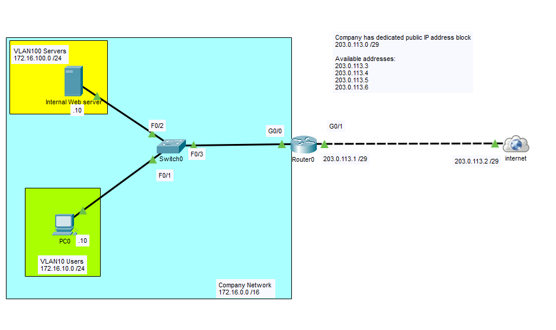
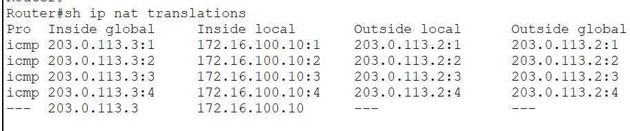
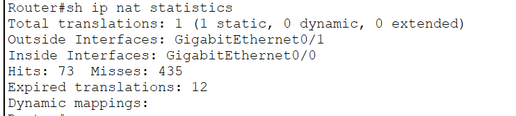
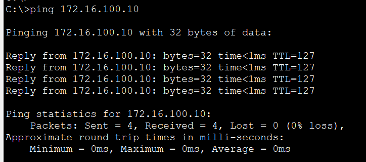

# Static NAT

In this lab, I configured **Static Network Address Translation (Static NAT)** to provide a permanent one-to-one mapping between an internal web server and a dedicated public IP address.

To better reflect a real-world enterprise environment, the internal network is segmented into separate **User** and **Server VLANs** using a **Router-on-a-Stick (ROAS)** design. The router performs both inter-VLAN routing and Static NAT, allowing internal users to communicate with the server while simultaneously publishing the web server to external networks using a public IP address.

## Objective

Gain hands-on experience configuring Static NAT in a Router-on-a-Stick topology, verify one-to-one address translations, and understand how enterprise networks securely expose internal services to the Internet.

## Topology



## Network Overview

### VLAN 10 - Users

| Device | Interface | IP Address |
|---------|-----------|------------|
| Router0 | G0/0.10 | 172.16.10.1/24 |
| PC0 | NIC | 172.16.10.10/24 |

### VLAN 100 - Servers

| Device | Interface | IP Address |
|---------|-----------|------------|
| Router0 | G0/0.100 | 172.16.100.1/24 |
| Internal Web Server | NIC | 172.16.100.10/24 |

### Public Network

| Device | Interface | IP Address |
|---------|-----------|------------|
| Router0 | G0/1 | 203.0.113.1/29 |
| Internet | G0/0 | 203.0.113.2/29 |

### Public IP Block

The company owns the public subnet **203.0.113.0/29**, providing several usable public IP addresses for publishing internal services.

Available public IP addresses:

- 203.0.113.3
- 203.0.113.4
- 203.0.113.5
- 203.0.113.6

In this lab, **203.0.113.3** is permanently mapped to the internal web server using Static NAT.

## Configuration Summary

Configured:

- Router-on-a-Stick (802.1Q Subinterfaces)
- VLAN 10 for user devices
- VLAN 100 for internal servers
- Inter-VLAN Routing
- NAT Inside and Outside interfaces
- Static NAT mapping between the internal web server and a dedicated public IP address

### Static NAT Mapping

```text
Inside Local
172.16.100.10

↓

Inside Global
203.0.113.3
```

## Verification

### Static NAT Translation

`show ip nat translations`



### NAT Statistics

`show ip nat statistics`



### Internal Access

Verified that users within the enterprise network can access the web server using its private IP address.



### External Access

Verified that external users can access the same web server using its assigned public IP address.


## What I Learned

- Configured Router-on-a-Stick to provide inter-VLAN routing.
- Segmented users and servers into separate VLANs.
- Configured Static NAT to create a permanent one-to-one address translation.
- Distinguished between **Inside Local** and **Inside Global** addresses.
- Configured NAT inside and outside interfaces.
- Verified Static NAT translations using Cisco IOS verification commands.
- Reinforced how organizations publish internal services while keeping private IP addresses hidden from external networks.

## Files

- `Static-NAT.pkt` — Cisco Packet Tracer lab
- `topology.png` — Network topology diagram
- `verification-translation.png` — NAT translation table
- `verification-statistics.png` — NAT statistics
- `verification-inside.png` — Internal access verification
- `verification-outside.png` — External access verification