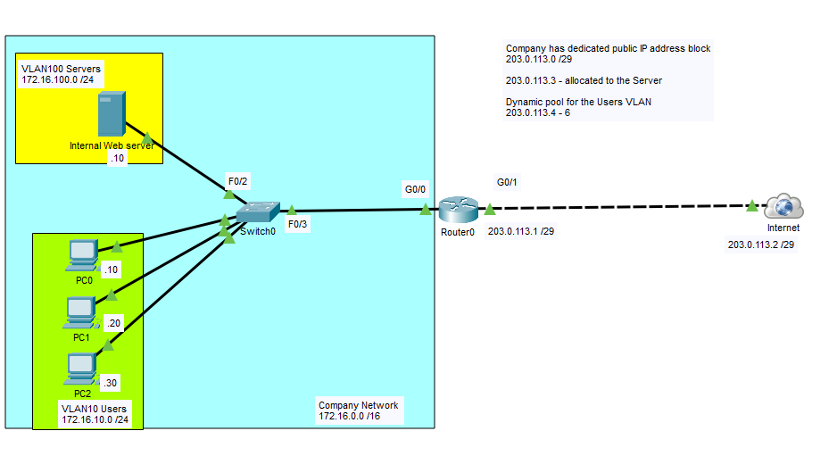
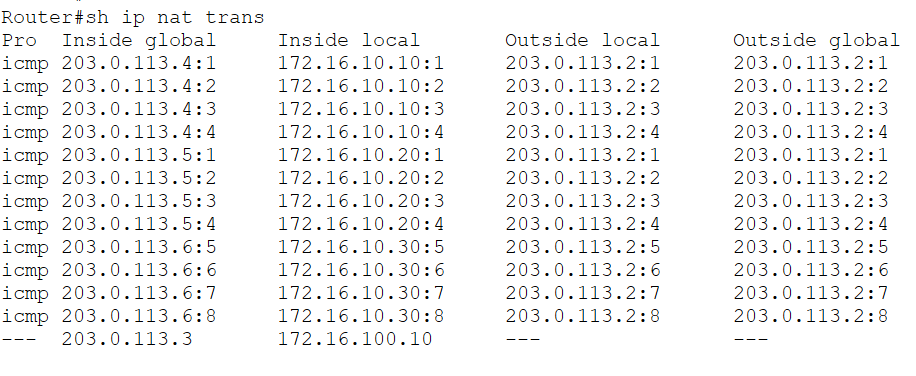
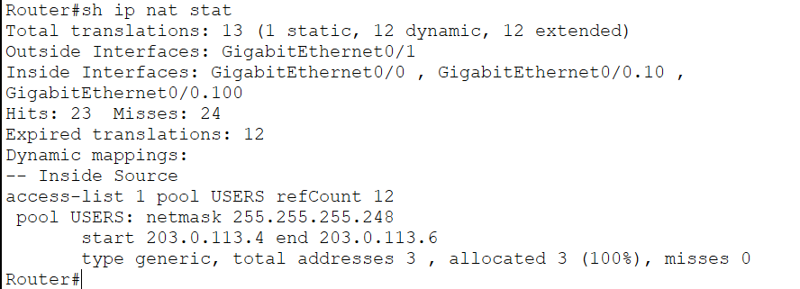
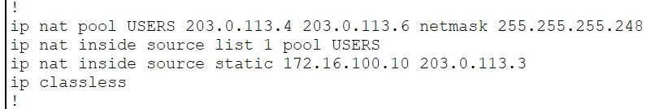
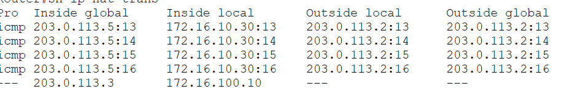

# Dynamic NAT

In this lab, I configured **Dynamic Network Address Translation (Dynamic NAT)** to allow multiple internal hosts to access external networks using a pool of public IP addresses. Unlike Static NAT, where a public IP address is permanently assigned to a specific device, Dynamic NAT temporarily assigns an available public IP address from a configured pool whenever an inside host initiates communication.

This lab uses the same **Router-on-a-Stick (ROAS)** topology as the Static NAT lab. Internal users are placed in a separate VLAN from the server, while the router performs inter-VLAN routing and Dynamic NAT for outbound traffic. The internal web server continues to use a dedicated Static NAT mapping, while client PCs dynamically receive public IP addresses from the available pool.

## Objective

Gain hands-on experience configuring Dynamic NAT, creating a public IP address pool, verifying address translations, and understanding how public IP addresses are temporarily assigned to internal hosts.

## Topology



## Network Overview

### VLAN 10 - Users

| Device | Interface | IP Address |
|---------|-----------|------------|
| Router0 | G0/0.10 | 172.16.10.1/24 |
| PC0 | NIC | 172.16.10.10/24 |
| PC1 | NIC | 172.16.10.11/24 |
| PC2 | NIC | 172.16.10.12/24 |

### VLAN 100 - Servers

| Device | Interface | IP Address |
|---------|-----------|------------|
| Router0 | G0/0.100 | 172.16.100.1/24 |
| Internal Web Server | NIC | 172.16.100.10/24 |

### Public Network

| Device | Interface | IP Address |
|---------|-----------|------------|
| Router0 | G0/1 | 203.0.113.1/29 |
| Internet | Cloud | 203.0.113.2/29 |

### Public IP Allocation

| Public IP | Purpose |
|------------|---------|
| 203.0.113.3 | Static NAT for Internal Web Server |
| 203.0.113.4 | Dynamic NAT Pool |
| 203.0.113.5 | Dynamic NAT Pool |
| 203.0.113.6 | Dynamic NAT Pool |

## Configuration Summary

Configured:

- Router-on-a-Stick (802.1Q Subinterfaces)
- VLAN 10 for client devices
- VLAN 100 for internal servers
- Inter-VLAN Routing
- NAT Inside and Outside interfaces
- Dynamic NAT Pool
- Standard ACL to identify inside local addresses
- Dynamic NAT translation using the configured address pool

### Dynamic NAT Pool

```text
Pool Name: USERS

Start Address : 203.0.113.4
End Address   : 203.0.113.6
Subnet Mask   : 255.255.255.248
```

### Address Translation

```text
Inside Local                 Inside Global

172.16.10.10   --------->    203.0.113.4

172.16.10.11   --------->    203.0.113.5

172.16.10.12   --------->    203.0.113.6
```

> Public IP addresses are assigned dynamically when traffic is initiated and returned to the pool once no longer in use.

## Verification

### Dynamic NAT Translations

`show ip nat translations`



### NAT Statistics

`show ip nat statistics`



### Dynamic NAT Pool

`show running-config`



### End-to-End Connectivity

Verified that all internal clients were able to reach external networks using dynamically assigned public IP addresses.



## What I Learned

- Configured Dynamic NAT using a pool of public IP addresses.
- Used a standard ACL to identify traffic eligible for NAT.
- Distinguished between **Inside Local** and **Inside Global** addresses.
- Verified Dynamic NAT translations using Cisco IOS verification commands.
- Observed how public IP addresses are temporarily assigned to internal hosts during communication.
- Compared the behavior of Dynamic NAT with Static NAT and understood when each translation method is appropriate.

## Files

- `Dynamic NAT.pkt` — Cisco Packet Tracer lab
- `topology.png` — Network topology diagram
- `verification-translation.png` — Dynamic NAT translation table
- `verification-statistics.png` — NAT statistics
- `verification-config.png` — Dynamic NAT configuration
- `verification-ping.png` — End-to-end connectivity verification