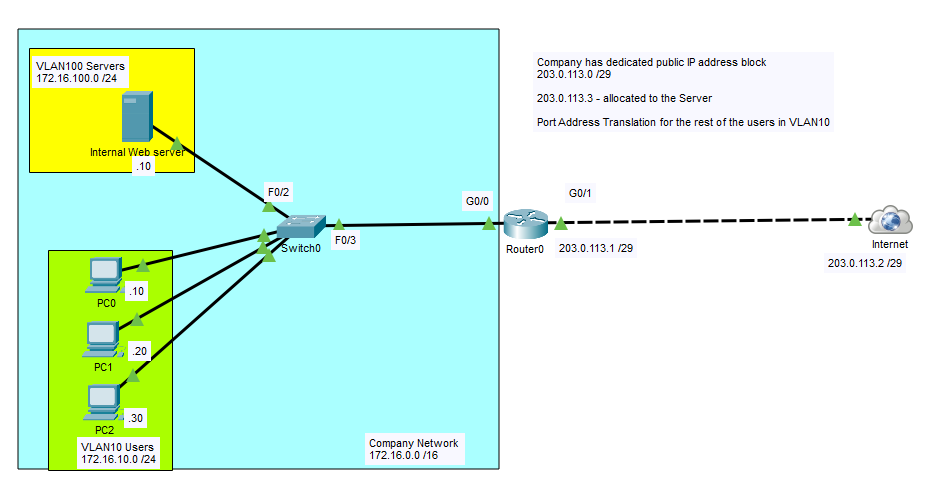
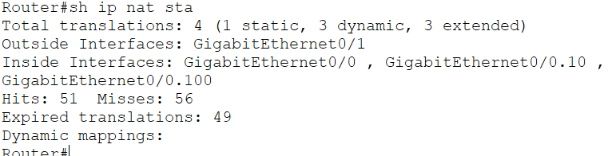
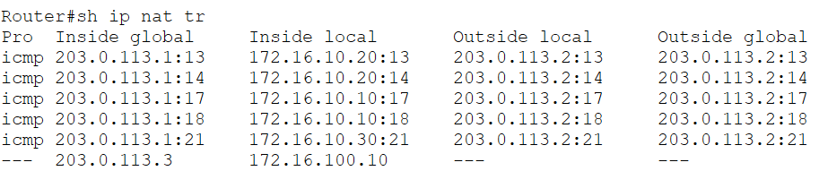

# PAT (NAT Overload)

In this lab, I configured **Port Address Translation (PAT)**, also known as **NAT Overload**, to allow multiple internal hosts to simultaneously access external networks while sharing a single public IP address.

PAT is the most commonly deployed form of Network Address Translation in **SOHO (Small Office/Home Office)** networks and is also widely used in enterprise environments for outbound Internet access. Instead of assigning a unique public IP address to every device, PAT translates multiple private IP addresses into a single public IP by using unique source port numbers.

This lab builds upon the previous Static NAT and Dynamic NAT labs. The internal web server continues to use a dedicated Static NAT mapping, while client devices in the user VLAN share the router's public interface address through PAT.

## Objective

Gain hands-on experience configuring PAT (NAT Overload), verify port-based address translations, and understand how multiple internal hosts can simultaneously share a single public IP address.

## Topology



## Network Overview

### VLAN 10 - Users

| Device | Interface | IP Address |
|---------|-----------|------------|
| Router0 | G0/0.10 | 172.16.10.1/24 |
| PC0 | NIC | 172.16.10.10/24 |
| PC1 | NIC | 172.16.10.20/24 |
| PC2 | NIC | 172.16.10.30/24 |

### VLAN 100 - Servers

| Device | Interface | IP Address |
|---------|-----------|------------|
| Router0 | G0/0.100 | 172.16.100.1/24 |
| Internal Web Server | NIC | 172.16.100.10/24 |

### Public Network

| Device | Interface | IP Address |
|---------|-----------|------------|
| Router0 | G0/1 | 203.0.113.1/29 |
| Internet | Cloud | 203.0.113.2/29 |

### Public IP Allocation

| Public IP | Purpose |
|------------|---------|
| 203.0.113.3 | Static NAT for Internal Web Server |
| 203.0.113.1 | PAT (NAT Overload) for Internal Users |

## Configuration Summary

Configured:

- Router-on-a-Stick (802.1Q Subinterfaces)
- VLAN 10 for client devices
- VLAN 100 for internal servers
- Inter-VLAN Routing
- NAT Inside and Outside interfaces
- Standard ACL to identify inside local addresses
- PAT (NAT Overload) using the router's public interface address

> **Note:** This lab builds upon the previous Dynamic NAT lab. The Dynamic NAT pool was removed and replaced with PAT (NAT Overload), allowing all internal users to share the router's public IP address for outbound Internet access.

## Configuration Snippets

### Configure NAT Interfaces

```cisco
interface GigabitEthernet0/0.10
 ip nat inside

interface GigabitEthernet0/0.100
 ip nat inside

interface GigabitEthernet0/1
 ip nat outside
```

### Configure Access List

```cisco
access-list 1 permit 172.16.10.0 0.0.0.255
```

### Configure PAT (NAT Overload)

```cisco
ip nat inside source list 1 interface GigabitEthernet0/1 overload
```

### Static NAT for the Internal Web Server

```cisco
ip nat inside source static 172.16.100.10 203.0.113.3
```

## How PAT Works

Unlike Dynamic NAT, where each internal host temporarily receives a unique public IP address from a pool, PAT allows all internal hosts to share a single public IP address. Each connection is uniquely identified using a different source port number.

### Example Translation

```text
Inside Local                 Inside Global

172.16.10.10:1025  ----->  203.0.113.1:30001

172.16.10.20:1025  ----->  203.0.113.1:30002

172.16.10.30:1025  ----->  203.0.113.1:30003
```

Although all three clients share **203.0.113.1**, PAT keeps each session unique by assigning a different source port.

## Verification

### PAT Translation Table

`show ip nat translations`


### NAT Statistics

`show ip nat statistics`



### End-to-End Connectivity

Verified that multiple internal hosts were able to simultaneously access external networks while sharing the router's public IP address.



## What I Learned

- Configured PAT (NAT Overload) using a single public IP address.
- Used a standard ACL to identify traffic eligible for translation.
- Configured NAT inside and outside interfaces in a Router-on-a-Stick topology.
- Verified PAT translations using Cisco IOS verification commands.
- Observed how multiple hosts can simultaneously share one public IP through unique source port numbers.
- Compared PAT with Static NAT and Dynamic NAT, and understood why PAT is the preferred NAT solution for Internet access in most modern SOHO and enterprise networks.
- Reinforced how PAT helps conserve public IPv4 addresses while maintaining simultaneous connectivity for multiple devices.

## Files

- `PAT-NAT-Overload.pkt` — Cisco Packet Tracer lab
- `topology.png` — Network topology diagram
- `verification-translation.png` — PAT translation table
- `verification-statistics.png` — NAT statistics
- `verification-ping.png` — End-to-end connectivity verification