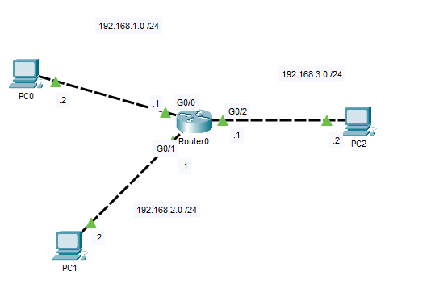
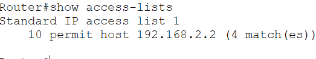
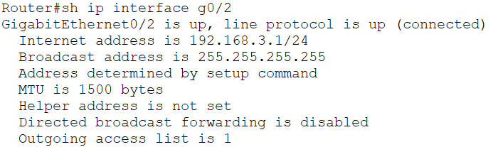
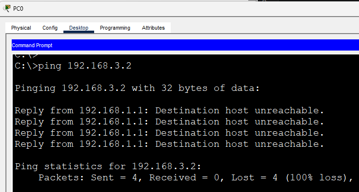
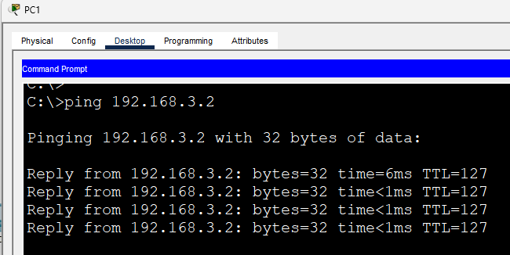
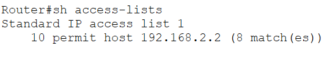

# Standard ACL

This lab demonstrates the basic implementation of a **Standard Access Control List (ACL)** using Cisco IOS.

Standard ACLs filter traffic based solely on the **source IPv4 address**, making them suitable for simple traffic filtering scenarios. In this lab, only **PC1** is permitted to communicate with **PC2**, while traffic originating from **PC0** is denied.

This introduces the fundamental concepts of ACL creation, interface application, implicit deny behavior, and verification.

## Objective

Configure a Standard ACL that:

- Permits PC1 to access PC2.
- Denies PC0 from accessing PC2.
- Demonstrates the implicit deny statement in Cisco ACLs.

## Topology



## Addressing

| Device | IP Address | Default Gateway |
|---------|------------|-----------------|
| PC0 | 192.168.1.2 | 192.168.1.1 |
| PC1 | 192.168.2.2 | 192.168.2.1 |
| PC2 | 192.168.3.2 | 192.168.3.1 |

---

# Configuration

## Router Interfaces

```cisco
interface GigabitEthernet0/0
 ip address 192.168.1.1 255.255.255.0
 no shutdown

interface GigabitEthernet0/1
 ip address 192.168.2.1 255.255.255.0
 no shutdown

interface GigabitEthernet0/2
 ip address 192.168.3.1 255.255.255.0
 no shutdown
```

## Standard ACL

```cisco
access-list 1 permit host 192.168.2.2

interface GigabitEthernet0/2
 ip access-group 1 out
```

The ACL permits traffic originating from **PC1** while all other traffic is denied by the implicit `deny any` statement.

---

# Verification

## Verify ACL

```cisco
show access-lists
```



---

## Verify Interface

```cisco
show ip interface GigabitEthernet0/2
```



---

# End-to-End Connectivity Verification

### 1. PC0 attempting to reach PC2

Traffic from PC0 should be denied.

```text
ping 192.168.3.2
```



---

### 2. PC1 successfully reaching PC2

Traffic from PC1 should be permitted.

```text
ping 192.168.3.2
```



---

### 3. Verify ACL Hit Counters

After generating traffic, verify that the ACL counters increase.

```cisco
show access-lists
```



---

# IOS Verification Commands Used

```cisco
show access-lists

show ip interface

show running-config
```

---

# What I Learned

- Configured a Standard IPv4 ACL using Cisco IOS.
- Applied an ACL to an outbound router interface.
- Understood that Standard ACLs filter traffic based only on the source IP address.
- Observed the implicit `deny any` behavior at the end of every ACL.
- Verified ACL operation using Cisco IOS verification commands and end-to-end connectivity tests.

---

# Files

- `Standard-ACL.pkt` — Cisco Packet Tracer lab
- `topology.png` — Network topology
- `verification-acl.png`
- `verification-interface.png`
- `verification-pc0-denied.png`
- `verification-pc1-success.png`
- `verification-acl-counter.png`