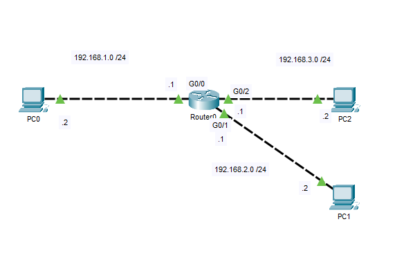
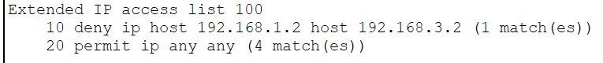
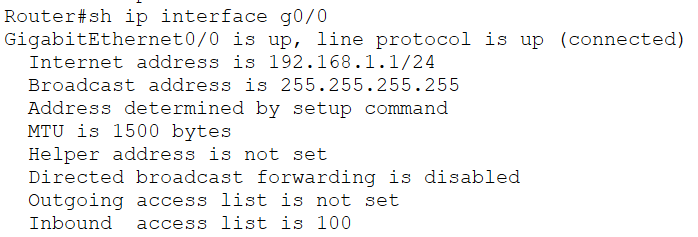
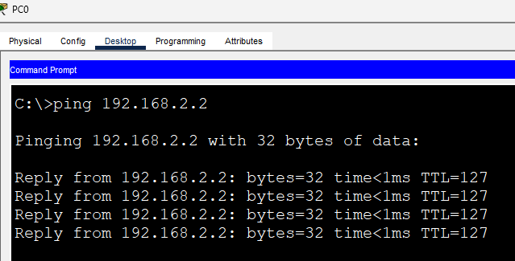
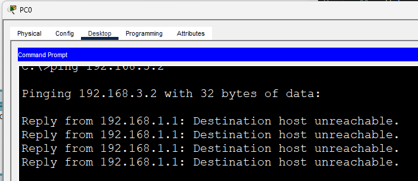
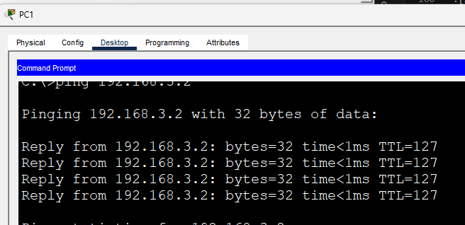
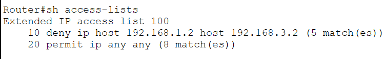

# Extended ACL

This lab introduces **Extended Access Control Lists (ACLs)** and demonstrates their ability to filter traffic based on multiple criteria, including the **source IP address**, **destination IP address**, and higher-layer protocols.

Unlike Standard ACLs, which only examine the source IP address, Extended ACLs provide much finer control over network traffic. In this scenario, **PC0 is denied access to PC2 while remaining able to communicate with PC1**, illustrating the additional flexibility provided by Extended ACLs.

## Objective

Configure an Extended ACL that:

- Denies traffic from PC0 to PC2.
- Allows PC0 to continue communicating with PC1.
- Permits all remaining traffic.
- Demonstrates the increased granularity of Extended ACLs compared to Standard ACLs.

## Topology



## Addressing

| Device | IP Address | Default Gateway |
|---------|------------|-----------------|
| PC0 | 192.168.1.2 | 192.168.1.1 |
| PC1 | 192.168.2.2 | 192.168.2.1 |
| PC2 | 192.168.3.2 | 192.168.3.1 |

---

# Configuration

## Router Interfaces

```cisco
interface GigabitEthernet0/0
 ip address 192.168.1.1 255.255.255.0
 no shutdown

interface GigabitEthernet0/1
 ip address 192.168.2.1 255.255.255.0
 no shutdown

interface GigabitEthernet0/2
 ip address 192.168.3.1 255.255.255.0
 no shutdown
```

## Extended ACL

```cisco
access-list 100 deny ip host 192.168.1.2 host 192.168.3.2
access-list 100 permit ip any any

interface GigabitEthernet0/0
 ip access-group 100 in
```

The ACL denies only traffic originating from **PC0** destined for **PC2** while allowing all other traffic to pass.

---

# Why an Extended ACL?

This lab highlights the key advantage of Extended ACLs over Standard ACLs.

| Standard ACL | Extended ACL |
|--------------|--------------|
| Filters only on the source IP address | Filters on source IP, destination IP, protocol, and port numbers |
| Limited traffic control | Fine-grained traffic filtering |
| Usually placed close to the destination | Usually placed close to the source |

In this lab:

- ✅ PC0 → PC1 is permitted.
- ❌ PC0 → PC2 is denied.
- ✅ PC1 → PC2 remains permitted.

This level of control cannot be achieved using a Standard ACL alone.

---

# Verification

## Verify ACL Entries

```cisco
show access-lists
```



---

## Verify ACL Application

```cisco
show ip interface GigabitEthernet0/0
```



---

# End-to-End Connectivity Verification

### 1. PC0 → PC1

Traffic should be permitted.

```text
ping 192.168.2.2
```



---

### 2. PC0 → PC2

Traffic should be denied.

```text
ping 192.168.3.2
```



---

### 3. PC1 → PC2

Traffic should still be permitted.

```text
ping 192.168.3.2
```



---

### 4. Verify ACL Hit Counters

After generating traffic, verify that the ACL counters increment.

```cisco
show access-lists
```



---

# IOS Verification Commands Used

```cisco
show access-lists

show ip interface

show running-config
```

---

# What I Learned

- Configured a numbered Extended ACL using Cisco IOS.
- Applied an Extended ACL to an inbound router interface.
- Understood how Extended ACLs filter traffic using both source and destination IP addresses.
- Observed the importance of the `permit ip any any` statement to prevent unintended traffic drops due to the implicit deny rule.
- Reinforced Cisco's recommendation to place Extended ACLs as close to the source as possible.
- Compared the capabilities of Standard and Extended ACLs through a practical access control scenario.

---

# Files

- `Extended-ACL.pkt` — Cisco Packet Tracer lab
- `topology.png` — Network topology
- `verification-acl.png`
- `verification-interface.png`
- `verification-pc0-pc1.png`
- `verification-pc0-pc2.png`
- `verification-pc1-pc2.png`
- `verification-counter.png`