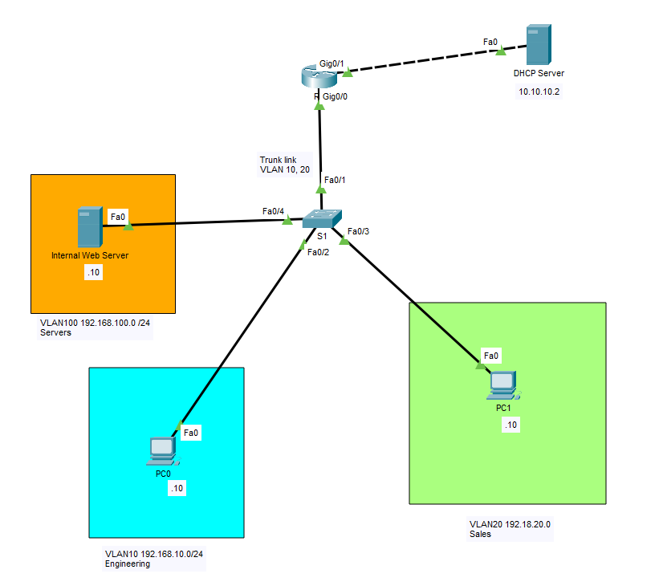
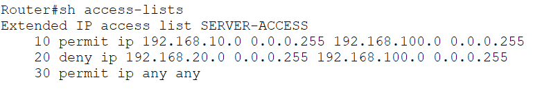
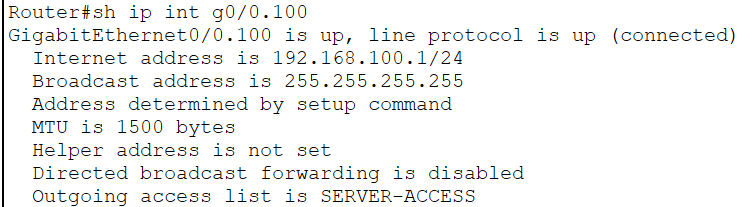
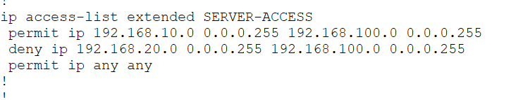
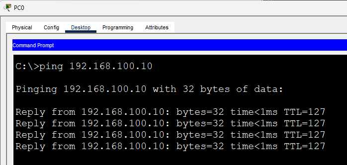
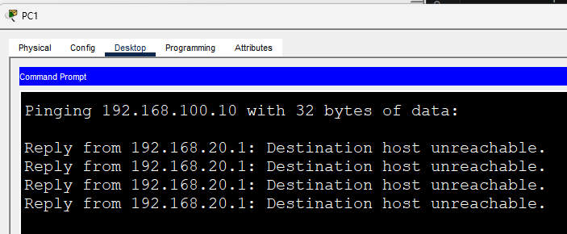
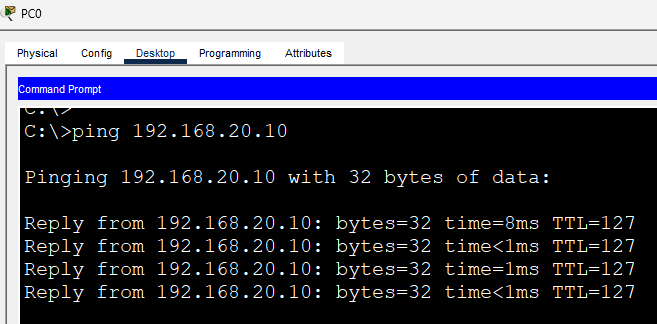
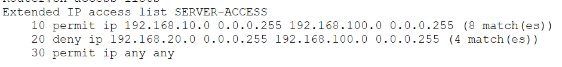

# Named ACL

This lab demonstrates the use of a **Named Extended Access Control List (ACL)** to implement role-based access control between VLANs in a small enterprise network.

Unlike numbered ACLs, named ACLs use descriptive identifiers, making them easier to understand, troubleshoot, and maintain. In this lab, the **Engineering VLAN** is allowed to access the **Internal Server VLAN**, while the **Sales VLAN** is denied access. The ACL is applied **outbound on the Server VLAN subinterface**, protecting server resources before traffic reaches the destination network.

## Objective

Configure a Named Extended ACL that:

- Allows the Engineering VLAN to access the Internal Server VLAN.
- Blocks the Sales VLAN from accessing the Internal Server VLAN.
- Permits all remaining traffic.
- Demonstrates the advantages of Named ACLs over numbered ACLs.
- Reinforces the use of ACLs to protect server resources in an enterprise environment.

---

# Topology



---

# Network Overview

| VLAN | Department | Network |
|------|------------|---------|
| VLAN 10 | Engineering | 192.168.10.0/24 |
| VLAN 20 | Sales | 192.168.20.0/24 |
| VLAN 100 | Servers | 192.168.100.0/24 |

The router performs **Router-on-a-Stick** routing using IEEE 802.1Q subinterfaces. A Named Extended ACL is applied **outbound on the Server VLAN subinterface (G0/0.100)** so that only authorized VLANs are allowed to reach the internal server.

---

# Configuration

## Named Extended ACL

```cisco
ip access-list extended SERVER-ACCESS

 permit ip 192.168.10.0 0.0.0.255 192.168.100.0 0.0.0.255
 deny ip 192.168.20.0 0.0.0.255 192.168.100.0 0.0.0.255
 permit ip any any
```

## Apply the ACL

```cisco
interface GigabitEthernet0/0.100
 ip access-group SERVER-ACCESS out
```

The ACL filters traffic as it exits the router toward the Server VLAN. Engineering hosts are permitted to access the server, Sales hosts are denied, and all other traffic continues to be forwarded because of the final `permit ip any any` statement.

---

# Why Use a Named ACL?

Named ACLs offer several advantages over numbered ACLs.

| Numbered ACL | Named ACL |
|---------------|-----------|
| Identified only by a number | Uses a descriptive name |
| Harder to identify in large configurations | Self-documenting |
| Less intuitive during troubleshooting | Easier to maintain and troubleshoot |
| Limited readability | Clearly communicates its purpose |

Using a descriptive name such as **SERVER-ACCESS** immediately tells another network engineer what the ACL is intended to do.

---

# Verification

## Verify ACL Entries

```cisco
show access-lists
```



---

## Verify ACL Application

```cisco
show ip interface GigabitEthernet0/0.100
```



---

## Verify Running Configuration

```cisco
show running-config
```



---

# End-to-End Connectivity Verification

### 1. Engineering VLAN → Internal Server

Traffic should be permitted.

```text
ping 192.168.100.10
```



---

### 2. Sales VLAN → Internal Server

Traffic should be denied.

```text
ping 192.168.100.10
```



---

### 3. Engineering VLAN → Sales VLAN

Communication should still succeed because the ACL only protects access to the Server VLAN.

```text
ping 192.168.20.10
```



---

### 4. Verify ACL Hit Counters

Generate traffic from both VLANs and verify that the ACL counters increase.

```cisco
show access-lists
```



---

# IOS Verification Commands Used

```cisco
show access-lists

show ip interface

show running-config
```

---

# What I Learned

- Configured a Named Extended ACL using Cisco IOS.
- Applied a Named ACL to a Router-on-a-Stick subinterface.
- Implemented role-based access control between multiple VLANs.
- Protected an internal server network by controlling which VLANs could access it.
- Understood the benefits of descriptive ACL names for readability and long-term maintenance.
- Verified ACL functionality using Cisco IOS verification commands and end-to-end connectivity testing.

---

# Files

- `Named-ACL.pkt` — Cisco Packet Tracer lab
- `topology.png` — Network topology
- `verification-acl.png`
- `verification-interface.png`
- `verification-running.png`
- `verification-engineering-server.png`
- `verification-sales-server.png`
- `verification-engineering-sales.png`
- `verification-counter.png`