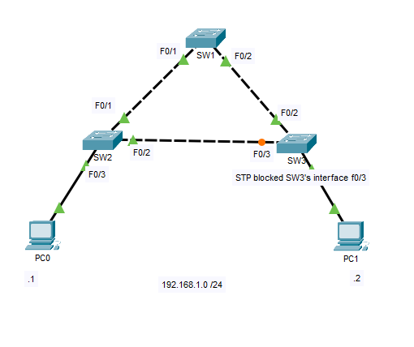
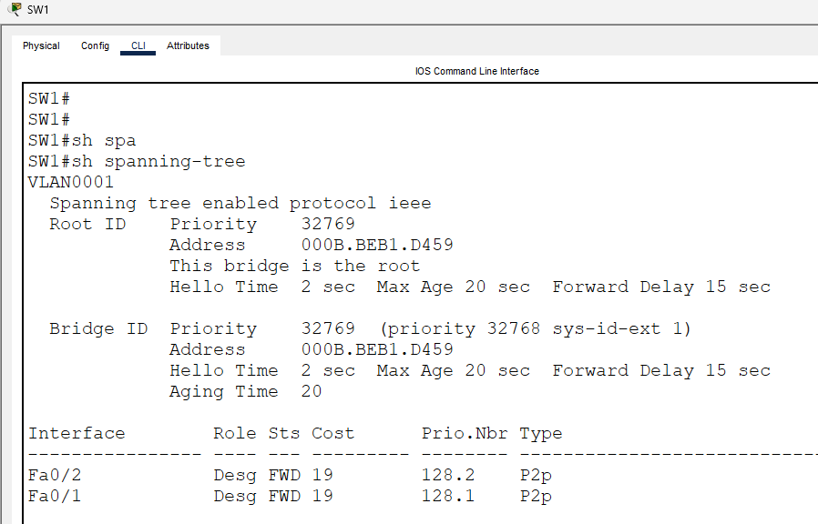
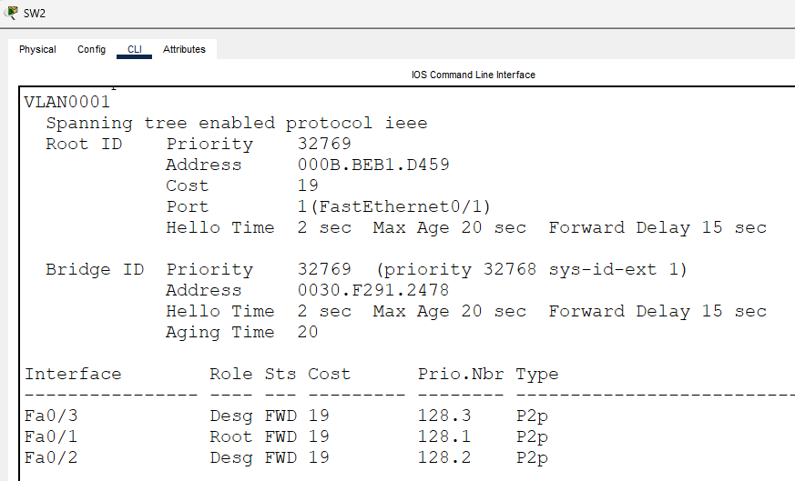
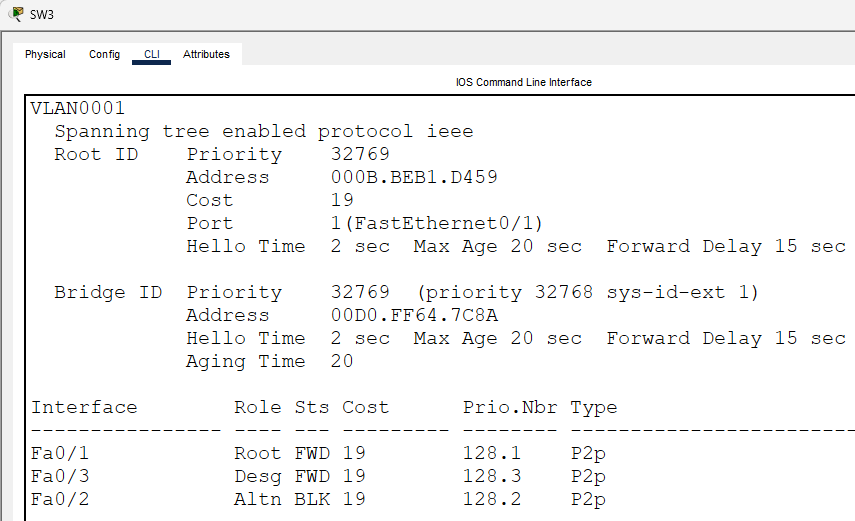
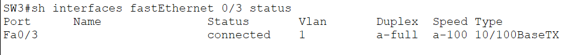
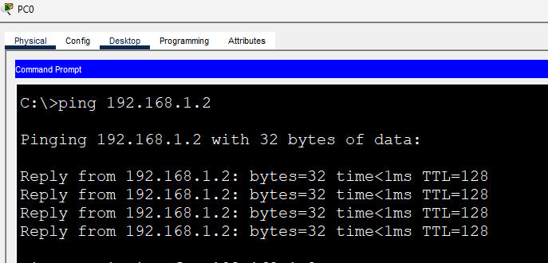
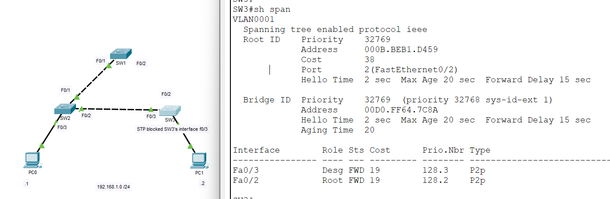
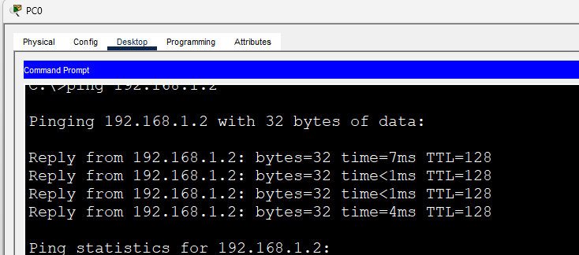

# Spanning Tree Protocol (STP) - Loop Prevention

This lab introduces **Spanning Tree Protocol (STP)** by demonstrating how it prevents Layer 2 switching loops in a network with redundant links.

Redundant links improve network availability by providing backup paths if a link fails. However, because Ethernet frames do not contain a Time-to-Live (TTL) field, redundant Layer 2 paths can create switching loops that lead to broadcast storms, duplicate frames, and unstable MAC address tables.

Spanning Tree Protocol (STP) solves this problem by automatically detecting Layer 2 loops and placing one redundant link into a **Blocking** state while keeping it available as a backup path.

---

# Objective

In this lab, you will:

- Understand why Spanning Tree Protocol is necessary.
- Observe STP automatically blocking a redundant link.
- Verify that end devices remain connected.
- Demonstrate automatic failover after a link failure.
- Verify STP operation using Cisco IOS commands.

---

# Topology



Three Layer 2 switches are connected in a triangle, creating multiple redundant paths between the switches.

Without STP, this topology would create a Layer 2 switching loop.

In this topology:

- **SW1** is elected as the Root Bridge.
- **SW3 FastEthernet0/3** is placed into the **Blocking** state.
- The blocked link serves as a backup path and will automatically transition to forwarding if an active link fails.

---

# Network Overview

| Device | Purpose |
|---------|---------|
| SW1 | Root Bridge |
| SW2 | Access Switch |
| SW3 | Access Switch |
| PC0 | End Device |
| PC1 | End Device |

Network:

- **192.168.1.0/24**

---

# Configuration

No manual STP configuration is required.

Cisco Catalyst switches run **PVST+ (Per-VLAN Spanning Tree Plus)** by default in Packet Tracer.

Verify the spanning tree mode:

```cisco
show spanning-tree summary
```

---

# Verification

## Verify the STP Topology

```cisco
show spanning-tree
```



Verify the following:

- Root Bridge
- Root Port
- Designated Ports
- Blocking Port

Notice that **SW3 FastEthernet0/3** is in the **Blocking** state to eliminate the Layer 2 loop.

---

# Per-Switch STP Verification

Viewing the spanning tree information from every switch provides a better understanding of how STP builds a loop-free topology.

---

## SW1 (Root Bridge)

```cisco
show spanning-tree
```


Observe:

- SW1 identifies itself as the Root Bridge.
- All ports are Designated Ports in the Forwarding state.

---

## SW2

```cisco
show spanning-tree
```



Observe:

- The Root Port points toward SW1.
- The remaining active port is a Designated Port.
- No ports are blocked.

---

## SW3

```cisco
show spanning-tree
```



Observe:

- The Root Port points toward SW1.
- FastEthernet0/3 is placed into the **Blocking** state.
- The blocked interface prevents a Layer 2 switching loop.

---

## Verify Interface Status

```cisco
show interfaces status
```



The blocked interface should remain operational but will not forward user traffic.

---

# End-to-End Connectivity Verification

Although one redundant link is blocked, hosts should still communicate successfully.

### PC0 → PC1

```text
ping 192.168.1.2
```



This demonstrates that STP prevents switching loops **without interrupting normal network communication**.

---

# Demonstrating STP Redundancy

Disconnect one of the active forwarding links (for example, **SW1 F0/2 ↔ SW3 F0/2**).

STP will detect the topology change and automatically transition the previously blocked interface (**SW3 F0/3**) into the **Forwarding** state after reconvergence.

Run:

```cisco
show spanning-tree
```



Observe that:

- The previously blocked port is now forwarding.
- A new loop-free topology has been calculated.
- End-to-end connectivity is maintained.

Verify connectivity once more.

```text
ping 192.168.1.2
```



This demonstrates one of STP's most important features: **automatic recovery from link failures while maintaining a loop-free topology**.

---

# IOS Verification Commands Used

```cisco
show spanning-tree

show spanning-tree summary

show interfaces status
```

---

# Key Concepts

## Why is STP Needed?

Without STP, redundant Layer 2 links can create:

- Broadcast storms
- Duplicate Ethernet frames
- MAC address table instability
- Network outages caused by switching loops

---

## How Does STP Prevent Loops?

STP automatically:

- Elects a Root Bridge.
- Determines the best path to the Root Bridge.
- Places redundant links into the Blocking state.
- Recalculates the topology when a link fails.
- Activates a backup path if necessary.

---

# What I Learned

- Understood why Spanning Tree Protocol is required in Layer 2 Ethernet networks.
- Observed STP automatically blocking redundant links to eliminate switching loops.
- Identified the Root Bridge, Root Ports, Designated Ports, and Blocking Port from each switch's perspective.
- Verified that hosts remain connected despite one blocked path.
- Demonstrated STP's automatic failover capability after a link failure.
- Verified STP operation using Cisco IOS show commands.

---

# Files

- `STP-Loop-Prevention.pkt` — Cisco Packet Tracer lab
- `topology.png` — Network topology
- `verification-spanning-tree.png`
- `sw1-show-spanning-tree.png`
- `sw2-show-spanning-tree.png`
- `sw3-show-spanning-tree.png`
- `verification-interface-status.png`
- `verification-ping.png`
- `verification-failover.png`
- `verification-ping-after-failover.png`