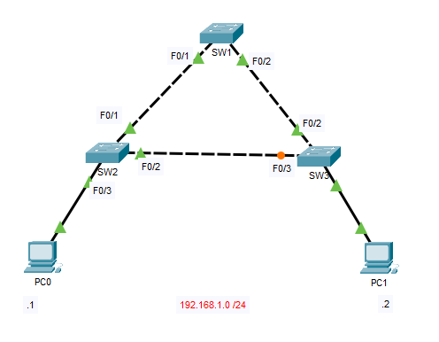
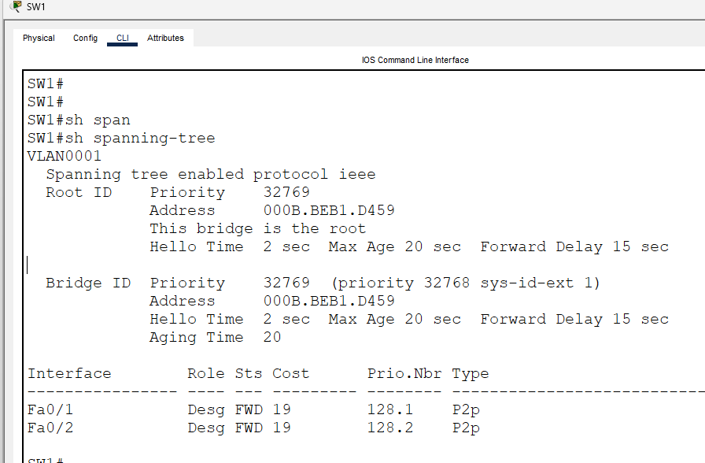
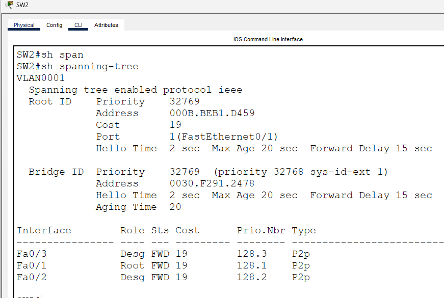
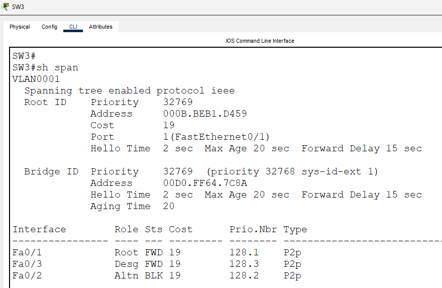
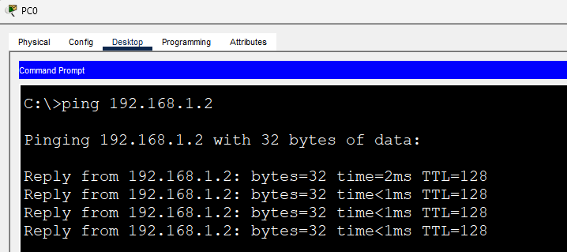
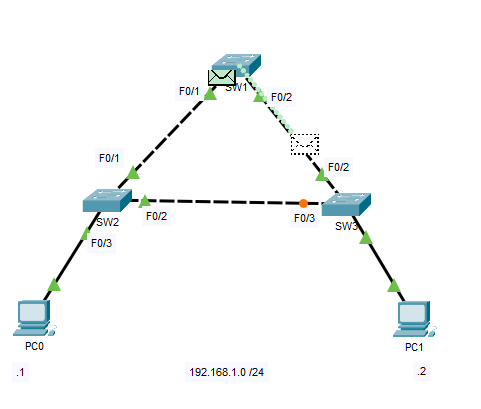
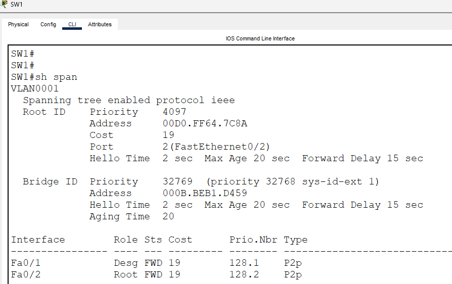
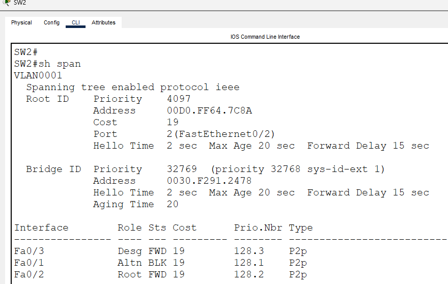
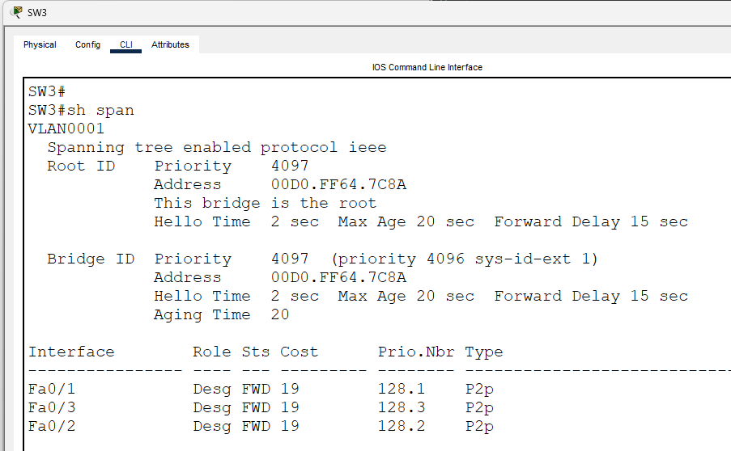
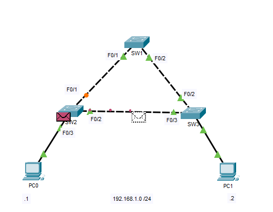

# Root Bridge Election

This lab demonstrates how **Spanning Tree Protocol (STP)** elects a **Root Bridge** and how changing the Root Bridge influences the loop-free topology and the forwarding path between hosts.

By default, STP elects the switch with the **lowest Bridge ID (Bridge Priority + MAC Address)** as the Root Bridge. Network administrators can manually influence this election by configuring a lower bridge priority on a preferred switch.

In this lab, I'll compare the default STP election with a manually configured Root Bridge and observe how the forwarding path changes.

---

# Objectives

In this lab, I will:

- Understand how STP elects the Root Bridge.
- Verify the elected Root Bridge using Cisco IOS commands.
- Configure a switch to become the Root Bridge.
- Observe how the STP topology changes after the Root Bridge changes.
- Compare the forwarding path before and after the Root Bridge election.

---

# Topology



Three Layer 2 switches are connected in a triangle, creating redundant Layer 2 paths.

The network consists of a single VLAN:

- **VLAN 1**
- **192.168.1.0/24**

PC0 and PC1 are connected to opposite sides of the network to demonstrate how the forwarding path changes after electing a new Root Bridge.

---

# Scenario 1 - Default Root Bridge Election

Initially, all switches use the default bridge priority.

STP automatically elects **SW1** as the Root Bridge because it has the lowest Bridge ID.

Current topology:

- **Root Bridge:** SW1
- **Blocked Port:** SW3 FastEthernet0/3

Traffic from **PC0** to **PC1** follows the active forwarding path:

```text
PC0
 ↓
SW2
 ↓
SW1
 ↓
SW3
 ↓
PC1
```

The traffic passes through SW1 because the direct SW2 ↔ SW3 link is blocked by STP.

---

# Verification - Scenario 1

## SW1

```cisco
show spanning-tree
```



Observe:

- SW1 identifies itself as the Root Bridge.
- All ports are Designated Ports.

---

## SW2

```cisco
show spanning-tree
```



Observe:

- The Root Port points toward SW1.
- All forwarding ports are active.

---

## SW3

```cisco
show spanning-tree
```



Observe:

- The Root Port points toward SW1.
- FastEthernet0/3 is in the Blocking state.

---

## End-to-End Connectivity

Verify that PC0 can successfully reach PC1.

```text
ping 192.168.1.2
```



---

## Simulation Mode

Use Packet Tracer's **Simulation Mode** to observe the packet path.

Expected forwarding path:

```text
PC0 → SW2 → SW1 → SW3 → PC1
```



This demonstrates how the current STP topology forwards traffic when SW1 is the Root Bridge.

---

# Scenario 2 - Manually Electing SW3 as the Root Bridge

Configure SW3 with a lower bridge priority.

```cisco
SW3(config)# spanning-tree vlan 1 priority 4096
```

After STP reconverges:

- SW3 becomes the Root Bridge.
- The forwarding topology changes.
- The direct SW2 ↔ SW3 link becomes active.

Traffic now follows a shorter forwarding path:

```text
PC0
 ↓
SW2
 ↓
SW3
 ↓
PC1
```

This demonstrates how changing the Root Bridge changes the active forwarding topology.

---

# Verification - Scenario 2

## SW1

```cisco
show spanning-tree
```



Observe the updated port roles after STP reconverges.

---

## SW2

```cisco
show spanning-tree
```



Observe that the Root Port now points toward SW3 and interface F0/1 is now the blocked port

---

## SW3

```cisco
show spanning-tree
```



Observe:

- SW3 now identifies itself as the Root Bridge.
- All interfaces are Designated Ports.

---

## End-to-End Connectivity

Verify connectivity again.

```text
ping 192.168.1.2
```


---

## Simulation Mode

Observe the forwarding path again using Packet Tracer's **Simulation Mode**.

Expected forwarding path:

```text
PC0 → SW2 → SW3 → PC1
```



Notice that traffic now takes the direct path because STP recalculated the loop-free topology after the Root Bridge changed.

---

# IOS Commands Used

## Verify STP

```cisco
show spanning-tree

show spanning-tree summary
```

## Configure the Root Bridge

```cisco
spanning-tree vlan 1 priority 4096
```

---

# Key Concepts

## Root Bridge Election

STP elects the Root Bridge using the **lowest Bridge ID**, which consists of:

- Bridge Priority
- MAC Address (used as a tiebreaker)

The switch with the lowest Bridge ID becomes the Root Bridge.

---

## Why Does the Forwarding Path Change?

The Root Bridge acts as the reference point that STP uses to calculate a loop-free topology.

When a different switch becomes the Root Bridge:

- Root Ports may change.
- Designated Ports may change.
- Blocking Ports may change.
- The active forwarding path may also change.

Traffic does **not** always pass through the Root Bridge. Instead, traffic follows the forwarding topology that STP has calculated. In this lab, changing the Root Bridge causes the direct SW2 ↔ SW3 link to become part of the forwarding path.

---

# What I Learned

- Learned how STP elects the Root Bridge.
- Verified the Root Bridge using Cisco IOS commands.
- Configured bridge priority to manually influence the STP election.
- Observed how changing the Root Bridge affects port roles and forwarding paths.
- Used Packet Tracer Simulation Mode to visualize the forwarding path before and after the Root Bridge election.

---

# Files

- `STP-Root-Bridge-Election.pkt` — Cisco Packet Tracer lab
- `topology.png`
- `scenario1-sw1.png`
- `scenario1-sw2.png`
- `scenario1-sw3.png`
- `scenario1-ping.png`
- `scenario1-simulation.png`
- `scenario2-sw1.png`
- `scenario2-sw2.png`
- `scenario2-sw3.png`
- `scenario2-ping.png`
- `scenario2-simulation.png`