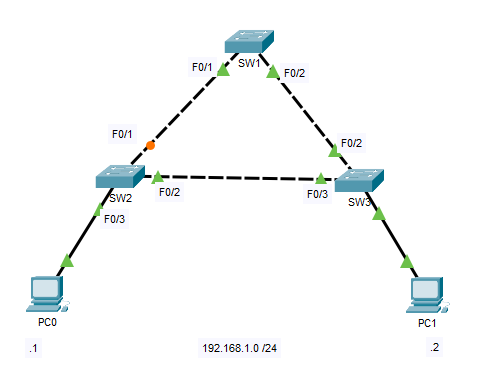
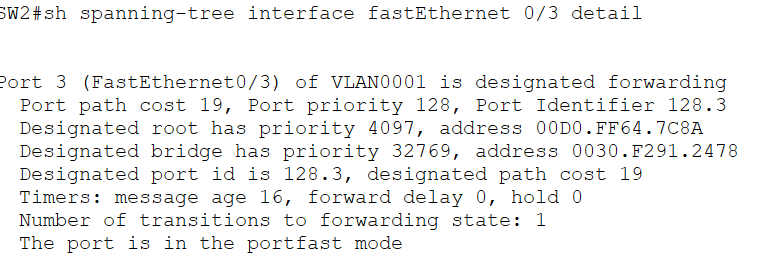
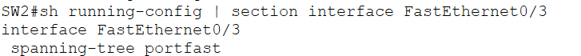
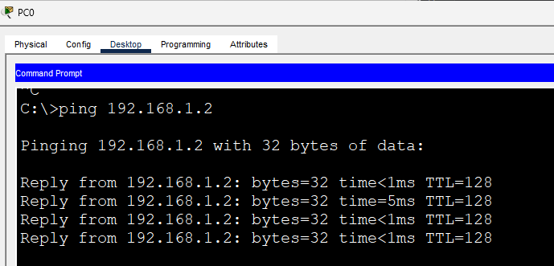

# PortFast

This lab demonstrates how **PortFast** allows access ports connected to end devices to transition immediately into the **Forwarding** state, eliminating the normal STP convergence delay.

By default, Spanning Tree Protocol places a port through the **Listening** and **Learning** states before forwarding traffic. This process can take approximately **30 seconds**, delaying network connectivity for end devices after they are connected or rebooted.

PortFast is designed for interfaces connected to **end devices** such as PCs, printers, IP phones, and servers. It allows these interfaces to bypass the normal STP convergence process while still participating in Spanning Tree.

---

# Objectives

In this lab, I will:

- Understand the purpose of PortFast.
- Configure PortFast on an access port.
- Verify PortFast using Cisco IOS commands.
- Observe that the interface immediately enters the Forwarding state.
- Learn where PortFast should and should not be deployed.

---

# Topology



This lab reuses the previous STP topology.

PortFast will be enabled on the interface connected to **PC0**.

```
PC0
 |
SW2 Fa0/3
```

Since PC0 is an end device, the interface is an ideal candidate for PortFast.

---

# Configuration

Configure PortFast on the access interface connected to PC0.

```cisco
interface FastEthernet0/3
 spanning-tree portfast
```

---

# Verification

## Verify PortFast Configuration

```cisco
show spanning-tree interface fastethernet0/3 detail
```



Observe that PortFast is enabled on the interface.

---

## Verify Running Configuration

```cisco
show running-config |section interface fastethernet0/3
```



---

# End-to-End Connectivity

Verify that PC0 can still communicate with PC1.

```text
ping 192.168.1.2
```



---

# Why Use PortFast?

Normally, STP transitions through the following states:

```text
Blocking
   ↓
Listening
   ↓
Learning
   ↓
Forwarding
```

With PortFast enabled on an access port:

```text
Forwarding
```

The interface immediately begins forwarding traffic, allowing end devices to obtain network connectivity without waiting for the normal STP convergence process.

---

# Best Practice

PortFast should only be enabled on **access ports connected directly to end devices**, such as:

- PCs
- Laptops
- Servers
- Printers
- IP Phones

It should **never** be enabled on interfaces connected to another switch unless you fully understand the implications.

> **Enterprise Best Practice:** Configure PortFast on all user-facing access ports to improve end-device connectivity. These ports are commonly paired with **BPDU Guard** to protect the network from accidental or unauthorized switch connections. BPDU Guard will be covered in the next lab.

---

# IOS Commands Used

```cisco
show spanning-tree interface fastethernet0/4 detail

show running-config | section interface fastethernet0/4
```

---

# What I Learned

- Learned why PortFast is used in enterprise networks.
- Configured PortFast on an access interface.
- Verified PortFast using Cisco IOS commands.
- Understood that PortFast should only be enabled on interfaces connected to end devices.
- Learned that PortFast is commonly deployed together with BPDU Guard as an enterprise best practice.

---

# Files

- `STP-PortFast.pkt` — Cisco Packet Tracer lab
- `topology.png`
- `verification-portfast.png`
- `verification-running-config.png`
- `verification-ping.png`