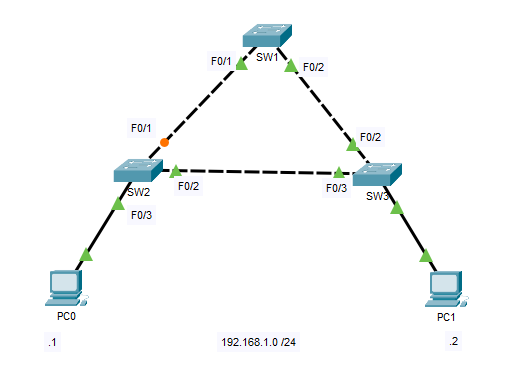
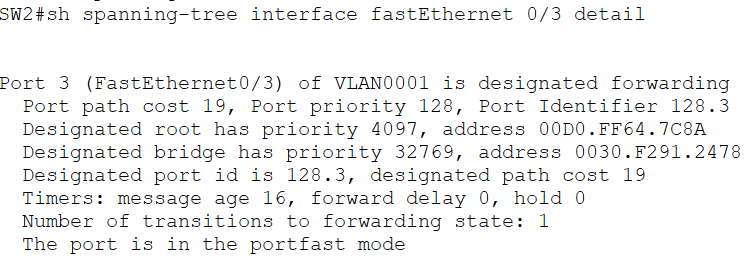
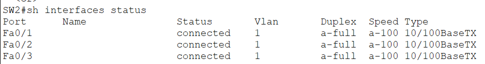
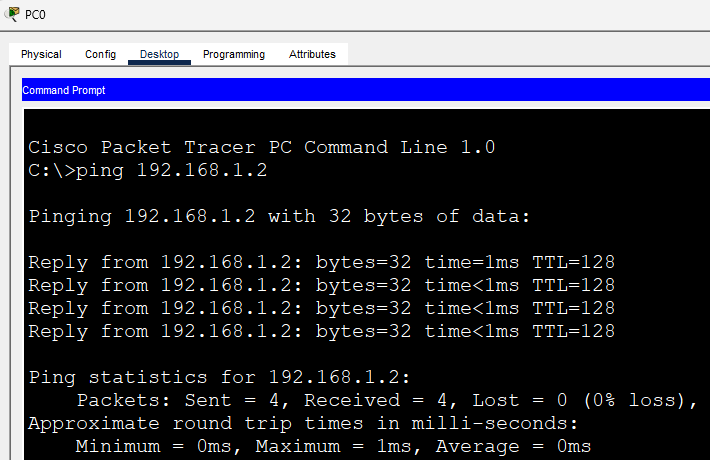
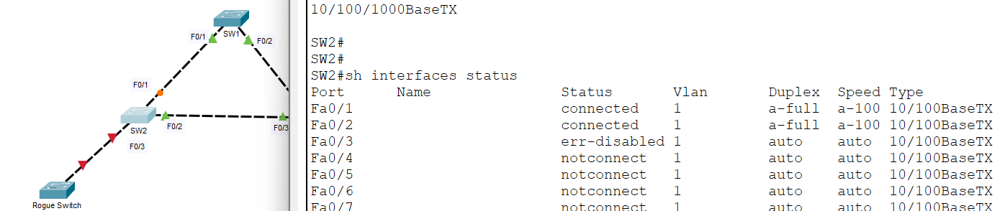
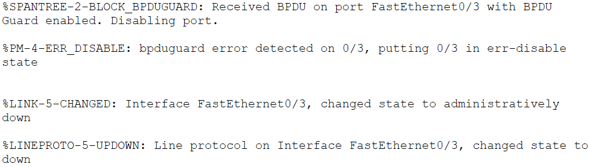

# BPDU Guard

This lab demonstrates how **BPDU Guard** protects the network by preventing unauthorized switches from being connected to **PortFast-enabled access ports**.

In the previous lab, PortFast was configured on an access port to allow end devices to begin forwarding traffic immediately. While this improves connectivity for users, it also introduces a potential risk: if another switch is accidentally or intentionally connected to a PortFast-enabled port, it can participate in Spanning Tree Protocol (STP) and potentially alter the network topology.

BPDU Guard addresses this risk by automatically placing the interface into the **err-disabled** state whenever it receives a Bridge Protocol Data Unit (BPDU) on a PortFast-enabled port.

---

# Objectives

In this lab, I will:

- Understand the purpose of BPDU Guard.
- Configure BPDU Guard on a PortFast-enabled access port.
- Verify normal operation when an end device is connected.
- Observe BPDU Guard shutting down a port after another switch is connected.
- Verify the err-disabled state using Cisco IOS commands.
- Learn why PortFast and BPDU Guard are commonly deployed together in enterprise networks.

---

# Topology



This lab reuses the previous STP topology and consists of two scenarios.

---

# Scenario 1 - Normal Operation

Initially, **PC0** is connected to **SW2 FastEthernet0/3**.

```
PC0
 |
SW2 Fa0/3
```

The interface is configured as:

- Access Port
- PortFast Enabled
- BPDU Guard Enabled

Since a PC does not generate BPDUs, the interface operates normally.

---

# Configuration

Configure PortFast and BPDU Guard on the access interface.

```cisco
interface FastEthernet0/3
 switchport mode access
 spanning-tree portfast
 spanning-tree bpduguard enable
```

---

# Verification - Scenario 1

## Verify PortFast

```cisco
show spanning-tree interface fastethernet0/3 detail
```



---

## Verify Interface Status

```cisco
show interfaces status
```



The interface should be **connected** and forwarding traffic normally.

---

## End-to-End Connectivity

Verify that PC1 can still communicate with the rest of the network.

```text
ping 192.168.1.2
```



This confirms that enabling BPDU Guard has no impact on normal end-device connectivity.

---

# Scenario 2 - Connecting Another Switch

Replace **PC0** with another switch connected to **SW2 FastEthernet0/3**.

```
SW4
 |
SW2 Fa0/3
```

Unlike a PC, the newly connected switch immediately begins sending **Bridge Protocol Data Units (BPDUs)**.

Because BPDU Guard is enabled, SW2 detects the BPDU and immediately disables the interface.

The port transitions into the **err-disabled** state to protect the Layer 2 topology.

---

# Verification - Scenario 2

## Verify Interface Status

```cisco
show interfaces status
```



Observe that **FastEthernet0/3** is now in the **err-disabled** state.

---

## Verify BPDU Guard Event

```cisco
%SPANTREE-2-BLOCK_BPDUGUARD: Received BPDU on port FastEthernet0/3 with BPDU Guard enabled. Disabling port.

%PM-4-ERR_DISABLE: bpduguard error detected on 0/3, putting 0/3 in err-disable state


%LINK-5-CHANGED: Interface FastEthernet0/3, changed state to administratively down
```



---

# Recovering the Interface

After removing the unauthorized switch, manually recover the interface.

```cisco
interface FastEthernet0/3
 shutdown
 no shutdown
```

Verify that the interface returns to the forwarding state.

---

# IOS Commands Used

## Configuration

```cisco
interface FastEthernet0/3
 switchport mode access
 spanning-tree portfast
 spanning-tree bpduguard enable
```

## Verification

```cisco
show spanning-tree interface fastethernet0/3 detail

show interfaces status

show logging
```

---

# Why BPDU Guard Matters

PortFast allows access ports to bypass the normal STP convergence process because they are expected to connect only to end devices.

However, if another switch is connected to a PortFast-enabled port, it begins transmitting BPDUs, which could unexpectedly affect the spanning-tree topology.

BPDU Guard prevents this by immediately disabling the interface whenever a BPDU is received on a protected PortFast port.

This helps protect the network from:

- Accidental switch connections
- Unauthorized devices
- Unexpected spanning-tree topology changes
- Potential Layer 2 loops

---

# Enterprise Best Practice

In enterprise networks, it is considered best practice to:

- Enable **PortFast** on all user-facing access ports.
- Enable **BPDU Guard** on those same ports.

This combination provides fast connectivity for end devices while protecting the network from accidental or unauthorized switch connections.

---

# What I Learned

- Learned why BPDU Guard is used together with PortFast.
- Configured BPDU Guard on an access interface.
- Verified normal operation when an end device was connected.
- Observed the interface entering the err-disabled state after connecting another switch.
- Used Cisco IOS commands to verify BPDU Guard events and recover the interface.

---

# Files

- `STP-BPDU-Guard.pkt` — Cisco Packet Tracer lab
- `topology.png`
- `scenario1-portfast.png`
- `scenario1-interface-status.png`
- `scenario1-ping.png`
- `scenario2-interface-status.png`
- `scenario2-bpduguard.png`
