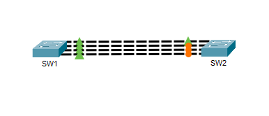
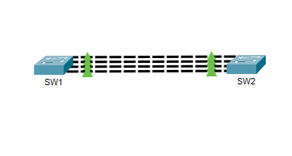
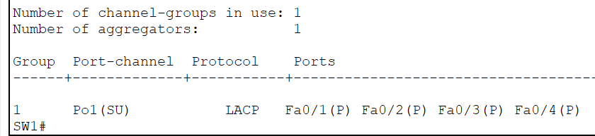
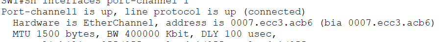
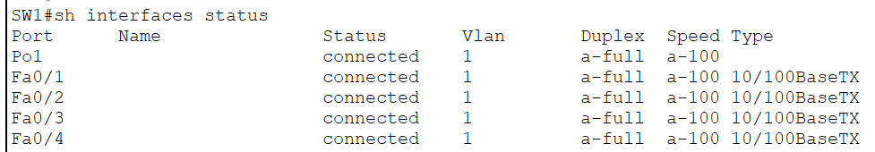
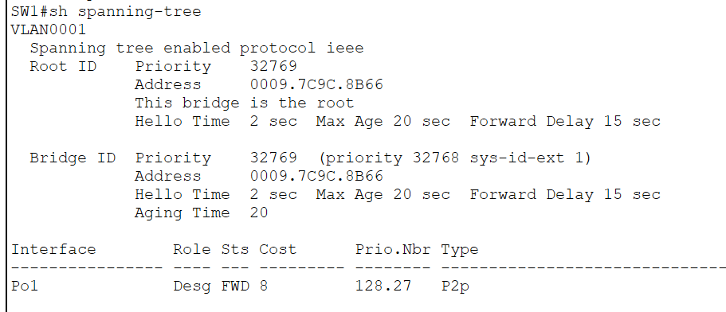

# Layer 2 EtherChannel (LACP)

This lab demonstrates how to configure a **Layer 2 EtherChannel** using **Link Aggregation Control Protocol (LACP)** to bundle multiple physical Ethernet links into a single logical interface called a **Port-Channel**.

Normally, when redundant links exist between two switches, **Spanning Tree Protocol (STP)** blocks all but one link to prevent Layer 2 loops. While this provides redundancy, it leaves the additional links unused.

EtherChannel solves this limitation by combining multiple physical links into a single logical interface. STP now treats the bundled interfaces as a single link, allowing all member interfaces to actively forward traffic while providing increased bandwidth and redundancy.

This lab focuses on **LACP**, the industry-standard EtherChannel negotiation protocol commonly deployed in enterprise networks.

---

# Objectives

In this lab, I will:

- Understand the purpose of Layer 2 EtherChannel.
- Learn the different EtherChannel formation methods.
- Configure a Layer 2 EtherChannel using LACP.
- Verify successful Port-Channel formation.
- Observe how STP treats the Port-Channel as a single logical interface.
- Understand why LACP is the preferred EtherChannel protocol in enterprise networks.

---

# Topology



The topology consists of two switches connected using **four FastEthernet links (Fa0/1–Fa0/4)**.

After configuration, the four physical interfaces are bundled into **Port-Channel1 (Po1)** using LACP.

---

# Why EtherChannel?

Without EtherChannel, STP blocks redundant links to eliminate Layer 2 loops, leaving only one forwarding path active.

```
SW1
 │
 │ Active
 │
SW2

Three redundant links remain blocked by STP.
```

With EtherChannel:

```
        SW1
     ║ ║ ║ ║
   Port-Channel1
     ║ ║ ║ ║
        SW2
```

The four physical interfaces now operate as one logical connection, providing:

- Increased bandwidth
- Link redundancy
- Simplified STP topology
- Automatic failover if a member link fails

---

# Before and After EtherChannel

## Before EtherChannel

Before configuring EtherChannel, the switches are connected by four separate physical links.

Since multiple redundant Layer 2 paths exist, **Spanning Tree Protocol (STP)** blocks all but one forwarding link to prevent switching loops.


Traffic uses only one forwarding path while the remaining redundant links remain in the **Blocking** state.

---

## After EtherChannel

After configuring LACP, the four physical interfaces are bundled into **Port-Channel1**.

STP now recognizes the bundle as a **single logical interface**, allowing all member links to actively forward traffic.



The result is:

- Increased bandwidth through link aggregation
- Link redundancy
- Simplified STP topology
- Automatic failover if a member link goes down

---

# EtherChannel Formation Methods

Cisco switches support three methods of forming an EtherChannel.

| Method | Standard | Modes | Description |
|---------|----------|-------|-------------|
| Static EtherChannel | None | `on` | No negotiation. Both sides must be manually configured. |
| PAgP | Cisco Proprietary | `desirable`, `auto` | Cisco-only negotiation protocol. |
| **LACP** | **IEEE 802.3ad / IEEE 802.1AX** | **active**, **passive** | Open standard and the preferred protocol in modern enterprise networks. |

Although all three methods create an EtherChannel, **LACP** is the most commonly deployed because it is vendor-neutral, automatically negotiates the connection, and supports multi-vendor environments.

---

# Configuration

The EtherChannel is formed using **LACP Active mode** on both switches.

## SW1

```cisco
interface range fa0/1-4
 no shutdown
 channel-group 1 mode active

interface port-channel1
 no shutdown
```

---

## SW2

```cisco
interface range fa0/1-4
 no shutdown
 channel-group 1 mode active

interface port-channel1
 no shutdown
```

---

# Verification

## Verify EtherChannel Summary

```cisco
show etherchannel summary
```



A successful configuration should display something similar to:

```text
Group  Port-channel  Protocol    Ports
------+------------- ----------- -----------------------------------------
1      Po1(SU)       LACP        Fa0/1(P) Fa0/2(P) Fa0/3(P) Fa0/4(P)
```

### Legend

| Flag | Meaning |
|------|---------|
| **S** | Layer 2 Port-Channel |
| **U** | Port-Channel is operational |
| **P** | Interface is successfully bundled |

---

## Verify Port-Channel Interface

```cisco
show interfaces port-channel 1
```



This command displays operational information about the logical Port-Channel interface.

---

## Verify Interface Status

```cisco
show interfaces status
```



Verify that all four FastEthernet interfaces are connected and participating in the EtherChannel.

---

## Verify Spanning Tree

```cisco
show spanning-tree
```



Notice that STP recognizes **Port-Channel1** as a single logical interface instead of four separate physical links.

---

# LACP Modes

LACP supports two negotiation modes.

| Mode | Description |
|------|-------------|
| **Active** | Actively initiates LACP negotiation. |
| **Passive** | Waits for another device to initiate LACP negotiation. |

The following combinations are valid:

| Side A | Side B | Result |
|--------|--------|--------|
| Active | Active | ✅ EtherChannel forms |
| Active | Passive | ✅ EtherChannel forms |
| Passive | Passive | ❌ EtherChannel does not form |

---

# Enterprise Use Cases

Layer 2 EtherChannel is commonly deployed to provide both redundancy and increased bandwidth while carrying Layer 2 traffic.

Typical deployments include:

- Access Switch ↔ Distribution Switch
- Distribution Switch ↔ Core Switch
- Switch ↔ Server (NIC Teaming)
- Virtualization Hosts (VMware ESXi, Hyper-V)
- Storage Networks

---

# IOS Commands Used

## Configuration

```cisco
interface range fa0/1-4
 no shutdown
 channel-group 1 mode active

interface port-channel1
 no shutdown
```

## Verification

```cisco
show etherchannel summary

show interfaces port-channel 1

show interfaces status

show spanning-tree
```

---

# What I Learned

After completing this lab, I was able to:

- Explain why EtherChannel is used in switched networks.
- Differentiate between Static EtherChannel, PAgP, and LACP.
- Configure a Layer 2 EtherChannel using LACP.
- Verify successful Port-Channel formation using Cisco IOS commands.
- Observe how STP treats an EtherChannel as a single logical interface.
- Understand why LACP is the preferred EtherChannel protocol in enterprise environments.

---

# Files

- `01-Layer2-EtherChannel.pkt`
- `topology.png`
- `before-etherchannel.png`
- `after-etherchannel.png`
- `etherchannel-summary.png`
- `port-channel-interface.png`
- `interface-status.png`
- `stp-verification.png`