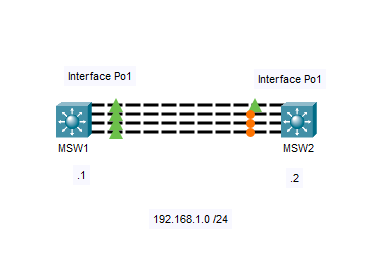
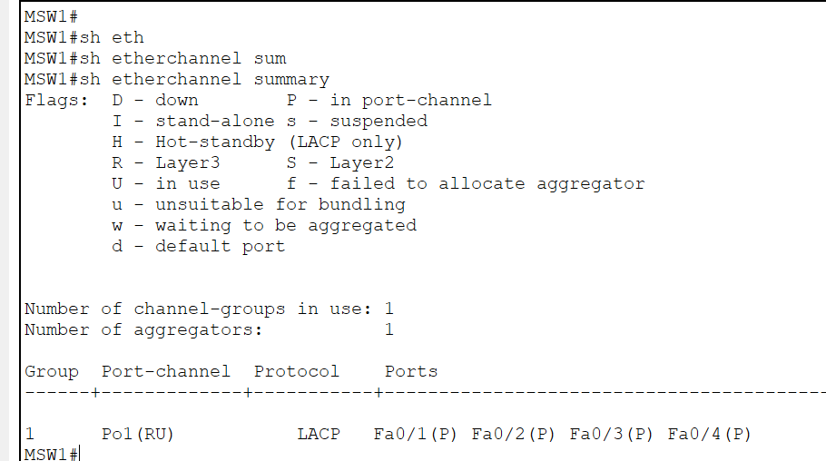
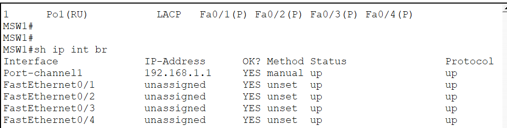
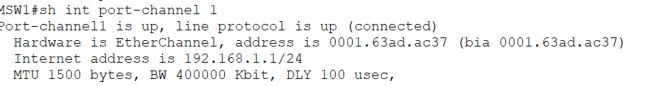
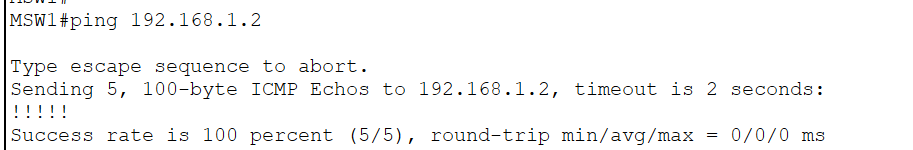

# Layer 3 EtherChannel (LACP)

This lab demonstrates how to configure a **Layer 3 EtherChannel** using **Link Aggregation Control Protocol (LACP)**.

Unlike the previous lab where the Port-Channel operated as a Layer 2 switchport, this lab bundles multiple **routed interfaces** into a single logical Layer 3 interface capable of carrying IP traffic.

Layer 3 EtherChannels are commonly deployed between Layer 3 switches in enterprise networks to provide increased bandwidth, redundancy, and high-performance routed links.

---

# Objectives

In this lab, I will:

- Configure a Layer 3 EtherChannel using LACP.
- Convert physical interfaces into routed ports.
- Assign an IP address to the Port-Channel interface.
- Verify Layer 3 connectivity across the EtherChannel.
- Compare Layer 2 and Layer 3 EtherChannels.

---

# Topology



The topology consists of two multilayer switches connected using four FastEthernet links (Fa0/1–Fa0/4).

After configuration, the four physical interfaces are bundled into **Port-Channel1**, which functions as a routed Layer 3 interface.

---

# Layer 2 vs Layer 3 EtherChannel

| Layer 2 EtherChannel | Layer 3 EtherChannel |
|----------------------|----------------------|
| Operates as a switchport | Operates as a routed interface |
| Carries VLAN traffic | Carries IP traffic |
| Participates in STP | Does not participate in STP |
| Uses access or trunk ports | Uses `no switchport` |
| Common between access/distribution switches | Common between distribution/core switches |

---

# Why Layer 3 EtherChannel?

A Layer 3 EtherChannel combines multiple routed interfaces into one logical routed link.

Benefits include:

- Increased bandwidth
- Link redundancy
- Simplified routing
- Automatic failover
- Load balancing across member links

Unlike Layer 2 EtherChannels, Layer 3 EtherChannels do **not** participate in Spanning Tree because routed interfaces do not create Layer 2 loops.

---

# Configuration

## MSW1

```cisco
interface range fa0/1-4
 no switchport
 channel-group 1 mode active

interface port-channel1
 no switchport
 ip address 192.168.1.1 255.255.255.0
 no shutdown
```

---

## MSW2

```cisco
interface range fa0/1-4
 no switchport
 channel-group 1 mode active

interface port-channel1
 no switchport
 ip address 192.168.1.2 255.255.255.0
 no shutdown
```

---

# Verification

## Verify EtherChannel

```cisco
show etherchannel summary
```



Verify that all four interfaces have successfully joined Port-Channel1.

---

## Verify Interface Status

```cisco
show ip interface brief
```



Notice that the IP address is assigned to **Port-Channel1**, not the individual FastEthernet interfaces.

---

## Verify Port-Channel

```cisco
show interfaces port-channel1
```



---

## Verify Connectivity

From MSW1:

```cisco
ping 192.168.1.2
```

From MSW2:

```cisco
ping 192.168.1.1
```



Successful replies confirm that the Layer 3 EtherChannel is forwarding IP traffic correctly.

---

# Enterprise Use Cases

Layer 3 EtherChannels are commonly used for routed links between:

- Distribution Switch ↔ Core Switch
- Core Switch ↔ Core Switch
- Data Center Spine ↔ Leaf Switches
- High-speed routed uplinks between Layer 3 devices

Because the interfaces operate at Layer 3, they are independent of VLANs and do not rely on Spanning Tree Protocol.

---

# IOS Commands Used

## Configuration

```cisco
interface range fa0/1-4
 no switchport
 channel-group 1 mode active

interface port-channel1
 no switchport
 ip address 192.168.1.X 255.255.255.0
 no shutdown
```

## Verification

```cisco
show etherchannel summary

show ip interface brief

show interfaces port-channel1

ping 192.168.1.X
```

---

# What I Learned

After completing this lab, I was able to:

- Configure a Layer 3 EtherChannel using LACP.
- Convert switchports into routed interfaces using `no switchport`.
- Assign an IP address to a Port-Channel interface.
- Verify Layer 3 connectivity across the EtherChannel.
- Understand the differences between Layer 2 and Layer 3 EtherChannels.
- Recognize where Layer 3 EtherChannels are commonly deployed in enterprise networks.

---

# Files

- `Layer3-EtherChannel.pkt`
- `topology.png`
- `etherchannel-summary.png`
- `show-ip-interface-brief.png`
- `show-port-channel.png`
- `successful-ping.png`