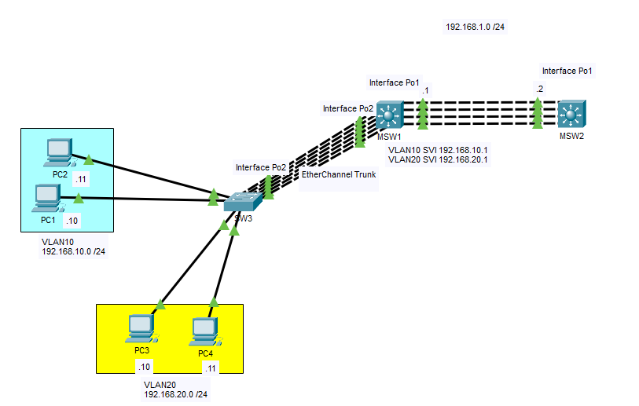
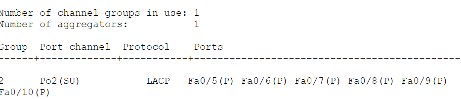
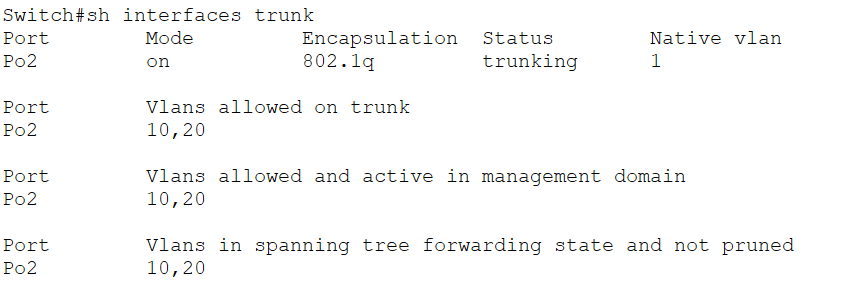
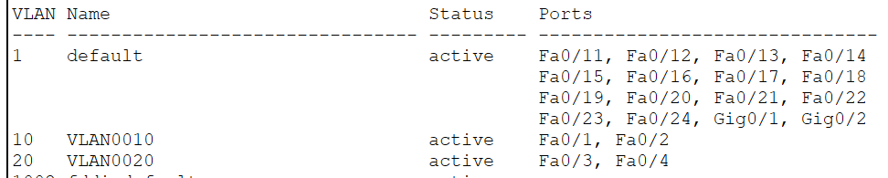
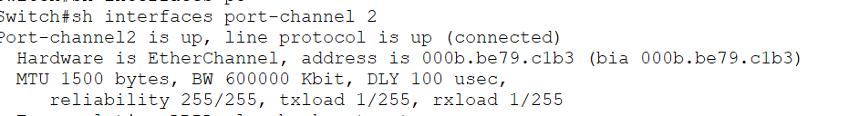
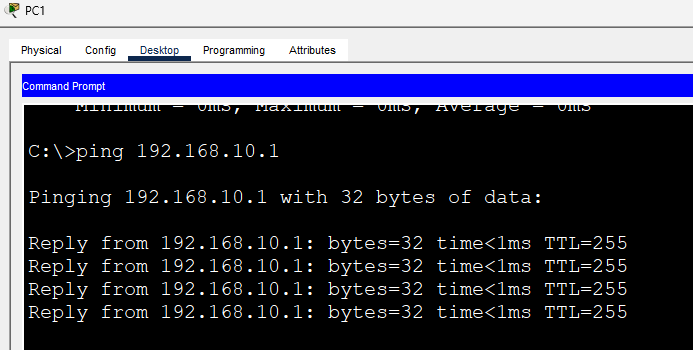
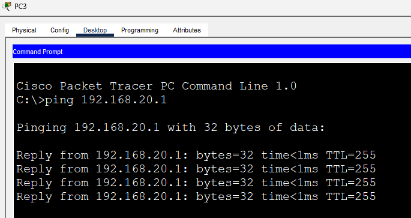
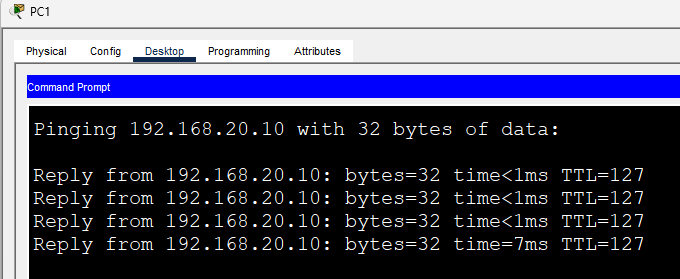

# Layer 2 EtherChannel Trunk (LACP)

This lab demonstrates how to configure a **Layer 2 EtherChannel trunk** using **Link Aggregation Control Protocol (LACP)** between an access switch and a multilayer switch.

Unlike the previous Layer 2 EtherChannel lab, this Port-Channel operates as a **trunk link**, allowing multiple VLANs to traverse a single logical interface while benefiting from increased bandwidth and redundancy.

This design closely resembles a typical enterprise campus network, where access switches connect to distribution or multilayer switches through redundant EtherChannel trunk links.

---

# Objectives

In this lab, I will:

- Configure a Layer 2 EtherChannel trunk using LACP.
- Carry multiple VLANs across a Port-Channel.
- Configure access ports for different VLANs.
- Verify VLAN communication across the EtherChannel trunk.
- Understand how EtherChannel and VLAN trunking are commonly combined in enterprise networks.

---

# Topology



The topology consists of:

- Two multilayer switches connected using a Layer 3 EtherChannel (Po1)
- One access switch connected to MSW1 using a Layer 2 EtherChannel trunk (Po2)
- VLAN 10 (Engineering)
- VLAN 20 (Sales)

The EtherChannel trunk carries VLANs 10 and 20 between the access and distribution layers.

---

# Why Use an EtherChannel Trunk?

In enterprise networks, a single uplink between switches can become both a bandwidth bottleneck and a single point of failure.

By combining multiple physical links into a Layer 2 EtherChannel trunk, organizations gain:

- Higher bandwidth
- Link redundancy
- Automatic failover
- Load balancing
- Simplified network management

Rather than configuring several independent trunk links, the switches treat the Port-Channel as one logical trunk interface.

---

# Network Overview

| Device | Role |
|---------|------|
| MSW1 | Distribution / Multilayer Switch |
| MSW2 | Neighboring Distribution Switch |
| SW3 | Access Switch |

| VLAN | Network | Gateway |
|------|---------|---------|
| VLAN 10 | 192.168.10.0/24 | 192.168.10.1 |
| VLAN 20 | 192.168.20.0/24 | 192.168.20.1 |

---

# Configuration

## MSW1

### Create the EtherChannel

```cisco
interface range fa0/5-10
 switchport mode trunk
 channel-group 2 mode active
```

### Configure Port-Channel2

```cisco
interface port-channel2
 switchport trunk encapsulation dot1q
 switchport mode trunk
 switchport trunk allowed vlan 10,20
```

---

## SW3

### Create the EtherChannel

```cisco
interface range fa0/5-10
 switchport mode trunk
 channel-group 2 mode active
```

### Configure Port-Channel2

```cisco
interface port-channel2
 switchport mode trunk
 switchport trunk allowed vlan 10,20
```

### Configure Access Ports

```cisco
interface range fa0/1-2
 switchport mode access
 switchport access vlan 10

interface range fa0/3-4
 switchport mode access
 switchport access vlan 20
```

---

# Verification

## Verify EtherChannel

```cisco
show etherchannel summary
```



Verify that all member interfaces are successfully bundled into **Port-Channel2**.

---

## Verify Trunk Status

```cisco
show interfaces trunk
```



Verify that:

- Port-Channel2 is operating as a trunk.
- VLANs 10 and 20 are allowed.
- The trunk is forwarding traffic correctly.

---

## Verify VLANs

```cisco
show vlan brief
```



Confirm that:

- Fa0/1–Fa0/2 belong to VLAN 10.
- Fa0/3–Fa0/4 belong to VLAN 20.

---

## Verify EtherChannel Interface

```cisco
show interfaces port-channel2
```



---

# End-to-End Connectivity

After completing the configuration, hosts should successfully communicate with their default gateways and across VLANs through the multilayer switch.

### PC1 → Default Gateway



---

### PC3 → Default Gateway



---

### Inter-VLAN Communication

Example:

- PC1 (VLAN 10)
- PC3 (VLAN 20)



Successful replies confirm that:

- VLAN traffic crosses the EtherChannel trunk.
- Inter-VLAN routing is performed by MSW1 using its SVIs.
- The EtherChannel trunk forwards traffic as a single logical interface.

---

# Enterprise Use Cases

Layer 2 EtherChannel trunks are widely used in enterprise campus networks, including:

- Access Switch ↔ Distribution Switch
- Distribution Switch ↔ Core Switch
- Data Center Top-of-Rack Switches
- Server access switches
- Campus building uplinks

Combining **LACP**, **VLAN trunking**, and **SVIs** provides a scalable and highly available design capable of supporting multiple VLANs while maintaining redundancy.

---

# IOS Commands Used

## Configuration

```cisco
interface range fa0/5-10
 switchport mode trunk
 channel-group 2 mode active

interface port-channel2
 switchport mode trunk
 switchport trunk allowed vlan 10,20

interface range fa0/1-2
 switchport mode access
 switchport access vlan 10

interface range fa0/3-4
 switchport mode access
 switchport access vlan 20
```

## Verification

```cisco
show etherchannel summary

show interfaces trunk

show vlan brief

show interfaces port-channel2
```

---

# What I Learned

After completing this lab, I was able to:

- Configure a Layer 2 EtherChannel trunk using LACP.
- Bundle multiple physical links into a single logical trunk.
- Carry multiple VLANs across a Port-Channel.
- Configure VLAN access ports connected to an EtherChannel trunk.
- Verify trunk and EtherChannel operation using Cisco IOS commands.
- Understand how EtherChannel trunks are commonly deployed in enterprise campus networks.

---

# Files

- `Layer2-EtherChannel-Trunk.pkt`
- `topology.png`
- `etherchannel-summary.png`
- `interfaces-trunk.png`
- `show-vlan-brief.png`
- `port-channel2.png`
- `pc1-gateway.png`
- `pc3-gateway.png`
- `inter-vlan-ping.png`