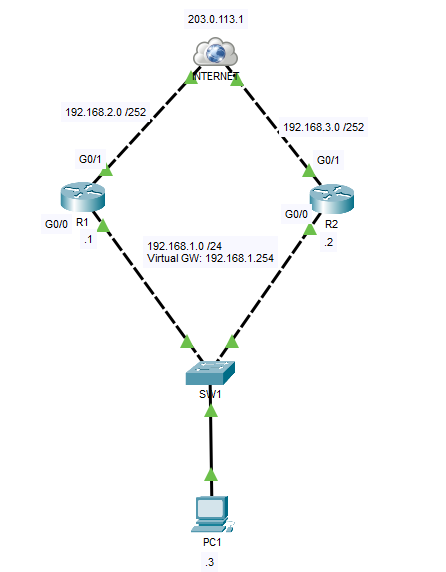
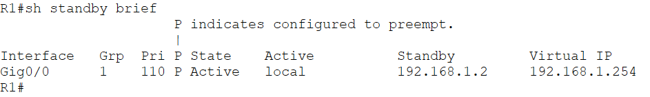
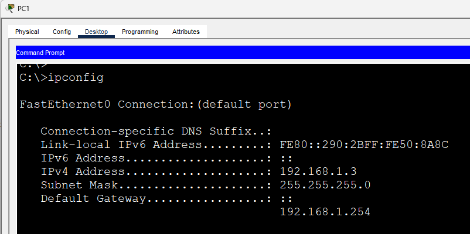
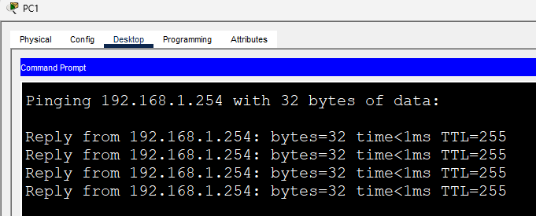
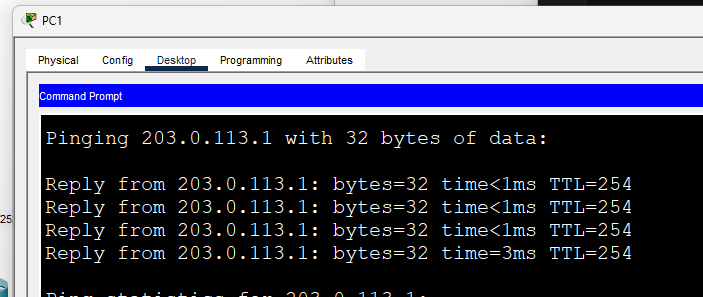
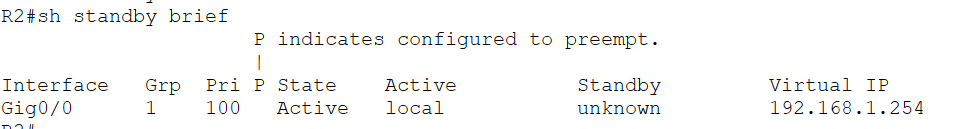
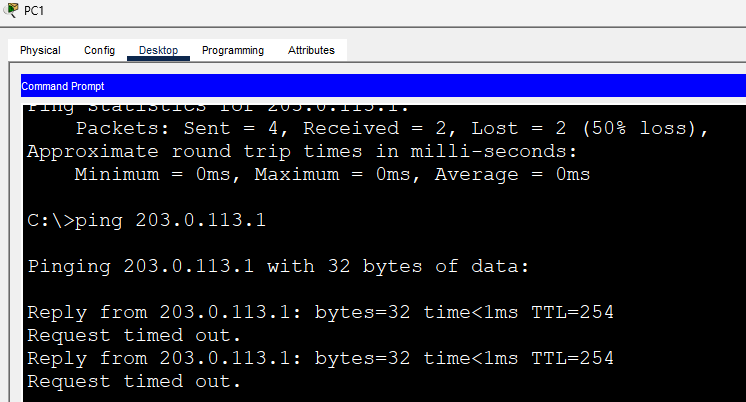

# Basic HSRP Configuration

This lab demonstrates the basic configuration of **Hot Standby Router Protocol (HSRP)**, Cisco's proprietary **First Hop Redundancy Protocol (FHRP)**. HSRP provides gateway redundancy by allowing multiple routers to share a single virtual default gateway. If the active router becomes unavailable, the standby router automatically assumes the gateway role, minimizing network downtime.

In this lab, **R1** is configured as the **Active Router** by assigning it a higher HSRP priority than **R2**. While the topology is intentionally simple, it introduces the core concepts used in enterprise high-availability network designs.

---

# Objectives

In this lab, I will:

- Configure basic HSRP between two routers.
- Configure a virtual default gateway for end devices.
- Set HSRP priorities to determine the Active and Standby routers.
- Verify HSRP operation using Cisco IOS commands.
- Simulate router failure and observe automatic failover.
- Understand how HSRP provides gateway redundancy in enterprise networks.

---

# Topology



The topology consists of:

- Two routers (R1 and R2)
- One Layer 2 switch
- One client PC
- A simulated Internet connection

### IP Addressing

| Device | Interface | IP Address |
|---------|-----------|------------|
| R1 | G0/0 | 192.168.1.1/24 |
| R2 | G0/0 | 192.168.1.2/24 |
| Virtual Gateway | HSRP | **192.168.1.254** |
| PC1 | NIC | 192.168.1.3/24 |
| R1 | G0/1 | 192.168.2.2/30 |
| R2 | G0/1 | 192.168.3.2/30 |
| Internet | — | 203.0.113.1 |

PC1 uses the **virtual IP address (192.168.1.254)** as its default gateway instead of either router's physical interface.

---

# Enterprise Context

This topology is intentionally simplified to focus on the core concepts of HSRP.

In a production enterprise network, gateway redundancy is commonly implemented between two edge routers or multilayer switches that connect the internal network to separate WAN or Internet providers. These devices often participate in additional technologies such as dynamic routing, firewall redundancy, NAT, VLANs, and redundant Layer 2 uplinks.

A typical enterprise deployment may include:

- Multiple access and distribution switches
- Several VLANs with HSRP configured on each VLAN interface
- Dual ISP or WAN connections
- Dynamic routing protocols such as OSPF or BGP
- Firewalls protecting the network edge
- EtherChannel and redundant trunk links

This lab intentionally omits those components to provide a clear introduction to HSRP. Although simplified, the same gateway redundancy principles demonstrated here also apply to other **First Hop Redundancy Protocols (FHRPs)**, such as **VRRP**, which provides similar functionality in multi-vendor environments.

---

# Why HSRP?

Without HSRP, hosts depend on a single default gateway.

```
PC → Router
```

If that router fails, all hosts lose connectivity even though another router may still be operational.

HSRP solves this problem by introducing a **virtual IP address** that is shared between multiple routers.

```
        Virtual Gateway
        192.168.1.254
             │
      ┌──────┴──────┐
      │             │
     R1           R2
  (Active)     (Standby)
```

The Active router forwards traffic destined for the virtual IP address, while the Standby router continuously monitors the Active router and automatically takes over if a failure occurs. This transition is transparent to end devices because they always use the same virtual gateway.

---

# HSRP Roles

| Role | Description |
|------|-------------|
| Active Router | Forwards traffic destined for the virtual IP address. |
| Standby Router | Monitors the Active router and assumes the gateway role upon failure. |
| Virtual IP | Shared default gateway configured on client devices. |
| Virtual MAC | MAC address associated with the virtual gateway. |

---

# Configuration

## R1 (Active Router)

```cisco
interface g0/0
 ip address 192.168.1.1 255.255.255.0
 standby 1 ip 192.168.1.254
 standby 1 priority 110
 standby 1 preempt
 no shutdown
```

---

## R2 (Standby Router)

```cisco
interface g0/0
 ip address 192.168.1.2 255.255.255.0
 standby 1 ip 192.168.1.254
 standby 1 priority 100
 standby 1 preempt
 no shutdown
```

Because **R1** has the higher priority (**110**), it becomes the Active router.

The `preempt` command allows R1 to automatically reclaim the Active role if it recovers after a failure.

---

# Verification

## Verify HSRP Status

```cisco
show standby brief
```



Verify that:

- R1 is **Active**
- R2 is **Standby**
- Virtual IP is **192.168.1.254**

---

## Verify PC Configuration

PC1 should use:

- IP Address: **192.168.1.3**
- Default Gateway: **192.168.1.254**



---

## Verify Connectivity

Ping the virtual gateway.

```text
ping 192.168.1.254
```



---

Ping the simulated Internet.

```text
ping 203.0.113.1
```



---

# Failover Test

Simulate a failure by shutting down R1's LAN interface.

```cisco
interface g0/0
 shutdown
```

Verify that R2 transitions to the **Active** role.

```cisco
show standby brief
```



Finally, repeat the ping tests from PC1 to verify that connectivity is maintained after the failover.



---

# IOS Commands Used

## Configuration

```cisco
standby 1 ip 192.168.1.254
standby 1 priority 110
standby 1 preempt
```

## Verification

```cisco
show standby

show standby brief
```

---

# What I Learned

After completing this lab, I was able to:

- Configure basic HSRP between two routers.
- Configure a virtual default gateway for client devices.
- Assign HSRP priorities to control Active and Standby roles.
- Verify HSRP operation using Cisco IOS commands.
- Simulate gateway failover and observe automatic redundancy.
- Understand how HSRP provides high availability in enterprise networks and how the same concepts extend to other FHRPs such as VRRP.

---

# Files

- `Basic-HSRP.pkt`
- `topology.png`
- `show-standby-brief.png`
- `pc-ip-config.png`
- `ping-virtual-gateway.png`
- `ping-internet.png`
- `failover.png`
- `failover-ping.png`