# HSRP Failover Demonstration

This lab builds upon the previous HSRP configuration by demonstrating how gateway redundancy works during a failure. Two multilayer switches provide redundant default gateways for multiple VLANs while connected to a simulated Internet.

In this lab, **MSW1** initially serves as the Active gateway for both VLANs. I will then simulate a failure and observe how **MSW2** automatically assumes the Active role while end devices continue using the same virtual default gateway.

---

# Objectives

In this lab, I will:

- Configure HSRP for multiple VLANs.
- Configure virtual default gateways for VLAN 10 and VLAN 20.
- Verify Active and Standby HSRP states.
- Simulate the failure of the Active gateway.
- Observe automatic HSRP failover.
- Verify uninterrupted connectivity after failover.
- Visualize packet forwarding before and after failover using Packet Tracer Simulation Mode.

---

# Topology

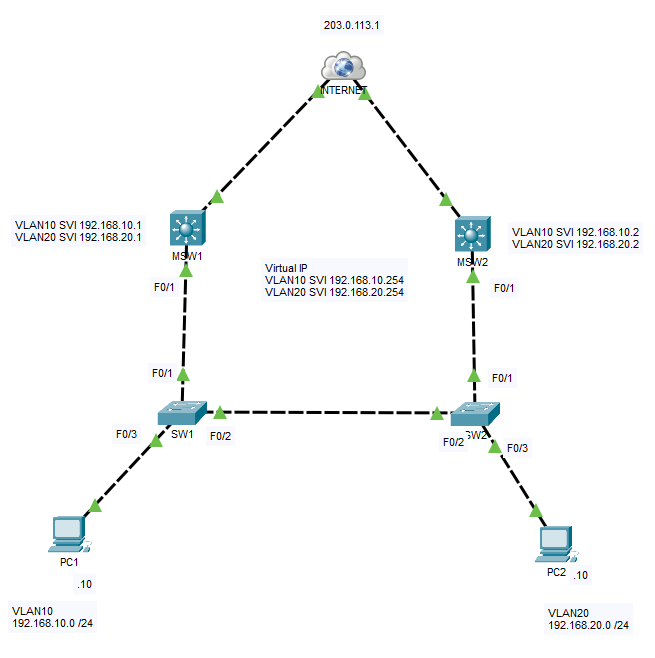

---

# Enterprise Context

This topology is intentionally simplified to demonstrate the core concepts of HSRP.

In production enterprise networks, gateway redundancy is commonly deployed between two multilayer switches or edge routers that connect users to redundant WAN or Internet connections. Multiple VLANs often rely on HSRP so that hosts continue communicating even if one gateway fails.

Although simplified, this lab demonstrates the same redundancy principles used in enterprise campus networks.

---

# Initial HSRP Roles

| Device | VLAN 10 | VLAN 20 |
|---------|---------|---------|
| MSW1 | Active | Active |
| MSW2 | Standby | Standby |

---

# Verify Initial HSRP Status

### MSW1

```cisco
show standby brief
```

**Screenshot**

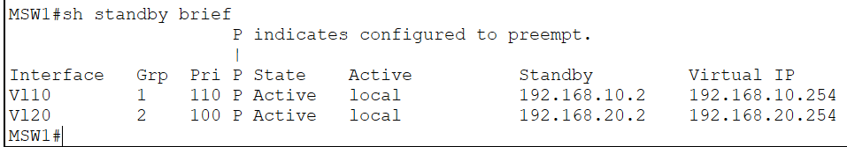

---

### MSW2

```cisco
show standby brief
```

**Screenshot**

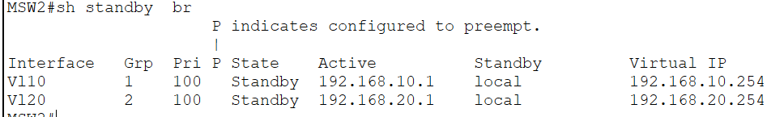

---

# End-to-End Connectivity

Verify connectivity before performing failover.

### PC1 → Virtual Gateway

**Screenshot**

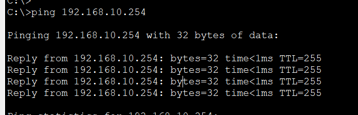

---

### PC2 → Virtual Gateway

**Screenshot**

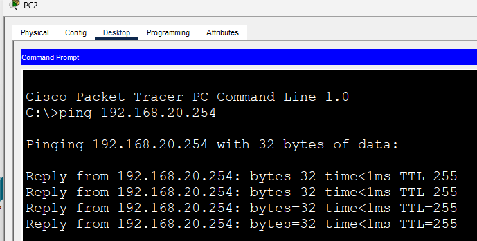

---

### PC1 → PC2

**Screenshot**

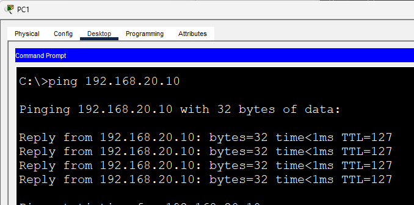

---

### PC1 → Internet

**Screenshot**

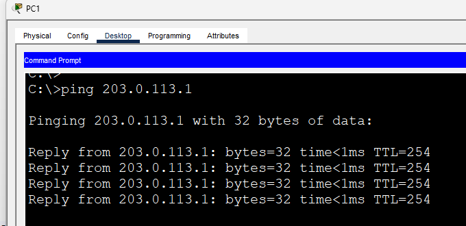

---

# Traffic Flow Before Failover

With **MSW1** acting as the Active gateway, traffic from both VLANs is forwarded through MSW1 before reaching its destination.

### Packet Tracer Simulation

**Video**

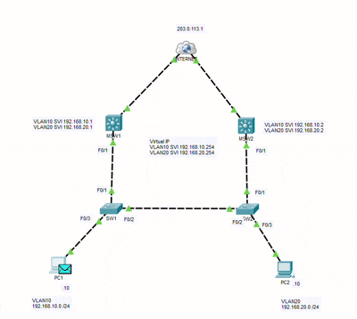

---

# Simulate Failover

Simulate a failure by shutting down the uplink connecting **MSW1** to the network.

```cisco
interface fa0/1
shutdown
```

HSRP automatically elects **MSW2** as the new Active gateway.

---

### MSW2

```cisco
show standby brief
```

**Screenshot**

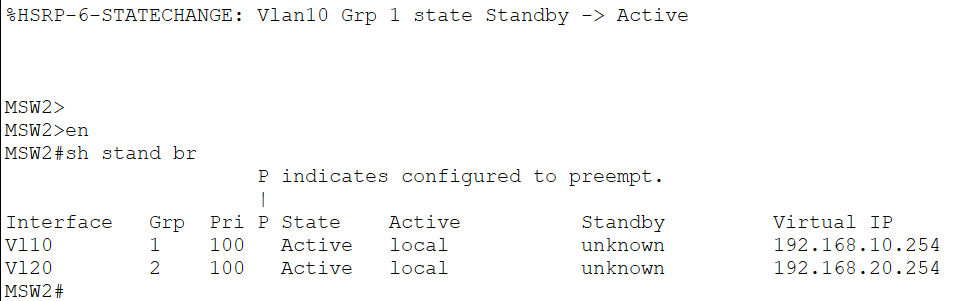

---

# Traffic Flow After Failover

After **MSW1** fails, **MSW2** becomes the Active gateway and forwards all inter-VLAN and Internet-bound traffic.

### Packet Tracer Simulation

**Video**

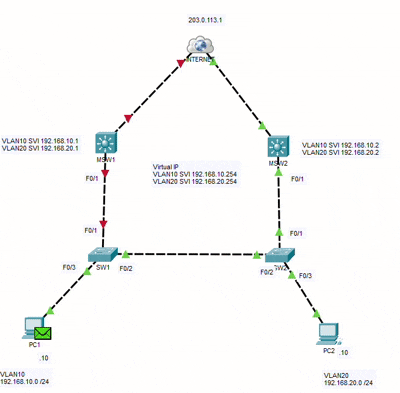

---

# Connectivity After Failover

Repeat the connectivity tests.

### PC1 → Virtual Gateway

**Screenshot**

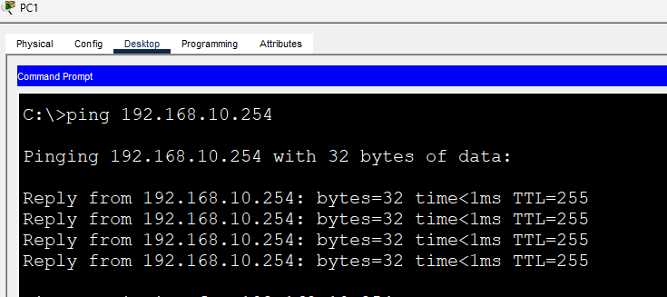

---

### PC2 → Virtual Gateway

**Screenshot**


---

### PC1 → PC2

**Screenshot**

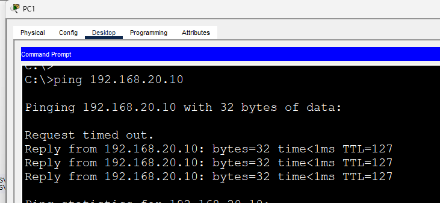

---

### PC1 → Internet

**Screenshot**

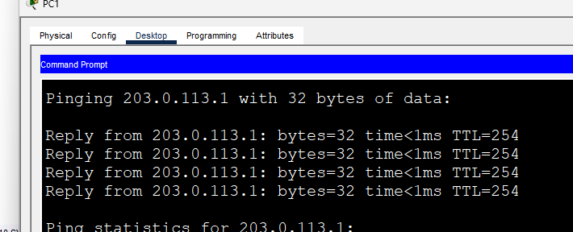

---

# IOS Commands Used

## Configuration

```cisco
standby version 2
standby 1 ip
standby 2 ip
standby priority
standby preempt
```

## Verification

```cisco
show standby

show standby brief
```

---

# What I Learned

After completing this lab, I was able to:

- Configure HSRP across multiple VLANs.
- Verify Active and Standby gateway roles.
- Simulate gateway failure and observe automatic failover.
- Confirm uninterrupted network connectivity during failover.
- Visualize how HSRP transparently redirects traffic without requiring any changes to client configurations.

---

# Files

- `HSRP with Multiple VLANs.pkt`
- `README.md`
- `topology.png`
- `show-standby-msw1.png`
- `show-standby-msw2.png`
- `pc1-ping-gateway.png`
- `pc2-ping-gateway.png`
- `pc1-ping-pc2.png`
- `pc1-ping-internet.png`
- `simulation-before-failover.mp4`
- `msw1-after-failover.png`
- `msw2-after-failover.png`
- `pc1-gateway-after.png`
- `pc2-gateway-after.png`
- `pc1-pc2-after.png`
- `pc1-internet-after.png`
- `simulation-after-failover.mp4`