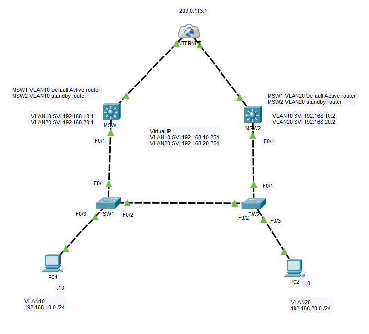
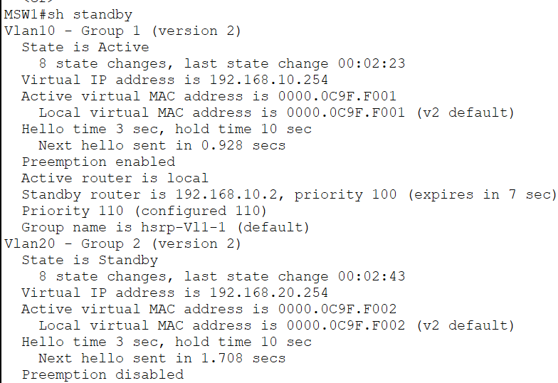
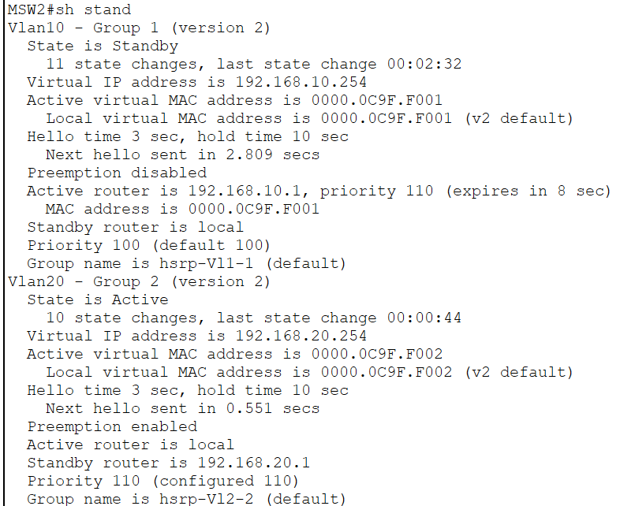
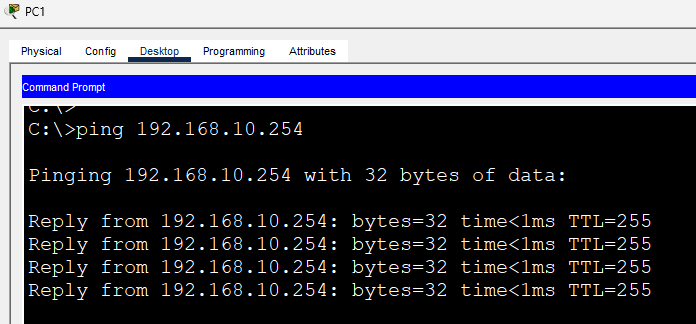
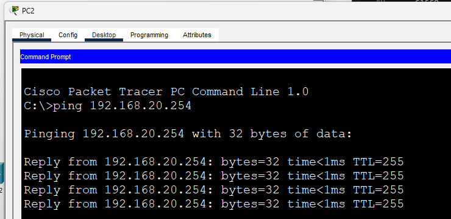
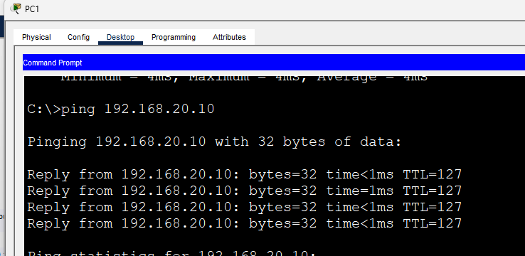
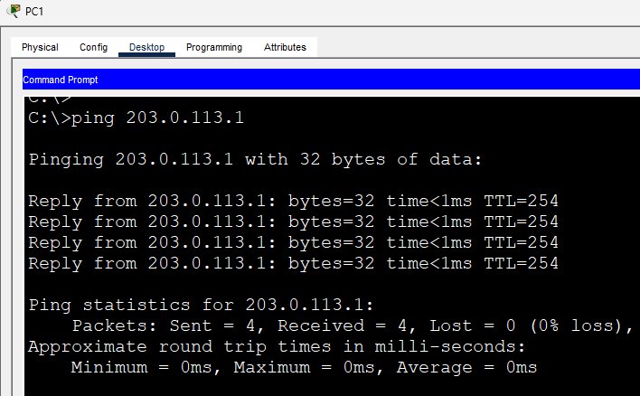
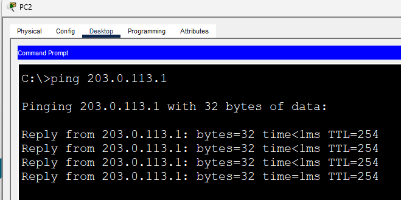

# HSRP Load Balancing

This lab demonstrates how HSRP can be configured to provide both **gateway redundancy** and **load balancing** across multiple VLANs. Instead of having one multilayer switch actively forwarding traffic for every VLAN, the HSRP Active role is distributed between two switches.

In this lab, **MSW1** is configured as the Active gateway for **VLAN 10**, while **MSW2** is configured as the Active gateway for **VLAN 20**. This allows both switches to actively forward traffic under normal operation while still providing automatic failover should either gateway become unavailable.

---

# Objectives

In this lab, I will:

- Configure HSRP for multiple VLANs.
- Configure different Active gateways for each VLAN.
- Verify HSRP Active and Standby roles.
- Demonstrate HSRP load balancing across VLANs.
- Verify end-to-end connectivity.
- Observe the traffic path using Packet Tracer Simulation Mode.

---

# Topology



---

# Enterprise Context

In enterprise networks, multiple VLANs often exist for different departments such as Engineering, Sales, Finance, or HR. If one gateway is configured as Active for every VLAN, that device handles all Layer 3 forwarding while the second gateway remains mostly idle.

To better utilize available hardware, network administrators commonly distribute HSRP Active roles across VLANs. This allows both multilayer switches to actively forward traffic while maintaining gateway redundancy in case either switch fails.

---

# HSRP Roles

| VLAN | Active Gateway | Standby Gateway | Virtual IP |
|------|----------------|-----------------|------------|
| VLAN 10 | MSW1 | MSW2 | 192.168.10.254 |
| VLAN 20 | MSW2 | MSW1 | 192.168.20.254 |

---

# Verify HSRP Status

### MSW1

```cisco
show standby brief
```

**Screenshot**



---

### MSW2

```cisco
show standby brief
```

**Screenshot**



---

# Verify End-to-End Connectivity

### PC1 → Default Gateway

**Screenshot**



---

### PC2 → Default Gateway

**Screenshot**



---

### PC1 → PC2

**Screenshot**



---

### PC1 → Internet

**Screenshot**



---

### PC2 → Internet

**Screenshot**



---

# Traffic Flow Demonstration

With HSRP load balancing configured:

- Traffic originating from **VLAN 10** uses **MSW1** as its Active gateway.
- Traffic originating from **VLAN 20** uses **MSW2** as its Active gateway.
- Both multilayer switches actively forward traffic, improving resource utilization while still providing gateway redundancy.

### Packet Tracer Simulation

**VLAN 10 Traffic**


---

**VLAN 20 Traffic**


---

# IOS Commands Used

## Configuration

```cisco
standby version 2
standby ip
standby priority
standby preempt
```

## Verification

```cisco
show standby

show standby brief
```

---

# What I Learned

After completing this lab, I was able to:

- Configure HSRP for multiple VLANs.
- Distribute HSRP Active roles across different VLANs.
- Verify Active and Standby gateway roles using `show standby brief`.
- Understand how HSRP can provide both redundancy and load balancing.
- Visualize how different VLANs use different Active gateways during normal operation.

---

# Files

- `HSRP LoadBalancing.pkt`
- `README.md`
- `topology.png`
- `show-standby-msw1.png`
- `show-standby-msw2.png`
- `pc1-ping-gateway.png`
- `pc2-ping-gateway.png`
- `pc1-ping-pc2.png`
- `pc1-ping-internet.png`
- `pc2-ping-internet.png`
- `vlan10-traffic.gif`
- `vlan20-traffic.gif`