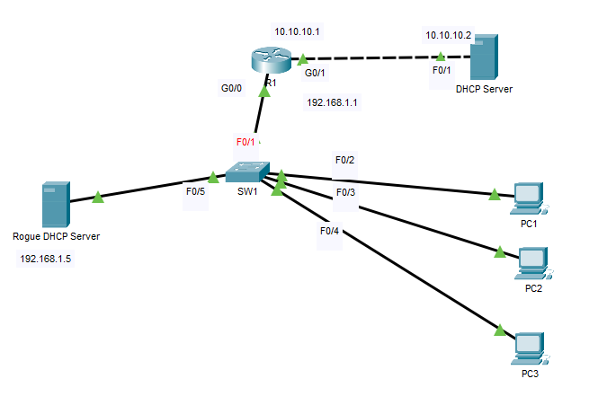
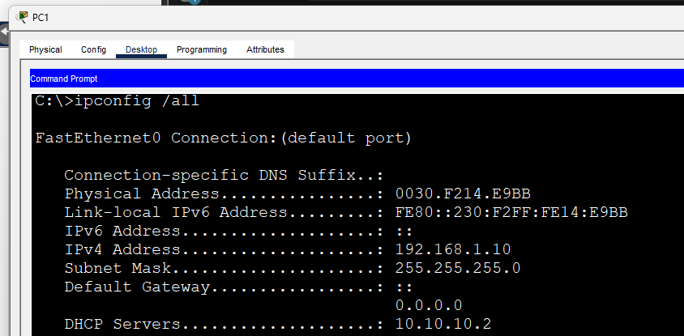
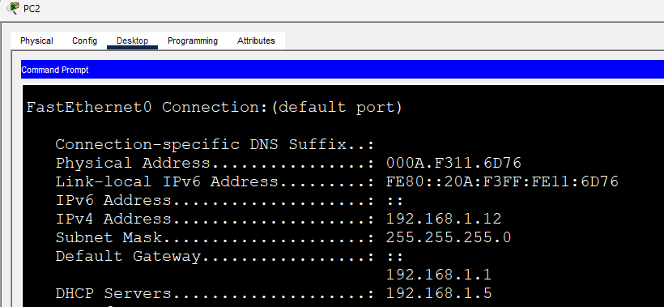
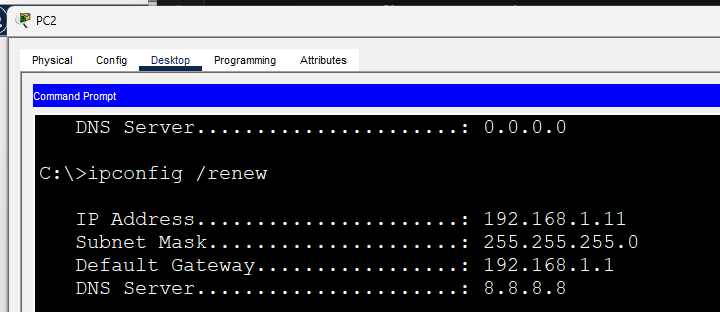
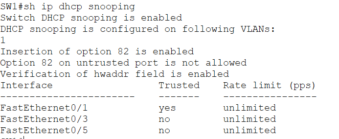
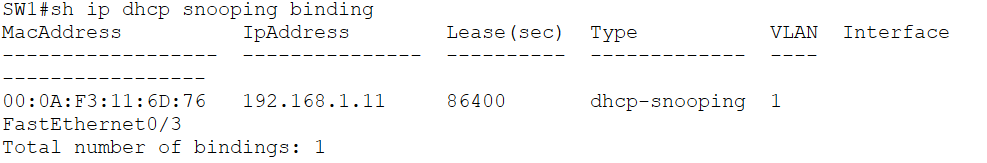

# DHCP Snooping - Rogue DHCP Server Prevention

## Overview

This lab demonstrates how **DHCP Snooping** protects a Layer 2 network from rogue DHCP servers.

Without DHCP Snooping, any device connected to the network can respond to DHCP requests and assign incorrect IP configurations to clients. This can result in network outages, traffic interception, or denial-of-service attacks.

After enabling DHCP Snooping, the switch only accepts DHCP server messages from **trusted interfaces**, ensuring that clients receive IP addresses only from the legitimate DHCP server.

---

## Objectives

- Understand the purpose of DHCP Snooping
- Observe the effects of a rogue DHCP server
- Configure DHCP Snooping on a Cisco switch
- Configure trusted interfaces
- Verify that rogue DHCP offers are blocked
- Confirm that clients receive valid IP configurations

---

## Topology



---

## Addressing Table

| Device | Interface | IP Address | Description |
|----------|-----------|------------|-------------|
| R1 | G0/0 | 192.168.1.1/24 | Default Gateway |
| R1 | G0/1 | 10.10.10.1/24 | Connected to Legitimate DHCP Server |
| DHCP Server | F0/1 | 10.10.10.2/24 | Legitimate DHCP Server |
| Rogue DHCP Server | F0 | 192.168.1.5/24 | Unauthorized DHCP Server |
| PC1 | NIC | DHCP | Client |
| PC2 | NIC | DHCP | Client |
| PC3 | NIC | DHCP | Client |

---

# Lab Scenario

The network contains two DHCP servers:

- A legitimate DHCP server connected through **R1**
- A rogue DHCP server connected directly to **SW1**

Initially, DHCP Snooping is disabled. Both DHCP servers respond to DHCP Discover messages, causing some clients to obtain invalid IP configurations.

After DHCP Snooping is enabled, only DHCP responses arriving from the trusted uplink are accepted. Any DHCP server messages arriving on untrusted interfaces are discarded.

---

# Part 1 - Rogue DHCP Server (Before DHCP Snooping)

## Expected Behavior

When clients request an IP address:

- Both DHCP servers send DHCP Offers.
- Some clients receive IP configuration from the rogue server.
- Clients with rogue IP settings may lose network connectivity.

---

## Verification

### PC1 - Valid DHCP Lease



PC1 successfully receives its IP configuration from the legitimate DHCP server.

---

### PC2 - Rogue DHCP Lease



PC2 receives its DHCP lease from the rogue DHCP server.

Notice that:

- DHCP Server: **192.168.1.5**
- Incorrect IP configuration is assigned.
- Connectivity may fail because of an incorrect gateway or subnet configuration.

---

### Connectivity Test

Attempting to reach the default gateway fails.

```text
PC2> ping 192.168.1.1

Request timed out.
Request timed out.
Request timed out.
Request timed out.
```

This demonstrates how a rogue DHCP server can disrupt normal network operation.

---

# Part 2 - Configure DHCP Snooping

## SW1 Configuration

Enable DHCP Snooping globally.

```cisco
conf t

ip dhcp snooping
ip dhcp snooping vlan 1
```

Trust the uplink toward the legitimate DHCP server.

```cisco
interface f0/1
 ip dhcp snooping trust
exit
```

(Optional) Configure DHCP packet rate limiting on access ports.

```cisco
interface range f0/2-5
 ip dhcp snooping limit rate 15
exit
```

Save the configuration.

```cisco
end
copy running-config startup-config
```

---

# Verification (After DHCP Snooping)

Renew the DHCP lease on each client.

```text
ipconfig /release
ipconfig /renew
```

---

### PC2 - New DHCP Lease



After renewing its lease, PC2 now receives its IP configuration from the legitimate DHCP server instead of the rogue server.

---

### Successful Connectivity

```text
PC> ping 192.168.1.1

Reply from 192.168.1.1
Reply from 192.168.1.1
Reply from 192.168.1.1
Reply from 192.168.1.1
```

All clients can successfully communicate with the default gateway.

---

### DHCP Snooping Status



The output confirms that:

- DHCP Snooping is enabled.
- VLAN 1 is protected.
- Only the uplink interface (F0/1) is trusted.

---

### DHCP Snooping Binding Table



The binding table displays the MAC address, leased IP address, VLAN, and interface for each DHCP client.

This confirms that DHCP Snooping successfully learned the legitimate DHCP bindings while blocking DHCP server messages arriving on untrusted ports.

---

# Expected Results

## Before DHCP Snooping

- Rogue DHCP server responds to client requests.
- Some clients receive incorrect IP configurations.
- Network connectivity becomes unreliable.

## After DHCP Snooping

- DHCP Offers from the rogue DHCP server are discarded.
- Only the legitimate DHCP server assigns IP addresses.
- Clients receive valid IP configurations.
- Connectivity is restored.

---

# Verification Commands

```cisco
show ip dhcp snooping

show ip dhcp snooping binding

show ip dhcp snooping statistics

show running-config
```

---

# Key Concepts

- DHCP Snooping is a Layer 2 security feature.
- DHCP Snooping must be enabled globally and for the VLANs to be protected.
- All switch interfaces are **untrusted by default**.
- Only interfaces connected to legitimate DHCP servers should be configured as **trusted**.
- DHCP server messages received on untrusted interfaces are dropped.
- DHCP Snooping builds a binding table that can be used by security features such as **Dynamic ARP Inspection (DAI)**.

---

# Skills Demonstrated

- Layer 2 Security
- DHCP Snooping
- Rogue DHCP Server Mitigation
- Cisco IOS Configuration
- DHCP Troubleshooting
- Network Security Fundamentals

---

# Files

- `DHCP-Snooping-Rogue-DHCP-Server.pkt`
- `README.md`
- `topology.png`
- `traffic-simulation.gif`
- `pc1-valid-lease.png`
- `pc2-rogue-lease.png`
- `pc2-valid-after-snooping.png`
- `show-ip-dhcp-snooping.png`
- `show-ip-dhcp-snooping-binding.png`