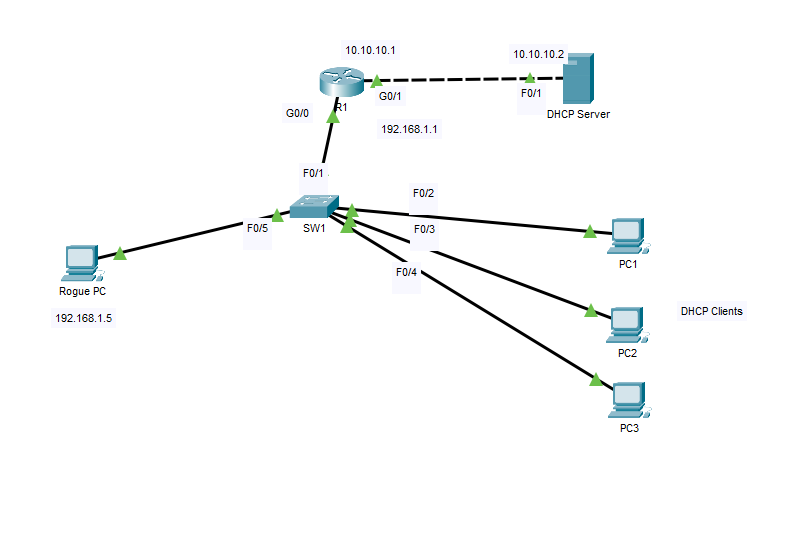
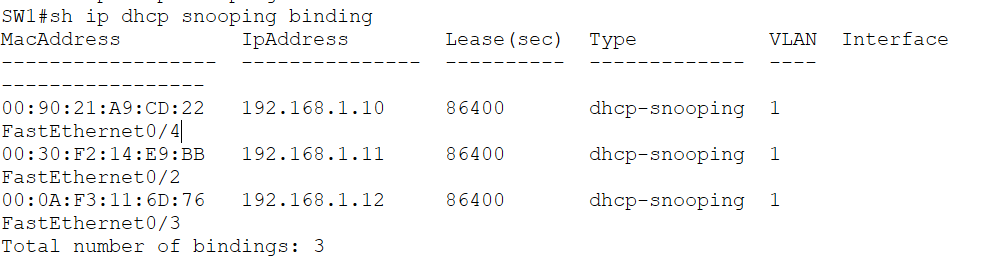
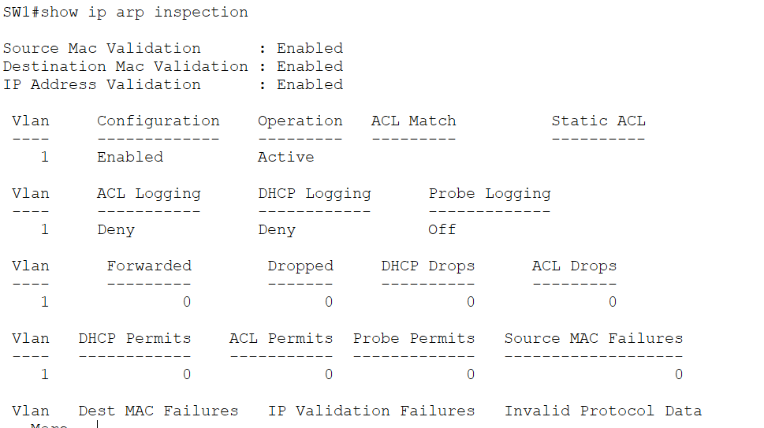
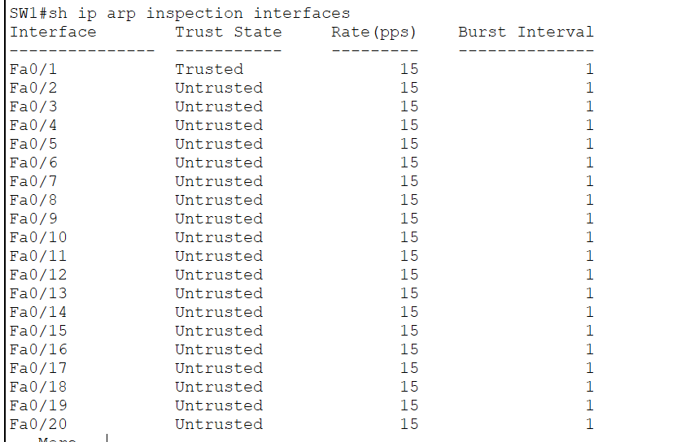
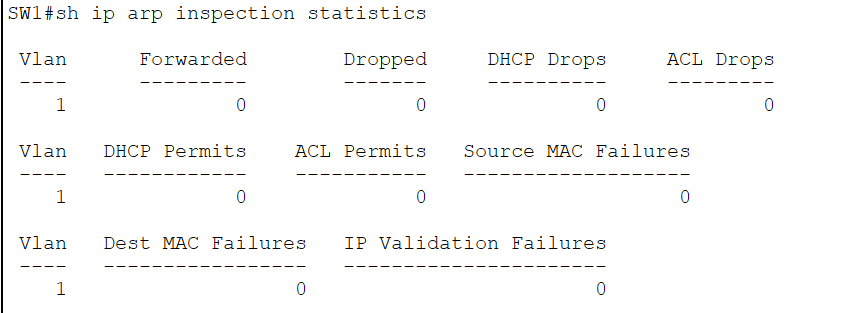
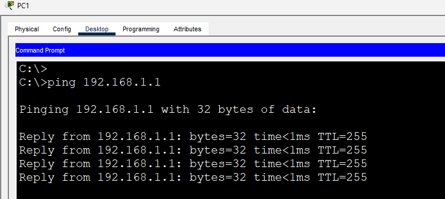
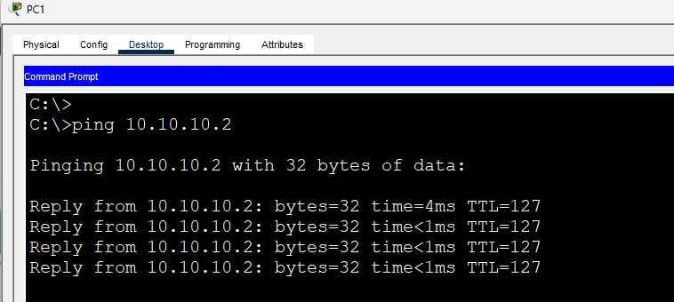
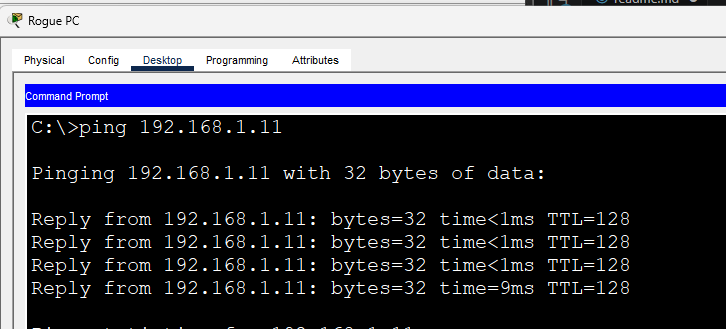

# Dynamic ARP Inspection (DAI)

This lab demonstrates how **Dynamic ARP Inspection (DAI)** protects a Layer 2 network against ARP spoofing and ARP poisoning attacks. DAI validates ARP packets received on **untrusted ports** by comparing them against the **DHCP Snooping binding table**.

Since Cisco Packet Tracer does not fully emulate ARP spoofing attacks, this lab focuses on the proper configuration and verification of DAI and its integration with DHCP Snooping.

---

# Objectives

In this lab, I will:

- Configure Dynamic ARP Inspection (DAI).
- Configure trusted and untrusted interfaces.
- Verify that DAI uses the DHCP Snooping binding table.
- Observe DAI operation using verification commands.
- Demonstrate normal ARP communication.
- Observe DAI statistics and inspection counters.

---

# Topology



---

# Prerequisites

Dynamic ARP Inspection depends on **DHCP Snooping**.

Before configuring DAI:

- DHCP Snooping must already be enabled.
- DHCP Snooping must already be operational.
- Clients should obtain their IP addresses through DHCP.
- The DHCP Snooping binding table should already contain valid IP-to-MAC mappings.

---

# Enterprise Context

ARP is responsible for mapping IPv4 addresses to MAC addresses within a local network. Attackers can exploit this process by sending forged ARP messages that associate their own MAC address with another device's IP address, such as the default gateway. This attack is commonly known as **ARP spoofing** or **ARP poisoning**.

Dynamic ARP Inspection mitigates this attack by inspecting ARP packets arriving on untrusted interfaces and validating them against the DHCP Snooping binding table. Invalid ARP packets are discarded before they reach other hosts.

---

# Verify DHCP Snooping Binding Table

```cisco
show ip dhcp snooping binding
```

**Screenshot**



---

# Verify DAI Configuration

```cisco
show ip arp inspection
```

**Screenshot**



---

# Verify Trusted Interfaces

```cisco
show ip arp inspection interfaces
```

**Screenshot**



---

# Verify DAI Statistics

```cisco
show ip arp inspection statistics
```

**Screenshot**



---

# Verify End-to-End Connectivity

### DHCP Client → Default Gateway

**Screenshot**



---

### DHCP Client → DHCP Server

**Screenshot**



---

### Rogue PC → DHCP Client

Although the Rogue PC can still communicate normally, DAI prevents it from successfully sending forged ARP packets that do not match the DHCP Snooping binding table.

**Screenshot**



---

# Packet Tracer Demonstration

Cisco Packet Tracer does not support generating a true ARP spoofing attack using tools such as Bettercap or Ettercap. Therefore, this lab focuses on demonstrating DAI configuration, verification, and its relationship with DHCP Snooping rather than a full man-in-the-middle attack.

---


# IOS Commands Used

## Configuration

```cisco
ip arp inspection vlan 1

interface Fa0/1
 ip arp inspection trust
```

## Verification

```cisco
show ip arp inspection

show ip arp inspection interfaces

show ip arp inspection statistics

show ip dhcp snooping binding
```

---

# What I Learned

After completing this lab, I was able to:

- Configure Dynamic ARP Inspection.
- Understand the relationship between DHCP Snooping and DAI.
- Configure trusted and untrusted interfaces.
- Verify DAI operation using Cisco IOS commands.
- Understand how DAI protects against ARP spoofing by validating ARP packets against the DHCP Snooping binding table.
- Recognize the limitations of Cisco Packet Tracer when demonstrating Layer 2 security attacks.

---

# Files

- `DAI.pkt`
- `README.md`
- `topology.png`
- `show-dhcp-binding.png`
- `show-arp-inspection.png`
- `show-arp-inspection-interfaces.png`
- `show-arp-inspection-statistics.png`
- `ping-gateway.png`
- `ping-dhcp-server.png`
- `rogue-ping-client.png`
