# Port Security

This lab demonstrates how Cisco Port Security restricts unauthorized devices from connecting to an access port. It covers manual MAC address configuration, Sticky MAC learning, and Port Security violation modes.

---

# Objectives

In this lab, I will:

- Configure Port Security on an access port.
- Configure a static secure MAC address.
- Configure Sticky MAC learning.
- Configure the violation mode.
- Verify Port Security using Cisco IOS commands.
- Demonstrate a Port Security violation.
- Recover an interface from the err-disabled state.

---

# Topology

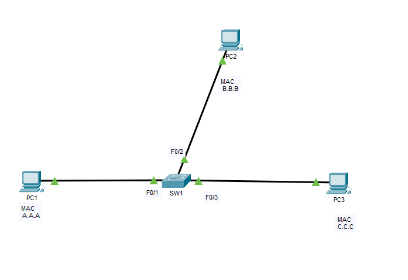

---

# Enterprise Context

Port Security is commonly deployed on access layer switches to prevent unauthorized devices from connecting to the network. By limiting the number of MAC addresses learned on an interface, administrators can protect the network against rogue devices while allowing legitimate hosts to communicate normally.

---

# Scenario 1 - Static Secure MAC Address

Configure FastEthernet0/1 to allow only PC1.

```cisco
interface fa0/1
 switchport mode access
 switchport port-security
 switchport port-security maximum 1
 switchport port-security mac-address A.A.A
 switchport port-security violation shutdown
```

## Verification

```cisco
show port-security

show port-security interface fa0/1

show running-config interface fa0/1
```

**Screenshots**

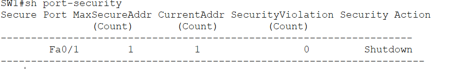

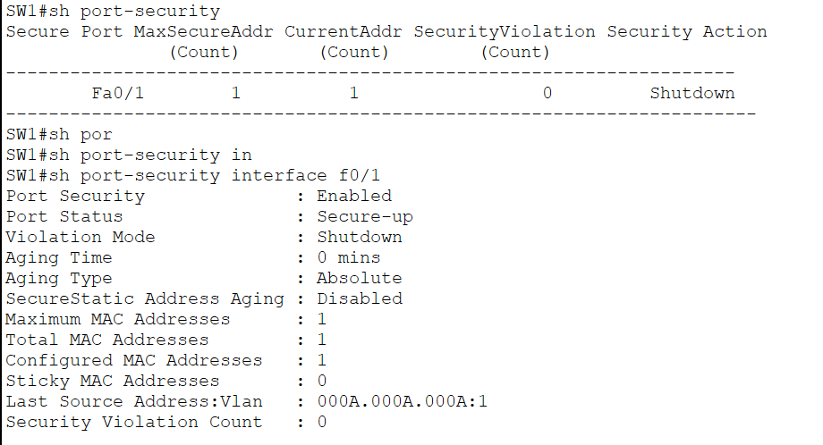

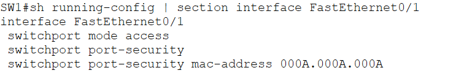

---

## Connectivity Test

PC1 should successfully communicate with the rest of the network.

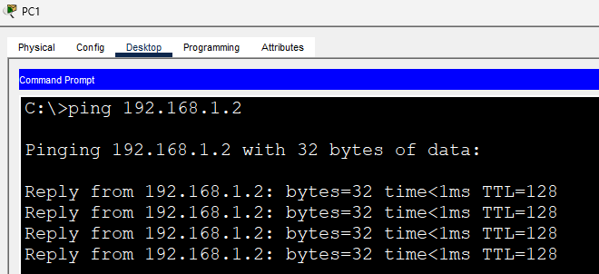

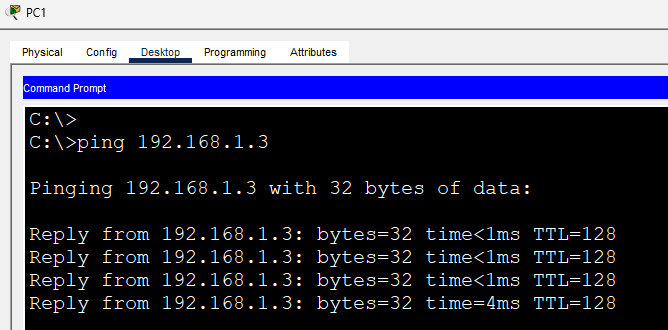

---

# Scenario 2 - Sticky MAC Learning

Instead of manually specifying the MAC address, configure Sticky MAC.

```cisco
interface fa0/1
 no switchport port-security mac-address A.A.A
 switchport port-security mac-address sticky
```

Reconnect PC1 or clear the learned address if necessary. The switch automatically learns PC1's MAC address and stores it in the running configuration.

## Verification

```cisco
show port-security

show running-config interface fa0/1
```

**Screenshots**

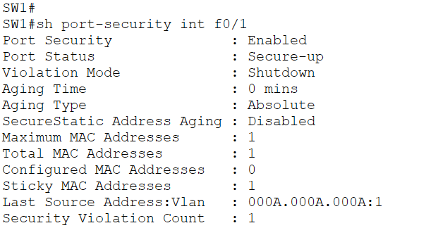

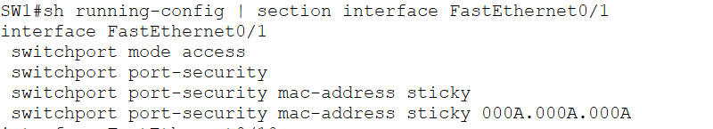

---

# Scenario 3 - Port Security Violation

Disconnect PC1 and connect another device with MAC address **D.D.D**.

Because the interface only allows one secure MAC address, the switch detects a violation.

The configured violation mode is:

```cisco
switchport port-security violation shutdown
```

The interface transitions to the **err-disabled** state.

## Verification

```cisco
show port-security

show port-security interface fa0/1
```

**Screenshots**

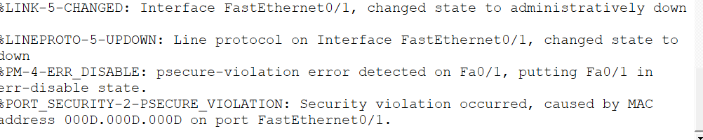

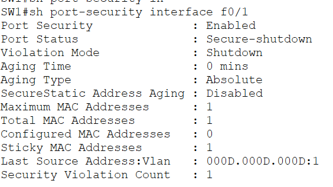

---

## Recover the Interface

```cisco
interface fa0/1
 shutdown
 no shutdown
```

**Screenshot**

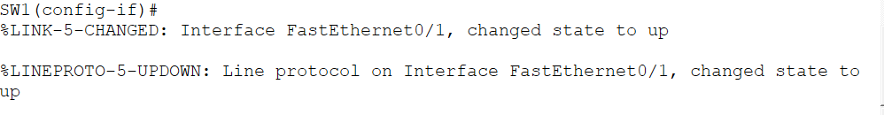

---

# Port Security Violation Modes

Cisco supports three violation modes.

| Mode | Behavior |
|------|----------|
| Protect | Drops frames from unauthorized MAC addresses without generating logs or increasing the violation counter. |
| Restrict | Drops unauthorized traffic, increments the violation counter, and generates log messages. |
| Shutdown | Places the interface into the err-disabled state until it is manually or automatically recovered. |

This lab uses **shutdown**, as it is the easiest mode to demonstrate and clearly shows the effects of a security violation.

---

# IOS Commands Used

## Configuration

```cisco
interface fa0/1
 switchport mode access
 switchport port-security
 switchport port-security maximum 1
 switchport port-security violation shutdown
 switchport port-security mac-address sticky
```

## Verification

```cisco
show port-security

show port-security interface fa0/1

show running-config interface fa0/1
```

---

# What I Learned

After completing this lab, I was able to:

- Configure Cisco Port Security.
- Restrict an access port to a single device.
- Configure both static and Sticky MAC addresses.
- Understand the differences between the Protect, Restrict, and Shutdown violation modes.
- Demonstrate a Port Security violation and recover the interface after it entered the err-disabled state.

---

# Files

- `Port Security.pkt`
- `README.md`
- `topology.png`
- `show-port-security-static.png`
- `show-port-security-interface-static.png`
- `show-running-config-static.png`
- `ping-pc2.png`
- `ping-pc3.png`
- `sticky-mac.png`
- `sticky-running-config.png`
- `violation.png`
- `violation-interface.png`
- `recovered-interface.png`