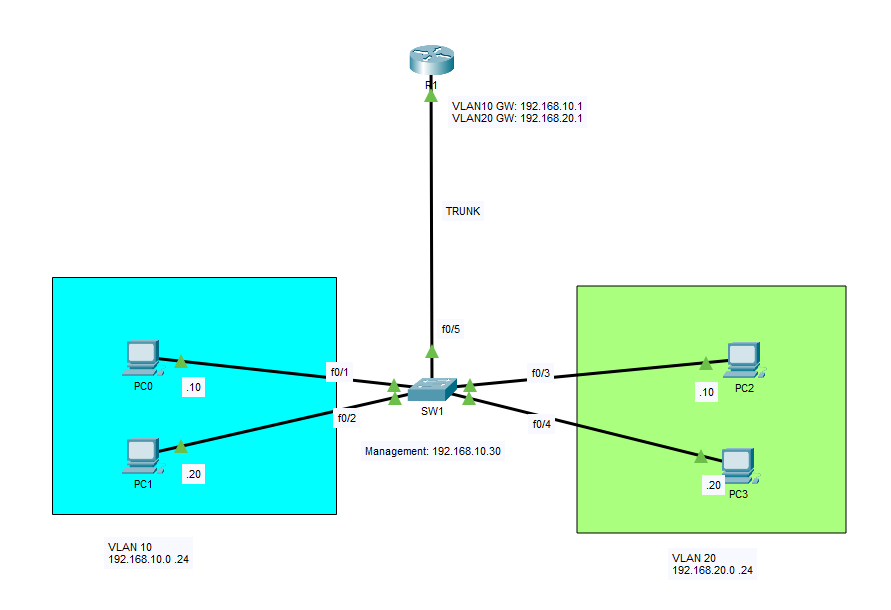
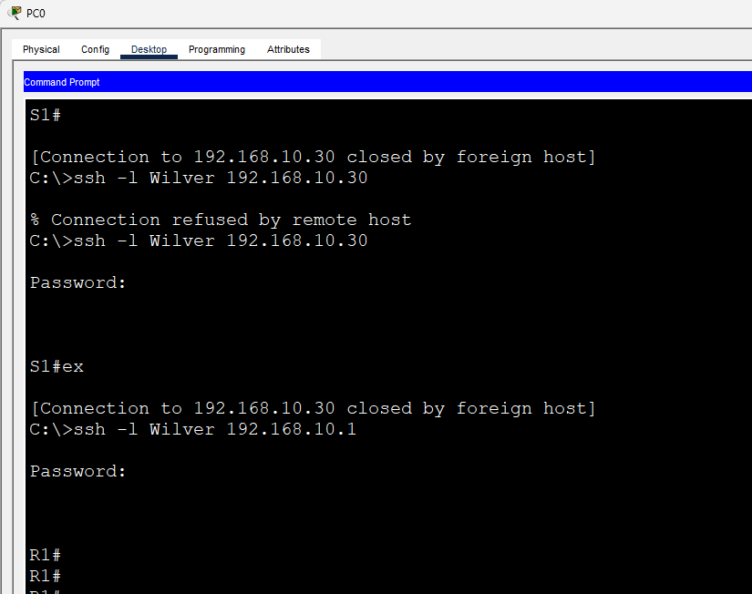
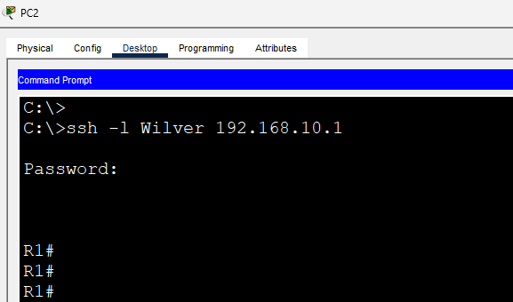
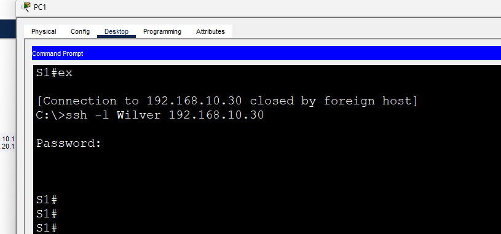
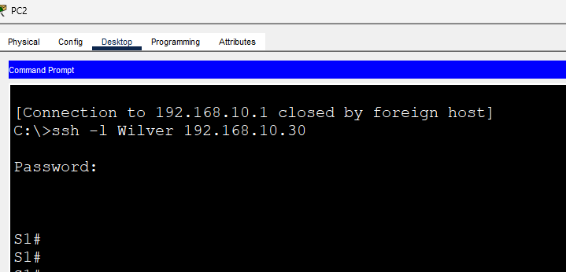
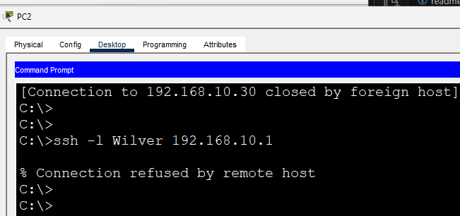
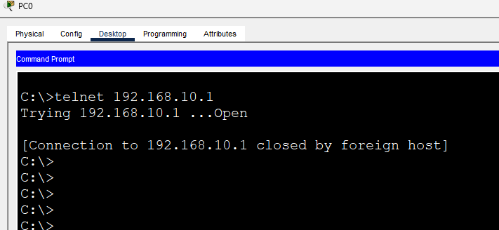

# SSH with Management ACL

This lab demonstrates how to securely manage Cisco network devices using **SSH Version 2**. It also shows how an Access Control List (ACL) can be used to restrict remote management access so that only trusted hosts are allowed to establish SSH sessions.

---

# Objectives

In this lab, I will:

- Configure SSH Version 2 on a Cisco router and switch.
- Configure a local administrator account.
- Generate RSA keys for encrypted remote access.
- Configure VTY lines for SSH-only management.
- Verify successful SSH connectivity from multiple VLANs.
- Restrict SSH access using a standard ACL.
- Verify that unauthorized hosts cannot remotely manage the devices.

---

# Topology



---

# Enterprise Context

SSH is the industry standard protocol for remotely managing Cisco devices because it encrypts both authentication credentials and management traffic.

In enterprise environments, network administrators typically restrict SSH access to trusted management networks by applying Access Control Lists (ACLs) to the VTY lines. This significantly reduces the attack surface by preventing unauthorized hosts from attempting to access network infrastructure.

---

# IP Addressing

| Device | Interface | IP Address |
|---------|-----------|------------|
| R1 | VLAN10 Gateway | 192.168.10.1 |
| R1 | VLAN20 Gateway | 192.168.20.1 |
| SW1 | VLAN10 SVI | 192.168.10.30 |
| PC0 | VLAN10 | 192.168.10.10 |
| PC1 | VLAN10 | 192.168.10.20 |
| PC2 | VLAN20 | 192.168.20.10 |
| PC3 | VLAN20 | 192.168.20.20 |

---

# Scenario 1 – SSH Remote Management

Configure SSH Version 2 on both the router and switch.

### Router/Switch Configuration

```cisco
hostname R1

ip domain-name cisco.com

username Wilver privilege 15 secret cisco

crypto key generate rsa modulus 1024

ip ssh version 2

line vty 0 15
 login local
 transport input ssh
```

Perform the same configuration on **SW1**.

---

## Verification

Verify SSH is enabled.

```cisco
show ip ssh
```

Verify active SSH sessions.

```cisco
show users
```

---

## Connectivity Tests

Initially, both VLANs are allowed to remotely manage the devices.

Expected Results

| Source | Router SSH | Switch SSH |
|---------|------------|------------|
| VLAN10 | ✅ Success | ✅ Success |
| VLAN20 | ✅ Success | ✅ Success |

---

### Screenshots









---

# Scenario 2 – Restrict SSH Using an ACL

To improve security, create a Standard ACL that allows only VLAN 10 to remotely manage the router and switch.

### Router/Switch Configuration

```cisco
access-list 10 permit 192.168.10.0 0.0.0.255

line vty 0 15
 access-class 10 in
 transport input ssh
```

---

## Verification

Verify the ACL.

```cisco
show access-lists
```

Verify the VTY configuration.

```cisco
show running-config | section line vty
```

---

## Connectivity Tests

After applying the ACL:

| Source | Router SSH | Switch SSH |
|---------|------------|------------|
| VLAN10 | ✅ Allowed | ✅ Allowed |
| VLAN20 | ❌ Denied | ❌ Denied |

---

### Screenshots




---

# Scenario 3 – Disable Telnet

As a security best practice, Telnet should be disabled because it transmits credentials in plaintext.

Ensure the VTY lines only accept SSH.

```cisco
line vty 0 15
 transport input ssh
```

Attempt a Telnet connection.

Expected Result

```
% Connection refused by remote host
```

---

### Screenshot



---

# Verification Commands

```cisco
show ip ssh

show users

show access-lists

show running-config | section line vty

show running-config | include username

show running-config | include crypto
```

---

# What I Learned

After completing this lab, I was able to:

- Configure SSH Version 2 on Cisco routers and switches.
- Secure remote device management using encrypted communication.
- Configure local administrator accounts.
- Generate RSA keys required for SSH.
- Configure VTY lines for SSH-only access.
- Restrict remote management access using Access Control Lists.
- Verify SSH operation using Cisco IOS commands.
- Understand why SSH is preferred over Telnet in enterprise networks.

---

# Files

- `SSH.pkt`
- `README.md`
- `topology.png`
- `ssh-router-vlan10.png`
- `ssh-router-vlan20.png`
- `ssh-switch-vlan10.png`
- `ssh-switch-vlan20.png`
- `vlan10-ssh-success.png`
- `vlan20-ssh-denied.png`
- `telnet-rejected.png`