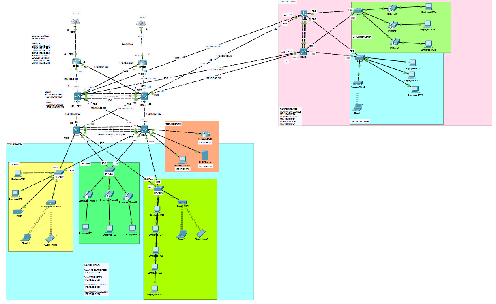
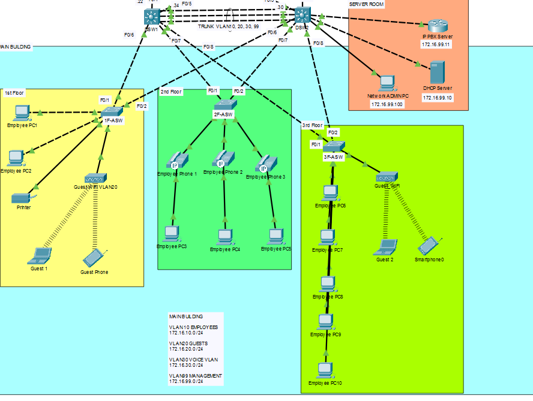
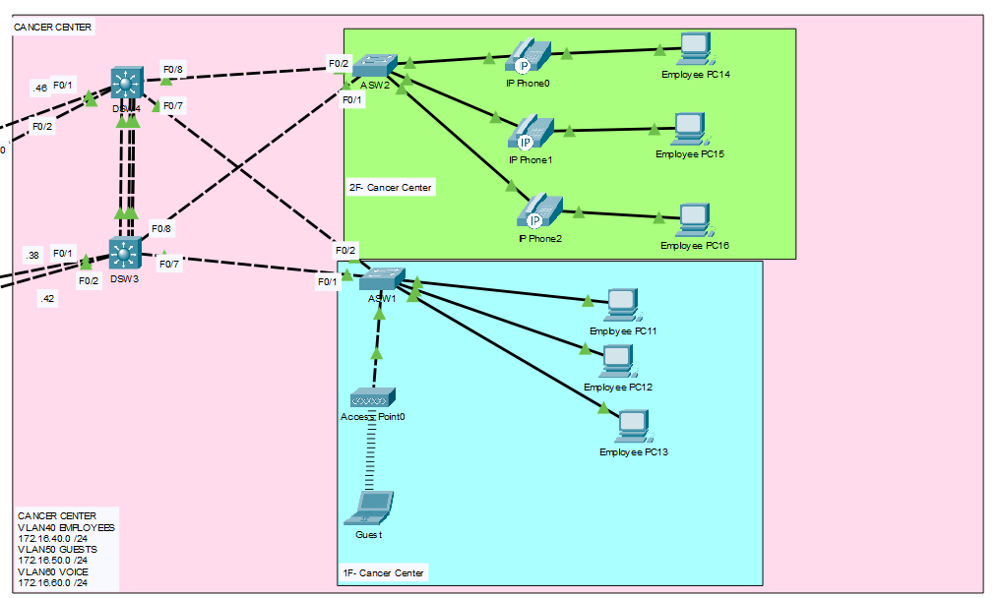
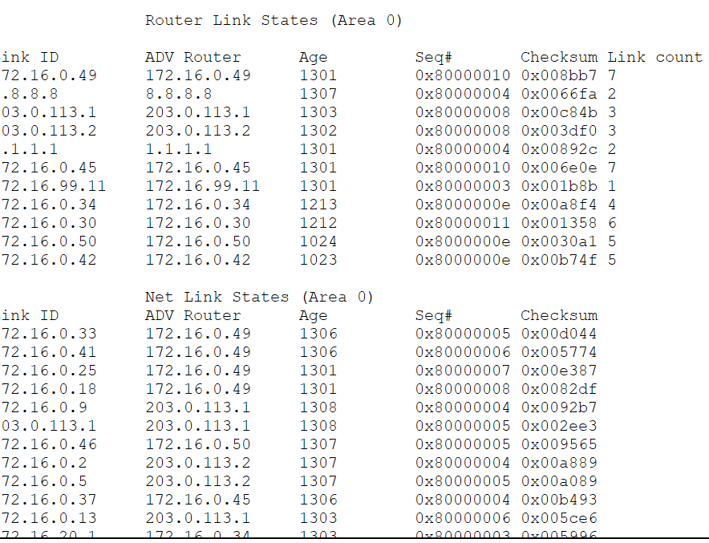
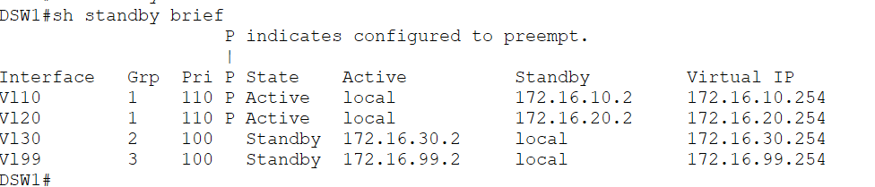
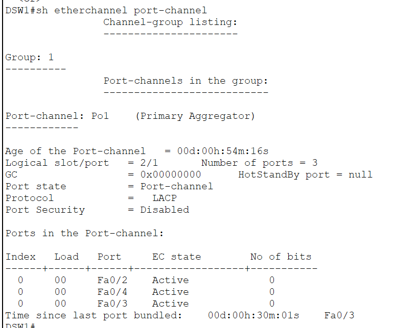
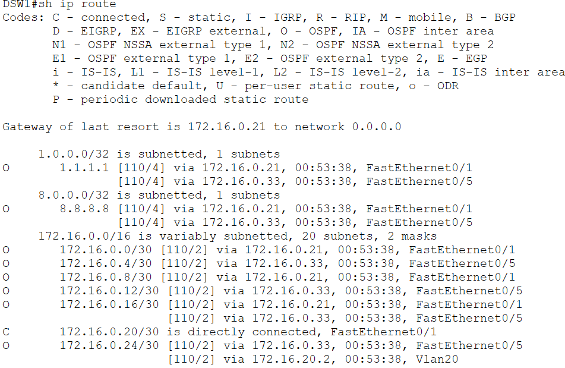
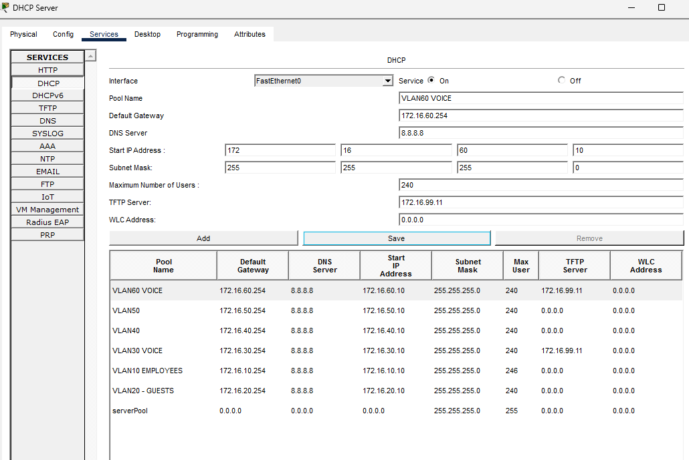
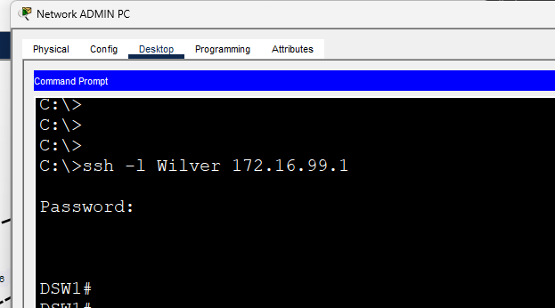
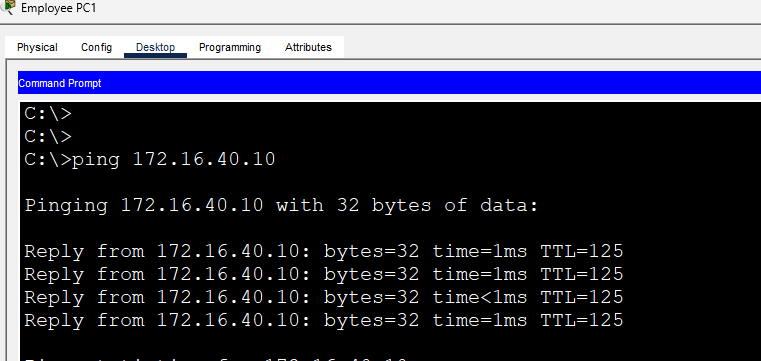

# 🏥 Enterprise Hospital Campus Network (Final CCNA Project)

> A Cisco Packet Tracer project simulating a multi-building enterprise hospital campus network using modern enterprise networking principles and the technologies covered throughout the CCNA curriculum.

---

# 📖 Overview

This project is the culmination of my CCNA learning journey. Instead of demonstrating networking technologies individually, this lab integrates them into a single enterprise campus network inspired by a real-world hospital environment.

The design was inspired by my experience working on the **Bicol Medical Center** project as an ICT Technical Engineer. While the actual deployment consists of multiple interconnected buildings, this topology simplifies the design into two buildings while preserving the architecture and networking concepts commonly found in enterprise campus networks.

The simulated campus consists of:

- 🏢 Main Building
- 🏥 Cancer Center

Each building functions as an independent Layer 2 domain while communicating through a Layer 3 routed campus backbone.

---

# ⭐ Key Features

- Enterprise Three-Tier Campus Architecture
- Multi-Building Hospital Network
- OSPF Dynamic Routing
- HSRP Gateway Redundancy
- Layer 3 Routed Backbone
- EtherChannel Link Aggregation
- Inter-VLAN Routing
- VLAN Segmentation
- Centralized DHCP Services
- IP Telephony (IP PBX)
- SSH Remote Management
- Redundant Core & Distribution Layers
- Dual ISP Connectivity
- Extended Access Control Lists (ACLs)

---

# 🖼️ Network Topology

## Full Campus Overview

---

## 🏢 Main Building

The Main Building contains:

- Three Floors
- Server Room
- DHCP Server
- IP PBX Server
- Network Administrator PC
- Employee Workstations
- Guest Wireless Network
- IP Phones
- Printers

---

## 🏥 Cancer Center

The Cancer Center contains:

- Two Floors
- Employee Network
- Guest Network
- Voice Network
- Wireless Access Point
- Employee PCs
- IP Phones

---

# 🏗️ Campus Architecture

The network follows a traditional **Three-Tier Enterprise Campus Architecture**.

## Core Layer

- CSW1
- CSW2

Responsibilities:

- Campus Backbone
- OSPF Routing
- Redundant Inter-Building Connectivity

---

## Distribution Layer

### Main Building

- DSW1
- DSW2

### Cancer Center

- DSW3
- DSW4

Responsibilities:

- Inter-VLAN Routing
- HSRP Gateway Redundancy
- Layer 3 Routed Uplinks
- Policy Enforcement

---

## Access Layer

Each floor contains dedicated access switches connecting:

- Employee PCs
- IP Phones
- Wireless Access Points
- Guest Devices
- Printers

---

# 🌐 VLAN Design

Each building maintains its own VLAN numbering while sharing a centralized management network.

## Main Building

| VLAN | Purpose | Network |
|------|----------|----------------|
| 10 | Employee | 172.16.10.0/24 |
| 20 | Guest | 172.16.20.0/24 |
| 30 | Voice | 172.16.30.0/24 |
| 99 | Management | 172.16.99.0/24 |

---

## Cancer Center

| VLAN | Purpose | Network |
|------|----------|----------------|
| 40 | Employee | 172.16.40.0/24 |
| 50 | Guest | 172.16.50.0/24 |
| 60 | Voice | 172.16.60.0/24 |

---

## Management Network

A dedicated **Management VLAN (VLAN 99)** is used to centrally manage all infrastructure devices across the campus.

Managed devices include:

- Core Switches
- Distribution Switches
- Access Switches
- DHCP Server
- IP PBX Server

This separates management traffic from user, guest, and voice traffic, following enterprise networking best practices.

---

# ⚙️ Technologies Implemented

### Layer 2

- VLANs
- IEEE 802.1Q Trunking
- EtherChannel
- Rapid PVST+
- PortFast
- BPDU Guard
- Storm Control
- Port Security

### Layer 3

- Inter-VLAN Routing
- Routed Point-to-Point Links
- OSPF
- Static Default Routes

### High Availability

- HSRP
- Gateway Redundancy
- Redundant Core Switches
- Redundant Distribution Switches

### Network Services

- DHCP
- IP PBX
- Voice VLAN
- SSH Remote Management

### Security

- SSH Version 2
- Extended ACLs
- Dedicated Management VLAN

---

# 🏛️ Design Decisions

Instead of extending Layer 2 VLANs between buildings, the network uses **Layer 3 routed links** between the Core and Distribution layers.

### Benefits

- Reduced broadcast domains
- Faster convergence
- Improved scalability
- Better fault isolation
- Easier troubleshooting
- Enterprise best practices

Each building maintains its own local VLANs while inter-building communication is handled through routing.

---

# 📸 Verification

The following screenshots verify the successful implementation of the network.

- OSPF Neighbor Adjacencies
- HSRP Status
- EtherChannel Summary
- Routing Table
- DHCP Address Assignment
- SSH Remote Access
- End-to-End Connectivity Tests

---

# 💻 Running the Lab

1. Download the `.pkt` file from this repository.
2. Open it using **Cisco Packet Tracer**.
3. Explore the topology and device configurations.
4. Verify routing, redundancy, and network services using the CLI.

---

# 💡 Skills Demonstrated

- Enterprise Campus Network Design
- Cisco Switching
- Cisco Routing
- OSPF
- HSRP
- VLAN Planning
- Inter-VLAN Routing
- EtherChannel
- IP Address Planning
- Network Redundancy
- Layer 2 Security
- Network Troubleshooting
- Cisco IOS CLI

---

# 🚀 Future Improvements

Potential enhancements include:

- IPv6 Dual Stack
- OSPFv3
- DHCP Snooping
- Dynamic ARP Inspection (DAI)
- IP Source Guard
- Wireless LAN Controller (WLC)
- RADIUS / TACACS+
- Syslog
- SNMP Monitoring
- NetFlow
- Site-to-Site VPN

---

# 🎯 Learning Outcome

This project represents the final lab in my CCNA Packet Tracer series. It combines routing, switching, redundancy, security, and network services into a cohesive enterprise campus network inspired by a real-world hospital deployment.

More than a Packet Tracer exercise, this project demonstrates how multiple Cisco technologies work together to build a scalable, resilient, and maintainable enterprise network.