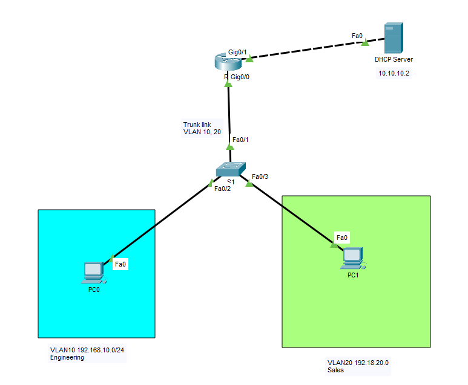
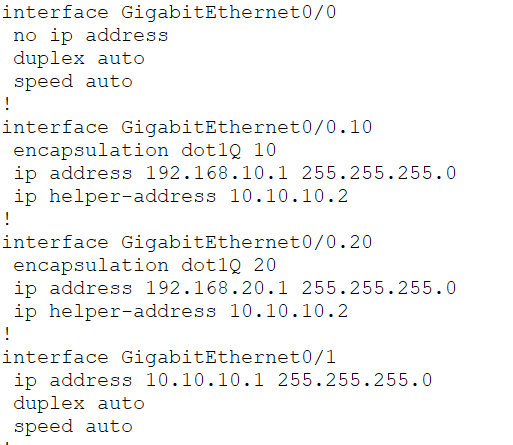
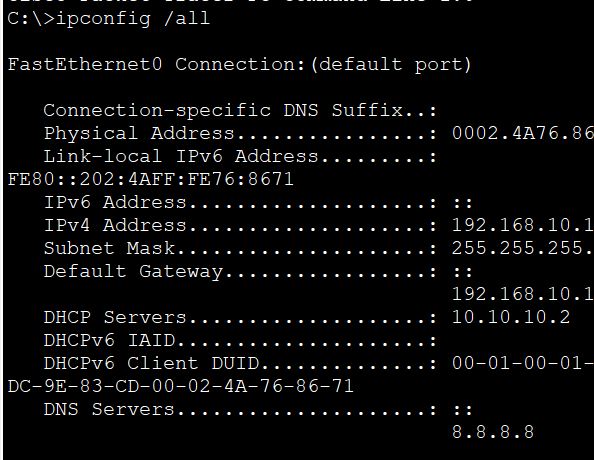
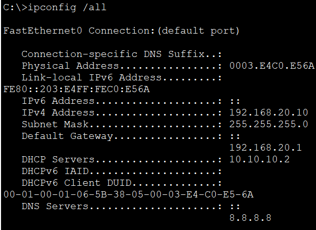

# DHCP with Inter-VLAN Routing

In this lab, I configured a router to provide **DHCP services for multiple VLANs** using **Router-on-a-Stick**. A single router interface carries traffic for multiple VLANs over an 802.1Q trunk, allowing clients in different VLANs to automatically receive IP addresses from separate DHCP pools.

This simplified topology represents a common design used in **small networks**, where a single router handles both inter-VLAN routing and DHCP services.

## Objective

Gain hands-on experience configuring DHCP for multiple VLANs while implementing inter-VLAN routing using Router-on-a-Stick.

## Topology



## Configuration

### Router

```cisco

interface GigabitEthernet0/0
 no sh

interface GigabitEthernet0/0.10
 encapsulation dot1Q 10
 ip address 192.168.10.1 255.255.255.0
 ip helper-address 10.10.10.2

interface GigabitEthernet0/0.20
 encapsulation dot1Q 20
 ip address 192.168.20.1 255.255.255.0
 ip helper-address 10.10.10.2

interface GigabitEthernet0/1
 ip address 10.10.10.1 255.255.255.0
 no sh

```

### Switch

- Configured VLAN 10 and VLAN 20
- Assigned access ports to the appropriate VLANs
- Configured the router uplink as an 802.1Q trunk

### DHCP Server

- Created separate DHCP pools for VLAN 10 and VLAN 20
- Configured the appropriate network addresses and subnet masks
- Specified the correct default gateway for each VLAN
- Configured DNS server information

## Verification

### Router

`show running-config`



### Clients

`ipconfig /all`

**VLAN 10**



**VLAN 20**



## What I Learned

- Configured Router-on-a-Stick for inter-VLAN routing.
- Configured DHCP relay using the `ip helper-address` command.
- Configured an external DHCP server with multiple DHCP scopes.
- Verified that clients in different VLANs received IP addresses from the correct DHCP pool.
- Reinforced how centralized DHCP services can support multiple VLANs through DHCP relay.

## Files

- `DHCP-with-Inter-VLAN-Routing-External-Server.pkt` — Cisco Packet Tracer lab
- `topology.png` — Network topology diagram
- `verification-router.png` — Router configuration verification
- `verification-vlan10.png` — VLAN 10 client configuration
- `verification-vlan20.png` — VLAN 20 client configuration