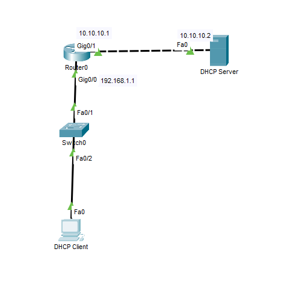

# External DHCP Server

In this lab, I configured a Cisco router to forward DHCP requests to an **external DHCP server** located on a different network segment. This demonstrates how DHCP services can be centralized while still providing IP address assignments to clients on remote LANs.

## Objective
Gain hands-on experience configuring a router to relay DHCP requests to an external DHCP server and verify that clients successfully receive IP addresses across different networks.

## Topology



## Configuration

### Router

```cisco
interface GigabitEthernet0/0
 ip address 192.168.1.1 255.255.255.0
 ip helper-address 10.10.10.2
 no shutdown

interface GigabitEthernet0/1
 ip address 10.10.10.1 255.255.255.0
 no shutdown
```

### DHCP Server

- Enabled DHCP service
- Configured a DHCP pool for the client subnet
- Specified:
  - Network address
  - Subnet mask
  - Default gateway
  - DNS server
  - Starting IP address

## Verification

- `show running-config` ([View Output](verification-router.png))
- `ipconfig /all` ([View Output](verification-client.png))

## What I Learned

- Configured a router to forward DHCP broadcasts using `ip helper-address`
- Configured an external DHCP server to lease addresses for a remote subnet
- Verified successful IP address assignment across different network segments
- Reinforced the concept that DHCP broadcasts do not cross routers without a relay agent

## Files

- `External-DHCP-Server.pkt` — Cisco Packet Tracer lab
- `topology.png` — Network topology diagram
- `verification-router.png` — Router verification
- `verification-client.png` — Client IP configuration