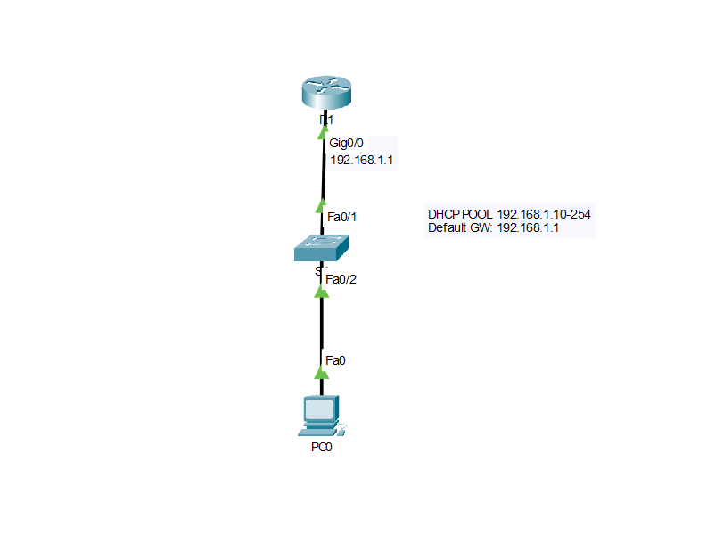

# Router as DHCP Server

In this lab, I configured a Cisco router to function as a **DHCP server**, allowing it to automatically assign IP addresses and other network parameters to clients on the local network.

## Objective
Gain hands-on experience configuring a router to provide DHCP services and verify that clients can successfully obtain IP addresses automatically.

## What I Learned
- Configure a DHCP pool on a Cisco router
- Exclude addresses from dynamic allocation
- Assign the default gateway and DNS server
- Verify DHCP leases and bindings
- Confirm that clients receive valid network configurations

## Topology

## Verification
- `show ip dhcp binding`
(verification.png)

## Files
- `Router-as-DHCP-Server.pkt` — Cisco Packet Tracer lab
- `topology.png` — Network topology diagram